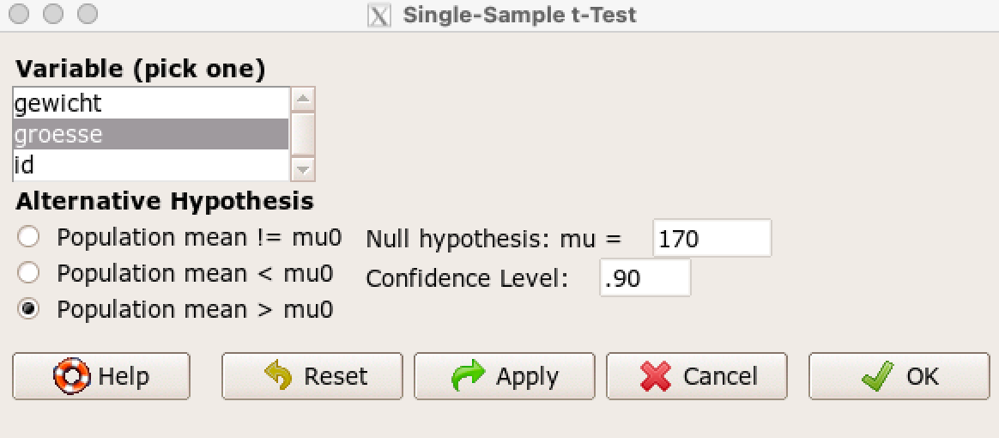
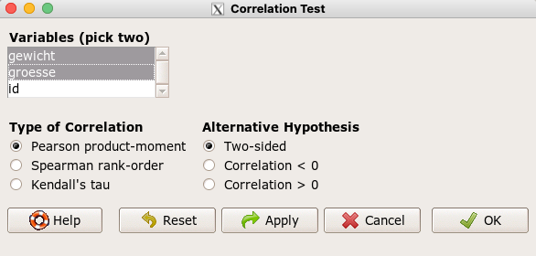
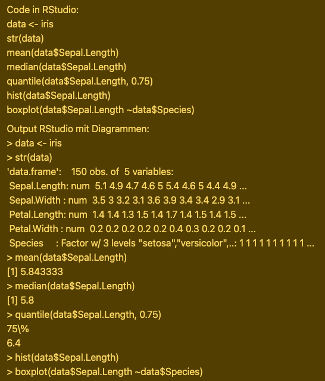
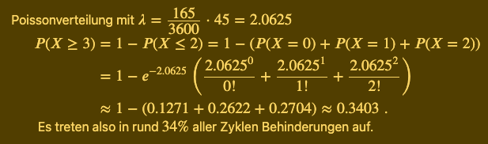

# WS - Wahrscheinlichkeitsrechnung und Statistik, WI-P-MS004, BE-Sa-2, FS21

- [WS - Wahrscheinlichkeitsrechnung und Statistik, WI-P-MS004, BE-Sa-2, FS21](#ws---wahrscheinlichkeitsrechnung-und-statistik--wi-p-ms004--be-sa-2--fs21)
  * [Lerninhalte](#lerninhalte)
    + [Beschreibende Statistik](#beschreibende-statistik)
    + [Zufallsvariablen und Wahrscheinlichkeitsverteilungen](#zufallsvariablen-und-wahrscheinlichkeitsverteilungen)
    + [Schliessende Statistik I: Punkt- und intervallschätzungen](#schliessende-statistik-i--punkt--und-intervallsch-tzungen)
    + [Schliessende Statistik II](#schliessende-statistik-ii)
    + [Korrelation und lineare Regression](#korrelation-und-lineare-regression)
    + [Statistiksoftware R](#statistiksoftware-r)
    + [Begleitkurs zu R](#begleitkurs-zu-r)
      - [Verwendeter Code](#verwendeter-code)
        * [Begleitkurs 1 - 3](#begleitkurs-1---3)
        * [Begleitkurs 4 - 5](#begleitkurs-4---5)
          + [4.2 Univariate Diagramme](#42-univariate-diagramme)
          + [4.3 Bivariate Diagramme](#43-bivariate-diagramme)
          + [1. Bestimmung von Wahrscheinlichkeiten und Quantilen](#1-bestimmung-von-wahrscheinlichkeiten-und-quantilen)
          + [Theoretische Verteilungen grafisch darstellen in RStudio](#theoretische-verteilungen-grafisch-darstellen-in-rstudio)
        * [Begleitkurs 7](#begleitkurs-7)
          + [2. Anteilstest](#2-anteilstest)
          + [3. t-Tests](#3-t-tests)
          + [3.1. Einstichproben-t-Test](#31-einstichproben-t-test)
          + [3.2. Ungepaarter Zweistichproben-t-Test](#32-ungepaarter-zweistichproben-t-test)
          + [3.3. Gepaarter Zweistichproben-t-Test (Paardifferenzen-Test)](#33-gepaarter-zweistichproben-t-test--paardifferenzen-test-)
          + [4. Chiquadrat-Tests](#4-chiquadrat-tests)
          + [4.1. Chiquadrat-Anpassungstest](#41-chiquadrat-anpassungstest)
          + [4.2. Chiquadrat-Unabhängigkeitstest](#42-chiquadrat-unabh-ngigkeitstest)
        * [Begleitkurs 8](#begleitkurs-8)
  * [1 Beschreibende Statistik](#1-beschreibende-statistik)
    + [Lernziele](#lernziele)
      - [Beschreibende Statistik](#beschreibende-statistik-1)
      - [Statistiksoftware R](#statistiksoftware-r-1)
    + [Vorbereitung](#vorbereitung)
      - [Zusammenfassung: Was ist Statistik?](#zusammenfassung--was-ist-statistik-)
      - [Zusammenfassung: Videos zur beschreibenden Statistik](#zusammenfassung--videos-zur-beschreibenden-statistik)
      - [1. Statistische Grundbegriffe](#1-statistische-grundbegriffe)
        * [Grundgesamtheit](#grundgesamtheit)
        * [Merkmale](#merkmale)
      - [2. Skalenniveaus](#2-skalenniveaus)
        * [Nomonalskala](#nomonalskala)
        * [Ordinalskala](#ordinalskala)
        * [Intervalskala](#intervalskala)
        * [Verhältnissskala](#verh-ltnissskala)
      - [3. Stabdiagramme und Histogramme](#3-stabdiagramme-und-histogramme)
        * [Stabdiagramm](#stabdiagramm)
        * [Empirische Häufigkeit](#empirische-h-ufigkeit)
        * [Histogramm](#histogramm)
      - [4. Lageparameter (arithmetisches, harmonisches und geometrisches Mittel)](#4-lageparameter--arithmetisches--harmonisches-und-geometrisches-mittel-)
        * [Mittelwerte](#mittelwerte)
        * [Unabhängige Messwerte](#unabh-ngige-messwerte)
        * [Arithmetisches Mittel (Durchschnitt)](#arithmetisches-mittel--durchschnitt-)
        * [Gewichtetes Arithmetisches Mittel](#gewichtetes-arithmetisches-mittel)
        * [Gewichtetes Harmonisches Mittel](#gewichtetes-harmonisches-mittel)
        * [Aufeinander aufbauende Werte](#aufeinander-aufbauende-werte)
        * [Geometrisches Mittel](#geometrisches-mittel)
      - [5. Streuparameter (Varianz, Standardabweichung, Variationskoeffizient)](#5-streuparameter--varianz--standardabweichung--variationskoeffizient-)
        * [Streumasse](#streumasse)
      - [6. Quartile und Boxplots](#6-quartile-und-boxplots)
        * [Boxplots](#boxplots)
        * [Median](#median)
        * [Unteres Quartil](#unteres-quartil)
        * [Oberes Quartil](#oberes-quartil)
        * [Gesamtheit](#gesamtheit)
        * [Merkmale, Merkmalsausprägungen und statistische Variablen](#merkmale--merkmalsauspr-gungen-und-statistische-variablen)
        * [Skalenniveaus](#skalenniveaus)
        * [Gruppierte und Klassierte Daten](#gruppierte-und-klassierte-daten)
    + [Präsenz](#pr-senz)
    + [Nachbearbeitung](#nachbearbeitung)
  * [2 Zufallsvariablen und Verteilungen](#2-zufallsvariablen-und-verteilungen)
    + [Lernziele](#lernziele-1)
      - [Zufallsvariablen und Verteilungen](#zufallsvariablen-und-verteilungen)
      - [Statistiksoftware R](#statistiksoftware-r-2)
    + [Vorbereitung](#vorbereitung-1)
      - [Zufallsvariablen](#zufallsvariablen)
        * [Massenfunktion](#massenfunktion)
        * [Dichtefunktion](#dichtefunktion)
        * [Verteilungsfunktion](#verteilungsfunktion)
        * [Erwartungswert](#erwartungswert)
    + [Präsenz](#pr-senz-1)
    + [Nachbearbeitung](#nachbearbeitung-1)
  * [3 Punkt- und Intervallschätzung](#3-punkt--und-intervallsch-tzung)
    + [Lernziele](#lernziele-2)
      - [Grenzwertsätze](#grenzwerts-tze)
      - [Punkt- und Intervallschätzung](#punkt--und-intervallsch-tzung)
      - [Statistiksoftware R](#statistiksoftware-r-3)
    + [Vorbereitung](#vorbereitung-2)
    + [Präsenz](#pr-senz-2)
    + [Nachbearbeitung](#nachbearbeitung-2)
  * [4 Hypothesentest](#4-hypothesentest)
    + [Lernziele](#lernziele-3)
      - [Zweidimensionale Häufigkeitsverteilung](#zweidimensionale-h-ufigkeitsverteilung)
      - [Hypothesentest](#hypothesentest)
      - [Statistiksoftware R](#statistiksoftware-r-4)
    + [Vorbereitung](#vorbereitung-3)
      - [Kreuztabelle (Kontingenztabelle) mit R](#kreuztabelle--kontingenztabelle--mit-r)
        * [Erwartungswerte für chiquadrat-test (𝛘²-test)](#erwartungswerte-f-r-chiquadrat-test------test-)
      - [Binomialtest](#binomialtest)
    + [Präsenz](#pr-senz-3)
    + [Nachbearbeitung](#nachbearbeitung-3)
  * [5 Korrelation und lineare Regression](#5-korrelation-und-lineare-regression)
    + [Lernziele](#lernziele-4)
      - [Korrelation und lineare Regression](#korrelation-und-lineare-regression-1)
      - [Statistiksoftware R](#statistiksoftware-r-5)
    + [Vorbereitung](#vorbereitung-4)
    + [Präsenz](#pr-senz-4)
    + [Nachbearbeitung](#nachbearbeitung-4)
- [R4STAT, Begleitkurs für R](#r4stat--begleitkurs-f-r-r)
  * [1 Installation und Programmstart](#1-installation-und-programmstart)
    + [1.1 Grundlegende Informationen zu den Programmen](#11-grundlegende-informationen-zu-den-programmen)
    + [1.2 Installation](#12-installation)
    + [1.3 Benutzeroberfläche](#13-benutzeroberfl-che)
  * [2 Datenmanagement](#2-datenmanagement)
    + [Themen](#themen)
    + [2.1 Datensatz einlesen, kontrollieren und speichern](#21-datensatz-einlesen--kontrollieren-und-speichern)
      - [1. Projekt erstellen](#1-projekt-erstellen)
      - [2. Mit R erstellten Datensatz einlesen](#2-mit-r-erstellten-datensatz-einlesen)
      - [3. Mit einem fremden Programm erstellten Datensatz einlesen](#3-mit-einem-fremden-programm-erstellten-datensatz-einlesen)
      - [4. Mit einem fremden Programm erstellte Textdatei einlesen](#4-mit-einem-fremden-programm-erstellte-textdatei-einlesen)
      - [5. Daten direkt eingeben](#5-daten-direkt-eingeben)
      - [6. Daten kontrollieren](#6-daten-kontrollieren)
      - [7. Datensatz anzeigen](#7-datensatz-anzeigen)
      - [8. Dateien oder Workspace speichern](#8-dateien-oder-workspace-speichern)
    + [2.2 Variablen erzeugen, verändern und löschen](#22-variablen-erzeugen--ver-ndern-und-l-schen)
      - [1. Neue Variable erzeugen](#1-neue-variable-erzeugen)
      - [2. Bestehende Variable verändern](#2-bestehende-variable-ver-ndern)
      - [3. Variable umbenennen](#3-variable-umbenennen)
      - [4. Variable löschen](#4-variable-l-schen)
      - [5. Faktoren](#5-faktoren)
      - [6. Zufallszahlen erzeugen](#6-zufallszahlen-erzeugen)
    + [2.3 Datensatz umformen und reduzieren](#23-datensatz-umformen-und-reduzieren)
      - [1.Beobachtungen nach einer Variable sortieren](#1beobachtungen-nach-einer-variable-sortieren)
      - [2.Variablen anordnen](#2variablen-anordnen)
      - [3.Datensatz vom Breit- ins Langformat umformen](#3datensatz-vom-breit--ins-langformat-umformen)
      - [4.Datensatz reduzieren](#4datensatz-reduzieren)
  * [3 Numerische Beschreibung von Daten](#3-numerische-beschreibung-von-daten)
      - [Themen](#themen-1)
      - [1.Überblick über den Datensatz verschaffen](#1-berblick--ber-den-datensatz-verschaffen)
      - [2.Häufigkeitstabellen für kategorielle Variablen](#2h-ufigkeitstabellen-f-r-kategorielle-variablen)
      - [Lage- und Streuungsmasse für stetige Variablen](#lage--und-streuungsmasse-f-r-stetige-variablen)
  * [4 Diagramme](#4-diagramme)
      - [Themen](#themen-2)
    + [4.1 Diagramme und Ihre Erstellung in R](#41-diagramme-und-ihre-erstellung-in-r)
    + [4.2 Univariate Diagramme](#42-univariate-diagramme-1)
      - [1.Formatieren und Exportieren von Diagrammen](#1formatieren-und-exportieren-von-diagrammen)
      - [2.Darstellung von diskreten Variablen](#2darstellung-von-diskreten-variablen)
      - [3.Darstellung von stetigen Variablen](#3darstellung-von-stetigen-variablen)
    + [4.3 Bivariate Diagramme](#43-bivariate-diagramme-1)
      - [1. Globale Grafikparameter setzen](#1-globale-grafikparameter-setzen)
      - [2. Diskrete Variable versus diskrete Variable](#2-diskrete-variable-versus-diskrete-variable)
      - [3. Stetige Variable versus diskrete Variable](#3-stetige-variable-versus-diskrete-variable)
      - [4. Stetige Variable vesus stetige Variable](#4-stetige-variable-vesus-stetige-variable)
    + [4.4 Diagnostische Diagramme](#44-diagnostische-diagramme)
      - [1. Q-Q-Plot verstehen und interpretieren](#1-q-q-plot-verstehen-und-interpretieren)
      - [2. Q-Q-Plot in RStudio erstellen](#2-q-q-plot-in-rstudio-erstellen)
  * [5 Theoretische Verteilungen](#5-theoretische-verteilungen)
    + [5.1 Wahrscheinlichkeiten und Quantile berechnen](#51-wahrscheinlichkeiten-und-quantile-berechnen)
      - [1. Bestimmung von Wahrscheinlichkeiten und Quantilen](#1-bestimmung-von-wahrscheinlichkeiten-und-quantilen-1)
    + [5.2 Wahrscheinlichkeits-/Dichtefunktion und Verteilungsfunktion grafisch darstellen](#52-wahrscheinlichkeits--dichtefunktion-und-verteilungsfunktion-grafisch-darstellen)
      - [1. Definitionen](#1-definitionen)
      - [2. Diskrete Verteilung](#2-diskrete-verteilung)
      - [3. Stetige Verteilung](#3-stetige-verteilung)
  * [6 Konfidenzintervalle](#6-konfidenzintervalle)
      - [1. Grundsätzliches](#1-grunds-tzliches)
      - [2. Konfidenzintervall für einen (arithmetischen) Mittelwert in der Gesamtheit](#2-konfidenzintervall-f-r-einen--arithmetischen--mittelwert-in-der-gesamtheit)
      - [3. Konfidenzintervall für einen Anteil](#3-konfidenzintervall-f-r-einen-anteil)
  * [7 Hypothesentests](#7-hypothesentests)
    + [1. Grundsätzliches](#1-grunds-tzliches-1)
      - [Kreuztabelle (Kontingenztabelle) mit R](#kreuztabelle--kontingenztabelle--mit-r-1)
        * [Erwartungswerte für chiquadrat-test (𝛘²-test)](#erwartungswerte-f-r-chiquadrat-test------test--1)
    + [2. Anteilstest](#2-anteilstest-1)
    + [3. t-Tests](#3-t-tests-1)
      - [3.1. Einstichproben-t-Test](#31-einstichproben-t-test-1)
      - [3.2. Ungepaarter Zweistichproben-t-Test](#32-ungepaarter-zweistichproben-t-test-1)
      - [3.3. Gepaarter Zweistichproben-t-Test (Paardifferenzen-Test)](#33-gepaarter-zweistichproben-t-test--paardifferenzen-test--1)
    + [4. Chiquadrat-Tests](#4-chiquadrat-tests-1)
      - [4.1. Chiquadrat-Anpassungstest](#41-chiquadrat-anpassungstest-1)
      - [4.2. Chiquadrat-Unabhängigkeitstest](#42-chiquadrat-unabh-ngigkeitstest-1)
  * [8 Korrelation und Lineare Regression](#8-korrelation-und-lineare-regression)
    + [1. Grundsätzliches](#1-grunds-tzliches-2)
    + [2. Voraussetzungen für eine lineare Regression prüfen](#2-voraussetzungen-f-r-eine-lineare-regression-pr-fen)
      - [2.1. Der Korrelationskoeffizient als Zufallsgrösse: Testen gegen Null](#21-der-korrelationskoeffizient-als-zufallsgr-sse--testen-gegen-null)
    + [3. Lineare Regression durchführen](#3-lineare-regression-durchf-hren)
      - [3.1. Regressionskoeffizienten als Zufallsgrössen: Testen gegen Null](#31-regressionskoeffizienten-als-zufallsgr-ssen--testen-gegen-null)
    + [4. Güte des Modells prüfen](#4-g-te-des-modells-pr-fen)
  * [9 Markov-Ketten (nur PiBS)](#9-markov-ketten--nur-pibs-)
    + [9.1 Vektor- und Matrizenrechnung](#91-vektor--und-matrizenrechnung)
    + [9.2 Programmieren](#92-programmieren)
- [Prüfungsvorbereitung](#pr-fungsvorbereitung)

Weiterführende Links:

[https://statistikgrundlagen.de/ebook/](https://statistikgrundlagen.de/ebook/)

## Lerninhalte

### Beschreibende Statistik

- Grundgesamtheit, Merkmale, Skalenniveaus
- Eindimensionale Häufigkeitsverteilungen und Verteilungsfunktionen
- Stabdiagramm, Histogramm und Boxplot
- Lage- und Streuungsparameter

### Zufallsvariablen und Wahrscheinlichkeitsverteilungen

- Diskrete und stetige Zufallsvariable
- Wahrscheinlichkeitsdichte und Verteilungsfunktion
- Erwartungswert und Varianz einer Zufallsvariable
- Diskrete Wahrscheinlichkeitsverteilungen:
  - Gleichverteilung
  - Binomialverteilung
  - Poissonverteilung
- Stetige Wahrscheinlichkeitsverteilungen:
  - Gleichverteilung
  - Normalverteilung

### Schliessende Statistik I: Punkt- und intervallschätzungen

- Gesetz der grossen Zahlen und zentraler Grenzwertsatz
- Punktschätzung Erwartungswert, Varianz und Anteilswert
- Intervallschätzung des Erwartungs- und Anteilwerts (Konfidenzintervall)
- t-Verteilung
- Konfindenzintervall und Stichprobenumfang

### Schliessende Statistik II

- Zweidimensionale Häufigkeitsverteilungen, Kontingenztabellen
- Null- und Gegenhypothese
- Einseitiger und Zweiseitiger Hypothesentest
- Fehler 1. und 2.Art
- Testniveau, Annahme- und Ablehnungsbereich
- Hypothesentests:
  - Binomialtest
  - Einstichproben und Zweistichproben t-Test
  - Paardifferenztest
  - Chi^2 Anpassungs- und Unabhängigkeitstest

### Korrelation und lineare Regression

- Kovarianz und Korrelationskoeffizient nach Bravais-Pearson und Spearman-Pearson
- Lineare Regression
- Exkurs: Residuenanalyse und Quantile-Quantile-Plots

### Statistiksoftware R

- Lage-/Streuungsparameter berechnen mit R
- Diagramme erstellen mit R
- Vertrauensintervalle bestimmen mit R
- Hypothesentests durchführen mit R
- Korrelation und lineare Regression durchführen mit R

Anwendung der deskriptiven und schliessenden Statistik auf Problemstellungen der realen Welt mit Unter- stützung der Statistiksoftware R

### Begleitkurs zu R

<https://moodle.ffhs.ch/course/view.php?id=5389>

#### Verwendeter Code

##### Begleitkurs 1 - 3

R Commander starten

```{r}
library(Rcmdr)
```

RStudio Environment bereinigen

```{r}
rm(list = ls())  # clear environment
cat("\014")  # ctrl+L
p_unload(all) # clear packages
detach("package:datasets", unload = TRUE)  # For base
```

csv einlesen und Parameter bestimmen

```{r}
verbrauchElektroauto <- read.table("<Pfad>/verbrauchElektroauto.csv", header=TRUE, sep=",", na.strings="Rep.", dec=".", strip.white=TRUE)
```

Datensatz abspeichern

```{r}
save(datensatz3, file = "~/Downloads/test.RData")
```

Multiplizieren einer Spalte (gewicht) und speichern in eine neue Spalte (test):

```{r}
datensatz1$test <- datensatz1$gewicht * 2 
```

Dividieren einer Spalte (test) und überschreiben

```{r}
datensatz1$test <- datensatz1$test/2
```

Daten einer SPlate (gewicht) in Klassen einteilen und Labels vergeben, speichern in neuer Spalte (gewicht_kl)

- Obere Grenze der Klasse gehört zur  linken Klasse und nicht zur rechten

```{r}
?cut
datensatz1$gewicht_kl <- cut(datensatz1$gewicht, c(50,60,70,85), labels = c("leicht","normal","schwer"), right = FALSE) 
```

Daten einer Spalte(gewicht) kathegorisieren

```{r}
?ifelse
datensatz1$gewicht_kat <- ifelse( datensatz1$gewicht_kl == "schwer", 1, 2)
```

Spalten (3:4 = 3 bis 4) von Datensatz1 zusammenzählen und Mittel in neuer Spalte(mittel_alt_gew) speichern

```{r}
?apply
datensatz1$mittel_alt_gew <- apply(datensatz1[,3:4], 1, mean)
```

Spalten (alter:gewicht = alter bis gewicht) von Datensatz1 zusammenzählen und Mittel in neuer Spalte(mittel_alt_gew2) speichern

```{r}
datensatz1$mittel_alt_gew2 <- apply(subset(datensatz1, select= alter:gewicht), 1, mean)
```

Spalte(id) hinzufügen und nummerieren

```{r}
datensatz1$id <- seq_len(nrow(datensatz1))
```

Neues Value zu Position(Spalte "test", Wert-Nr. 2) hinzufügen

```{r}
datensatz1$test[2] <- 165
```

Neues Value zu Position(Datensatz wo id=4) hinzufügen

```{r}
datensatz1$test[datensatz1$id == 4] <- 155
```

Alle Variablennamen ausgeben von Datensatz(datensatz1)

```{r}
colnames(datensatz1)
```

```{r}
[1] "geschlecht"      "haarfarbe"       "alter"           "gewicht"        
[5] "test"            "gewicht_kl"      "gewicht_kat"     "mittel_alt_gew" 
[9] "mittel_alt_gew2" "id"             
```

Variable eines Datensatzes umbebnennen via Position(5)

```{r}
colnames(datensatz1)[5]<-"umbenannt"
```

Variable eines Datensatzes umbenennen via Namen (umbenannt)

```{r}
colnames(datensatz1)[colnames(datensatz1)=="umbenannt"]<-"umbenannt2"
```

Variable eines Datensatzes löschen(mittel_alt_gew2) - Wird mit NULL überschrieben

```{r}
datensatz1$mittel_alt_gew2<-NULL
```

Values ersetzen in Variable(geschlecht) 0 --> m, 1 --> f

```{r}
datensatz1$geschlecht <- factor(datensatz1$geschlecht, levels = c(0, 1), labels = c("m", "f"))
```

Variable zu factor umwandeln

```{r}
datensatz <- within(datensatz, { variable <- as.factor(variable) })
```

Anzahl Werte pro Variable zählen und abgeben

```{r}
nrow(datensatz1)
```

```{r}
[1] 9
```

Variablen nach Value ordnen(- vor der Variable = Absteigend, sonst Aufsteigend)

```{r}
datensatz <- with(datensatz, detansatz[order(variable, decreasing=FALSE), ])
```

```{r}
datenNeu <- datensatz1[order(datensatz1$alter, -datensatz1$gewicht), ]
```

```{r}
datenNeuAbsteigend <- datensatz1[order(-datensatz1$alter, datensatz1$gewicht), ]
```

Variablen in Datensatz neu anordnen, neuen Datensatz speichern oder bestehenden überschrieben

```{r}
datenNeueOrdnung <- datensatz1[, c("id", "geschlecht", "alter", "gewicht", "gewicht_kl", "gewicht_kat", "mittel_alt_gew")]
```

```{r}
datenNeueOrdnung <- datensatz1[, c("id", "geschlecht", "alter", "gewicht", "haarfarbe", "gewicht_kl", "gewicht_kat", "mittel_alt_gew")]
```

Variablen umbenennen

```{r}
colnames(temperatur)[colnames(temperatur) == 'tMo'] <- 'temperatur1'
colnames(temperatur)[colnames(temperatur) == 'tMi'] <- 'temperatur2'
colnames(temperatur)[colnames(temperatur) == 'tAb'] <- 'temperatur3'
```

Datensätze umformen von breit zu lang, Variablen zusammenfassen

```{r}
temperaturLang <- reshape(
+     temperatur,
+     varying=c("temperatur1", "temperatur2", "temperatur3"),
+     timevar="zeit",
+     sep="",
+     direction="long"
+ )
```

```{r}
temperaturLang$zeit <- factor(
+     temperaturLang$zeit,
+     labels=c("Morgen", "Mittag", "Abend")
+ )
```

Datensatz erstellen mit gefilterten Variablen Values

```{r}
datenReduziert <- subset(
+     daten, subset = (geschlecht == "weiblich") & (groesse >=160) & (groesse != 175),
+     select = c(groesse, gewicht, haarfarbe)
+ )
```

Datensatz mit Variablen-Bezogenen Auswertungen darstellen

```{r}
      > summary(daten)
```

```{r}
             id           groesse         gewicht         geschlecht   haarfarbe
       Min.   : 1.00   Min.   :158.0   Min.   :53.20   männlich:6    blond  :2  
       1st Qu.: 3.25   1st Qu.:168.0   1st Qu.:70.03   weiblich:4    braun  :4  
       Median : 5.50   Median :172.0   Median :72.30                 rot    :1  
       Mean   : 5.50   Mean   :171.9   Mean   :72.03                 schwarz:3  
       3rd Qu.: 7.75   3rd Qu.:175.0   3rd Qu.:78.05                            
       Max.   :10.00   Max.   :181.0   Max.   :86.00                            
                       NA's   :1                                                
```

Werte einer Variablen ausdrucken

```{r}
table(daten$haarfarbe)
```

```{r}
  blond   braun     rot schwarz 
      2       4       1       3 
```

Werte einer Variablen in globale Variable speichern

```{r}
haarfarbe.table <- table(daten$haarfarbe)
haarfarbe.table
```

```{r}
        blond   braun     rot schwarz 
            2       4       1       3 
```

Werte als relative Werte ausdrucken

```{r}
prop.table(haarfarbe.table)
```

```{r}
  blond   braun     rot schwarz 
    0.2     0.4     0.1     0.3 
```

Werte als Prozent Werte ausdrucken

```{r}
prop.table(haarfarbe.table) * 100
```

```{r}
        blond   braun     rot schwarz 
           20      40      10      30 
```

Werte mehrerer Variablen in globale Variable speichern

```{r}
geschlHaar.table <- table(daten$geschlecht, daten$haarfarbe)
geschlHaar.table
```

```{r}
            blond braun rot schwarz
  männlich     1     3   1       1
  weiblich     1     1   0       2
```

```{r}
prop.table(geschlHaar.table) * 100
```

```{r}
            blond braun rot schwarz
  männlich    10    30  10      10
  weiblich    10    10   0      20
```

Werte als Prozent Werte ausdrucken - Zeilenbezogen (Parameter 1)

```{r}
prop.table(geschlHaar.table, 1) * 100
```

```{r}
              blond    braun      rot  schwarz
  männlich 16.66667 50.00000 16.66667 16.66667
  weiblich 25.00000 25.00000  0.00000 50.00000
```

Werte als Prozent Werte ausdrucken - Spaltenbezogen (Parameter 2)

```{r}
prop.table(geschlHaar.table, 2) * 100
```

```{r}
                blond     braun       rot   schwarz
  männlich  50.00000  75.00000 100.00000  33.33333
  weiblich  50.00000  25.00000   0.00000  66.66667
```

Variable mit Auswertungen darstellen

```{r}
summary(daten$groesse)
```

```{r}
    Min. 1st Qu.  Median    Mean 3rd Qu.    Max.    NA's 
  158.0   168.0   172.0   171.9   175.0   181.0       1 
```

Auswertungen anzeigen (na.rm = TRUE, entfernen von fehlenden Werten(NA) sonst generiert es ein Error)

```{r}
mean(daten$groesse, na.rm = TRUE)
```

```{r}
[1] 171.8889
```

```{r}
var(daten$groesse, na.rm = TRUE)
```

```{r}
[1] 49.36111
```

```{r}
var(daten$groesse, na.rm = TRUE)
```

```{r}
[1] 49.36111
```

```{r}
median(daten$groesse, na.rm = TRUE)
```

```{r}
[1] 172
```

Prozentangaben zu jeweiliger Variablen

```{r}
quantile(daten$groesse, probs = c(0.1, 0.9), na.rm = TRUE)
```

```{r}
  10%   90% 
165.2 180.2 
```

Berechnet gemäss der angegebenen Funktion(FUN) die Faktor-Bezogenen Mittelwerte

```{r}
tapply(daten$groesse, daten$geschlecht, FUN = mean, na.rm = TRUE)
```

```{r}
männlich weiblich 
  174.40   168.75
```

Rechenoperationen:

Potenzieren

```{r}
x^(5/2)
2^(5/2)
```

```{r}
[1] 5.656854
```

Quadratwurzel

```{r}
sqrt(x)
sqrt(6)
```

```{r}
[1] 2.44949
```

Exponentialfunktion (Euler)

```{r}
exp(x)
exp(5)
```

```{r}
[1] 148.4132
```

Logarithmen

```{r}
log(x), log10(x), log2(x)
log(10); log10(10); log2(10)
```

```{r}
[1] 2.302585
[1] 1
[1] 3.321928
```

Geometrische Werte

```{r}
sin(x), cos(x), tan(x)
sin(10); cos(10); tan(10)
```

```{r}
[1] -0.5440211
[1] -0.8390715
[1] 0.6483608
```

```{r}
asin(x), acos(x), atan(x)
asin(10); acos(10); atan(10)
```

```{r}
[1] NaN
[1] NaN
[1] 1.471128
```

Runden

```{r}
round(x, n)
round(5.345677, 3)
```

```{r}
[1] 5.346
```

Variation

```{r}
choose(5,2) # =5!/(2! * 3!)
```

```{r}
[1] 10
```

Faktorisieren

```{r}
factorial(n)
factorial(5)
```

```{r}
[1] 120
```

```{r}
factorial(5)/(factorial(3) * factorial(2))
```

```{r}
[1] 10
```

Random Zahlen generieren

```{r}
sample(x=1:6, size=100, replace=TRUE)
```

```{r}
[1] 5 6 5 5 6 4 1 3 6 5 6 4 6 6 2 4 5 2 2 3 3 6 2 2 4 3 6 6 1 4 1 3 1 4 1 3 6 4
[39] 4 5 3 2 5 5 3 4 5 4 6 3 2 5 3 6 6 2 5 3 5 6 4 4 6 3 4 6 3 2 6 5 5 2 2 1 1 6
[77] 6 1 5 6 3 4 6 4 6 1 4 3 5 4 3 5 3 2 4 4 2 5 1 2
```

```{r}
rbinom(n=100, size=10, p=0.2)
```

```{r}
[1] 2 6 1 3 3 0 0 3 2 3 3 2 2 2 3 2 2 0 3 2 2 2 0 2 2 1 1 3 6 1 2 1 2 3 2 2 0 2
[39] 1 4 2 3 4 2 1 3 3 2 2 2 2 2 1 2 0 4 0 0 1 2 2 3 3 1 5 1 2 2 0 4 2 2 2 0 1 1
[77] 3 1 4 2 2 2 1 3 1 2 1 2 1 0 2 2 4 4 2 2 2 2 3 2
```

```{r}
rbinom(n=100, size=10, p=0.2)
```

```{r}
[1] 0 2 3 1 4 2 2 2 2 1 0 2 2 2 0 2 2 3 3 1 3 2 2 2 2 1 3 1 3 1 1 2 2 2 3 0 2 3
[39] 1 3 4 2 0 3 4 3 0 4 2 2 2 4 6 1 3 1 2 1 2 1 2 2 3 1 5 1 1 1 0 2 1 3 6 3 3 2
[77] 4 1 2 4 3 5 1 1 3 1 2 3 5 2 2 1 3 1 1 2 3 2 1 1
```

```{r}
rpois(n=100, lambda=2)
```

```{r}
[1] 3 2 3 4 3 1 1 5 3 2 0 6 3 2 1 4 3 2 2 1 1 4 1 0 1 3 2 0 3 1 1 3 4 2 3 2 2 0
[39] 1 0 2 1 2 1 0 2 3 3 2 1 2 2 2 1 2 1 0 3 0 0 0 2 3 3 4 2 3 0 2 5 1 5 0 1 4 1
[77] 0 2 2 4 2 2 0 3 1 2 4 5 5 0 3 1 1 2 0 2 0 2 3 1
```

```{r}
runif(n=100, min=5, max=10)
```

```{r}
[1] 9.303752 9.293796 8.827764 5.102760 8.758816 8.195477 5.123459 8.053528
[9] 8.102820 5.014377 8.865109 5.129718 7.277885 7.142040 5.925667 5.642375
[17] 5.901951 6.509530 9.866657 7.055820 8.334351 7.411123 7.776961 5.738179
[25] 9.645890 8.033833 5.220113 6.162260 6.721334 9.122594 6.377511 5.125968
[33] 9.709733 7.112146 8.028593 7.378837 6.381900 7.948161 8.637083 6.590611
[41] 5.016048 7.264224 7.158858 7.598678 9.627865 5.727115 5.442145 7.200429
[49] 8.965291 6.229710 6.276889 8.073150 6.957466 5.786723 9.754656 6.527422
[57] 7.804083 6.289307 7.856799 8.205218 8.339493 5.844333 6.494914 8.059492
[65] 8.379775 7.314555 9.289110 7.329950 9.487168 6.842838 6.537654 9.320442
[73] 7.311444 7.053286 6.235053 5.217130 6.211931 6.523350 5.120996 5.975696
[81] 6.602470 7.571770 5.805852 7.632382 6.747797 9.374172 9.875959 5.086479
[89] 5.746564 7.079741 5.090920 5.582885 7.019287 6.857233 6.700666 5.890280
[97] 9.233576 9.477131 7.223476 7.464245
```

```{r}
runif(n=100, min=5, max=10)
```

```{r}
[1] 9.741386 7.390515 5.044614 6.688976 9.118274 7.279335 8.677245 8.066422
[9] 6.474637 5.322633 5.469989 9.049289 9.554634 6.902778 6.844959 5.811345
[17] 8.920584 5.026614 8.103463 6.405233 8.650623 6.147609 8.601002 8.185764
[25] 9.634037 8.265403 8.080640 5.979670 9.265563 8.627726 9.927833 8.978757
[33] 8.136348 9.742704 5.310429 9.971981 8.415432 6.810533 5.322707 6.540468
[41] 7.873058 8.562192 5.967191 9.612915 7.780133 9.400988 7.429394 9.593240
[49] 7.152047 9.088812 6.707757 8.353845 9.761064 7.441368 5.922520 6.939250
[57] 9.035839 5.372528 5.753307 7.001365 8.921515 7.451732 5.634392 6.106904
[65] 9.893565 8.281305 5.297143 9.580560 9.738938 7.251618 7.562977 9.856682
[73] 8.502838 8.855425 7.420816 9.175501 9.908860 5.424538 9.374659 9.018687
[81] 8.764943 7.018512 9.073380 9.137413 9.964542 5.114328 9.636340 5.243713
[89] 8.925568 8.347252 6.406414 8.694578 5.155590 8.120391 6.111841 8.756974
[97] 6.998157 6.173333 5.504992 9.971355
```

```{r}
rexp(n=100, rate=2)
```

```{r}
[1] 0.192045834 0.098631431 0.018323062 0.336342156 0.082969735 0.006995204
[7] 0.056535969 0.093611663 0.010630758 1.373775612 0.175572983 0.193821507
[13] 3.719717255 0.465575513 0.096967221 0.007868517 1.280071371 0.687172265
[19] 0.772391024 0.223577088 1.103349245 1.339199019 0.889924170 0.025901636
[25] 0.358914157 0.781349552 0.729944727 1.097080688 0.395389826 0.595084447
[31] 0.525713879 0.402464738 1.269119603 0.109454848 0.226701876 0.098755515
[37] 0.501667496 0.195516763 1.116955062 0.900312476 0.467529255 0.007643361
[43] 0.025175758 0.641903927 0.296539573 0.520753951 0.242481993 0.595825988
[49] 0.321476748 0.917306786 0.874627760 0.423442966 0.060374066 0.414579809
[55] 0.513850426 0.696599618 0.896759962 0.413698576 0.129312176 0.232430969
[61] 1.210764681 0.546501355 0.105837654 0.257576508 0.111375379 0.478128202
[67] 1.080792685 0.810455759 0.451761927 0.483701515 0.023504712 0.472317025
[73] 0.371144818 1.186324162 0.042075027 0.801588041 0.265206186 0.359625909
[79] 0.054146104 0.023545739 0.308010134 0.278279819 1.203106335 0.011056851
[85] 0.885608544 0.234529019 0.159850087 0.318184049 0.082961786 0.389728119
[91] 0.124225312 0.053916468 0.361831852 0.050205354 0.398486244 0.335834743
[97] 0.641491437 0.120220851 0.629756690 0.106803278
```

##### Begleitkurs 4 - 5

###### 4.2 Univariate Diagramme

1.Formatieren und Exportieren von Diagrammen

```{r}
par.default <- par(no.readonly=TRUE)

par(
  mar=c(4.5,4.5,1,1),
  las=1,
  cex.axis=1,
  cex.lab=1.5
)

par(par.default)
```

Darstellung von diskreten Variablen

```{r}
barplot(
  table(daten$haarfarbe),
  xlab="Haarfarbe",
  ylab="Absolute Häufigkeit"
)
```


```{r}
barplot(
  prop.table(table(daten$haarfarbe)),
  xlab="Haarfarbe",
  ylab="Relative Häufigkeit"
)
```


3.Darstellung von stetigen Variablen

```{r}
hist(
  daten$groesse
)
```


```{r}
    hist(
      daten$groesse,
      breaks=c(150, 160, 165, 170, 175, 180, 190),
      freq=FALSE,
      xlab="Grösse [cm]",
      ylab="Dichte",
      main=""
    )
```


```{r}
plot(
  ecdf(daten$bmi),
  pch=NA,
  main="",
  xlab="BMI [kg/m^2]",
  ylab="F"
)
```


```{r}
plot(
  ecdf(daten$bmi),
  pch=20,
  main="",
  xlab="BMI [kg/m^2]",
  ylab="F"
)
```


Boxplot

```{r}
par(mar=c(1, 4.5, 1, 1))
boxplot(
  daten$bmi,
  ylab="BMI [kg/m^2]"
)
```


###### 4.3 Bivariate Diagramme

1. Globale Grafikparameter setzen

```{r}
par.default <- par(no.readonly=TRUE)

par(
  mar=c(4.5,4.5,1,1),
  las=1,
  cex.axis=1,
  cex.lab=1.5
)

par(par.default)
```

2. Diskrete Variable versus diskrete Variable

```{r}
    barplot(
        table(
          daten$haarfarbe,
          daten$geschlecht
        ),
        beside=TRUE,
        legend.text=TRUE,
        xlab="Geschlecht",
        ylab="Absolute Häufigkeit"
      )
```


```{r}
barplot(
    prop.table(
      table(
        daten$haarfarbe,
        daten$geschlecht
      )
    ),
    beside=TRUE,
    legend.text=TRUE,
    xlab="Geschlecht",
    ylab="Relative Häufigkeit"
  )
```


3. Stetige Variable versus diskrete Variable

Boxplot

```{r}
boxplot(
    daten$bmi ~ daten$geschlecht,
    xlab="Geschlecht",
    ylab="BMI [kg/m^2]"
  )
```


4. Stetige Variable vesus stetige Variable

```{r}
plot(
    daten$groesse,
    daten$bmi,
    xlab="Körpergrösse [cm]",
    ylab="BMI [kg/m^2]"
  )
```


```{r}
pairs(
    daten[c("groesse",
    "gewicht",
    "bmi")],
    labels=c("Grösse [cm]",
    "Gewicht [kg]",
    "BMI [kg/m^2]")
  )
```


```{r}
plot(
    daten$groesse,
    daten$gewicht,
    pch=c(1,19)[daten$geschlecht],
    xlab="Grösse [cm]",
    ylab="Gewicht [kg]"
  )
```


###### 1. Bestimmung von Wahrscheinlichkeiten und Quantilen

Wahrsch./Dichte

dbinom()

```{r}
dgeom(x, prob)
dhyper(x, m, n, k)
dbinom(x, size, prob)
dpois(x, lambda)
dunif(x, min=0, max=1)
dnorm(x, mean=0, sd=1)
dexp(x, rate=1)
dt(x, df)
dchisq(x, df)
df(x, df1, df2)
```

pbinom()

```{r}
pgeom(q, prob)
phyper(q, m, n, k)
pbinom(q, size, prob)
ppois(q, lambda)
punif(q, min=0, max=0)
pnorm(q, mean=0, sd=1)
pexp(q, rate=1)
pt(q, df)
pchisq(q, df)
pf(q, df1, df2)
```

qbinom()

```{r}
qgeom(p, prob)
qhyper(p, m, n, k)
qbinom(p, size, prob)
qpois(p, lambda)
qunif(p, min=0, max=0)
qnorm(p, mean=0, sd=1)
qexp(p, rate=1)
qt(p, df)
qchisq(p, df)
qf(p, df1, df2)
```

rbinom()

```{r}
rgeom(n, prob)
rhyper(nn, m, n, k)
rbinom(n, size, prob)
rpois(n, lambda)
runif(n, min=0, max=0)
rnorm(n, mean=0, sd=1)
rexp(n, rate=1)
rt(n, df)
rchisq(n, df)
rf(n, df1, df2)
```

```{r}
geom = geometrische Verteilung
hyper = hypergeometrische Verteilung
pois = Poissonverteilung
unif = stetige Gleichverteilung (engl. uniform distribution)
norm = Normalverteilung
exp = Exponentialverteilung
t = t-Verteilung
chisq = Chiquadrat-Verteilung (engl. chisquare distribution)
f = F-Verteilung
```

Für 𝑋∼𝐺(𝑝)=𝐺(0.3) (geometrische Verteilung) ist  𝑃(𝑋=4)

```{r}
dgeom(3, prob=0.3)
```

Für 𝑋∼𝐻(𝑁;𝑀;𝑛)=𝐻(20;8;7) ist  𝑃(𝑋=3)

```{r}
dhyper(3, m=8, n=12, k=7)
```

Für 𝑋∼𝐵𝑖(𝑛;𝑝)=𝐵𝑖(10;0.2) ist  𝑃(𝑋≤3)

```{r}
pbinom(3, size=10, prob=0.2.)
```

Ist für 𝑋∼𝑁(𝜇;𝜎²)=𝑁(165;72) das 1. Quartil gesucht, d.h. 𝑥 so, dass  𝑃(𝑋≤𝑥)=0.25

```{r}
qnorm(0.25, mean=165, sd=7)
```

Mit rexp(100, rate=2) werden 100 Zufallszahlen gemäss der Exponentialverteilung 𝐸𝑥𝑝(𝜆)=𝐸𝑥𝑝(2) erzeugt.

```{r}
rexp(100, rate=2)
```

###### Theoretische Verteilungen grafisch darstellen in RStudio

2. Diskrete Verteilung

Verteilungsfunktion der Binomialverteilung

```{r}
xVect <- 0:10
fVect <- dbinom(xVect, size=10, prob=0.2)
barplot(
  fVect,
  names.arg=xVect,
  xlab="x",
  ylab="f(x)",
  main=""
)
```


Dichtefunktion der Binomialverteilung

```{r}
xVect <- 0:10
FVect <- pbinom(xVect, size=10, prob=0.2)
plot(
  xVect,
  FVect,
  type="s",
  xlab="x",
  ylab="F(x)",
  main=""
)
```


3. Stetige Verteilung

Verteilungsfunktion der Normalverteilung

```{r}
xVect <- seq(from=142, to=188, by=0.1) # Vektor (142.0, 142.1, ..., 188.0)
  fVect <- dnorm(xVect, mean=165, sd=7) # f(x) für x aus {142.0, 142.1, ..., 188.0}
  plot(
    xVect,
    fVect,
    type="l", # Liniendiagramm erstellen
    xlab="x",
    ylab="f(x)",
    main=""
  )
```


Dichtefunktion der Normalverteilung

```{r}
xVect <- seq(from=142, to=188, by=0.1) # Vektor (142.0, 142.1, ..., 188.0)
  FVect <- pnorm(xVect, mean=165, sd=7) # F(x) für x aus {142.0, 142.1, ..., 188.0}
  plot(
    xVect,
    FVect,
    type="l", # Liniendiagramm erstellen
    xlab="x",
    ylab="F(x)",
    main=""
  )
```


##### Begleitkurs 7

```{r}
load("/Users/chrigro/School/FFHS/documentation-ffhs-bsc-informatik/WS/WS_Begleitkurs/datenGewicht.RData")
```

###### 2. Anteilstest

```{r}
# Variable braunInd vorbereiten

daten$braunInd <- ifelse(
  daten$haarfarbe == "braun",
  1, 			# falls haarfarbe == "braun"
  2 			# sonst
)
daten$braunInd <- factor( # "braunInd" als Faktor definieren
  daten$braunInd,
  labels = c("braun", "nicht braun")
)
table( # Kontrolle der Variable "braunInd": Kreuztabelle mit "haarfarbe"
  daten$braunInd,
  daten$haarfarbe
)
```
```{r}
#################

		blond braun rot schwarz
  braun           0     4    0      0
  nicht braun     2     0    1      3

#################
```
```{r}
# Binomialtest auf braunInd durchführen
# Kann für grosse Tests lange dauern

braunTab <- table( 			# Tabelle erzeugen (wird von R nicht angezeigt)
  daten$braunInd
)
binom.test( 			# Binomialtest durchführen
  braunTab,
  p = 0.6, 			# Anteil, auf welchen getestet werden soll
  alternative = "two.sided", # zweiseitiger Test
  conf.level = 0.95 # Konfidenzniveau 1-alpha für das Konf.intervall des Anteils
)
remove(braunTab) 			# aufräumen
```
```{r}
#################

	Exact binomial test
data:  braunTab
number of successes = 4, number of trials = 10, p-value = 0.2126
alternative hypothesis: true probability of success is not equal to 0.6
95 percent confidence interval:
 0.1215523 0.7376219
sample estimates:
probability of success 
                   0.4

#################
```

###### 3. t-Tests

###### 3.1. Einstichproben-t-Test

```{r}
# Signifikanzniveau = a = 0.1
# Nullhypothese = Mittelwert der Körpergrösse grösser als 170 cm

t.test(
  daten$groesse,
  alternative='greater',    # rechtsseitiger Test
  mu=170,                   # postulierter Mittelwert mu_0 in der Gesamtheit
  conf.level=.9             # Konfidenzniveau 1-alpha für das Konf.intervall des Mittelwerts
)
```
```{r}
#################

data:  daten$groesse
t = 0.80656, df = 8, p-value = 0.2216
alternative hypothesis: true mean is greater than 170
90 percent confidence interval:
 168.6177      
Inf sample estimates:
mean of x 
 171.8889

#################
```

R-Commander

Statistics -> Means -> Simple-sample t-test




```{r}
with(
  daten, (
    t.test(
      groesse,
      alternative='greater',
      mu=170,
      conf.level=.90
    )
  )
)
```

###### 3.2. Ungepaarter Zweistichproben-t-Test

```{r}
# Signifikanzniveau a = 0.05
# Nullhypothese = die Mittelwerte in der Gesamtheit nicht voneinander unterscheiden

t.test(
  groesse~geschlecht,         # Formeleingabe, zu interpretieren als "groesse in Abhängigkeit von geschlecht"
  alternative="two.sided",    # zweiseitiger Test
  conf.level=.95,             # Konfidenzniveau 1-alpha für das Konf.intervall der Differenz der Mittelwerte
  data=daten                  # damit R weiss, wo es die Variablen suchen soll
)
```
```{r}
#################

	Welch Two Sample t-test
data:  groesse by geschlecht
t = 1.1967, df = 5.5342, p-value = 0.2801
alternative hypothesis: true difference in means is not equal to 0
95 percent confidence interval:
 -6.142043 17.442043
sample estimates:
mean in group männlich mean in group weiblich 
                174.40                 168.75

#################
```
R-Commander

Statistics -> Means -> Independent samples t-test


```{r}
load("/Users/chrigro/School/FFHS/documentation-ffhs-bsc-informatik/WS/WS_Begleitkurs/datenGewicht.RData")
```
```{r}
t.test(
	groesse~geschlecht, 
	alternative='two.sided', 
	conf.level=.95, 
	var.equal=FALSE, 
  	data=daten
)
```

###### 3.3. Gepaarter Zweistichproben-t-Test (Paardifferenzen-Test)

```{r}
load("/Users/chrigro/School/FFHS/documentation-ffhs-bsc-informatik/WS/WS_Begleitkurs/datenBlutdruck.RData")
```
```{r}
# Signifikanzniveau a = 0.01
# Nullhypothese = der Mittelwert der Blutdruckdifferenz in allen je dieses Medikament verwendenden Personen gleich Null ist

#################

t.test(
  daten$blutdruckVor,
  daten$blutdruckNach,
  alternative='two.sided', # zweiseitiger Test
  conf.level=.99, 			# Konfidenzniveau 1-alpha für das Konf.intervall der mittleren Differenz
  paired=TRUE 			# gepaarter Test
)
```
```{r}
#################

	Paired t-test
data:  daten$blutdruckVor and daten$blutdruckNach
t = 3.0987, df = 19, p-value = 0.005912
alternative hypothesis: true difference in means is not equal to 0
99 percent confidence interval:
  0.6839139 17.1392800
sample estimates:
mean of the differences 
               8.911597

#################
```

R-Commander:

Statistics -> Means -> Paired t-Test


```{r}
load("/Users/chrigro/School/FFHS/documentation-ffhs-bsc-informatik/WS/WS_Begleitkurs/datenBlutdruck.RData")
```

```{r}
with(
  daten, (
    t.test(
      blutdruckVor,
      blutdruckNach,
      alternative='two.sided', 
      conf.level=.99, 
      paired=TRUE
    )
  )
)
```

###### 4. Chiquadrat-Tests
```{r}
load("/Users/chrigro/School/FFHS/documentation-ffhs-bsc-informatik/WS/WS_Begleitkurs/datenGewicht.RData")
```
###### 4.1. Chiquadrat-Anpassungstest
```{r}
# Nullhypothese = die Haarfarbe in der Bevölkerung der diskreten Verteilung P("schwarz") = 0.15, P("braun") = 0.6, P("blond") = 0.2 und P("rot") = 0.05 

haarTab <- table(           # Tabelle von "haarfarbe" erzeugen (wird von R nicht angezeigt)
  daten$haarfarbe
)
chisq.test(                 # Chiquadrat-Test durchführen
  haarTab,
  p=c(0.15,0.6,0.2,0.05)    # vorgegebene Verteilung (gleiche Reihenfolge wie Werte von "haarfarbe")
)
remove(haarTab)             # aufräumen
```
```{r}
#################

	Chi-squared test for given probabilities
data:  haarTab
X-squared = 13.833, df = 3, p-value = 0.003141

#################
```

###### 4.2. Chiquadrat-Unabhängigkeitstest
```{r}
# Nullhypothese = die Haarfarbe unter Männern und Frauen dieselbe Verteilung hat

geschlHaarTab <- table(	# Kreuztabelle "haarfarbe" vs "geschlecht" erzeugen (wird von R nicht angezeigt)
  daten$geschlecht, 			# Zeilenvariable
  daten$haarfarbe   			# Spaltenvariable
)
chisq.test( 			# Chiquadrat-Test durchführen
  geschlHaarTab
)
remove(geschlHaarTab) 		# aufräumen
```
```{r}
#################

	Pearson's Chi-squared test
data:  geschlHaarTab
X-squared = 2.0139, df = 3, p-value = 0.5695

#################
```

##### Begleitkurs 8

```{r}
load("/Users/chrigro/School/FFHS/documentation-ffhs-bsc-informatik/WS/WS_Begleitkurs/datenGewicht.RData")
```

```{r}
summary(daten)
```
```{r}
       id           groesse         gewicht         geschlecht   haarfarbe
 Min.   : 1.00   Min.   :158.0   Min.   :53.20   männlich:6    blond  :2  
 1st Qu.: 3.25   1st Qu.:168.0   1st Qu.:70.03   weiblich:4    braun  :4  
 Median : 5.50   Median :172.0   Median :72.30                 rot    :1  
 Mean   : 5.50   Mean   :171.9   Mean   :72.03                 schwarz:3  
 3rd Qu.: 7.75   3rd Qu.:175.0   3rd Qu.:78.05                            
 Max.   :10.00   Max.   :181.0   Max.   :86.00                            
                 NA's   :1
```
```{r}
scatterplot(gewicht~groesse, regLine=FALSE, smooth=FALSE, boxplots=FALSE, xlab="Köroergrösse [cm]", 
  ylab="Gewicht [kg]", data=daten)
```


```{r}
with(daten, cor.test(gewicht, groesse, alternative="two.sided", method="pearson"))
```




```{r}
	Pearson's product-moment correlation

data:  gewicht and groesse
t = 3.2598, df = 7, p-value = 0.01387
alternative hypothesis: true correlation is not equal to 0
95 percent confidence interval:
 0.2319032 0.9504584
sample estimates:
      cor 
0.7764434
```
```{r}
LinearModel.gewichtVsGroesse <- lm(gewicht ~ groesse, data=daten)
summary(LinearModel.gewichtVsGroesse)
```


```{r}
Call:
lm(formula = gewicht ~ groesse, data = daten)

Residuals:
    Min      1Q  Median      3Q     Max 
-13.611  -1.939   2.560   4.203   6.332 

Coefficients:
             Estimate Std. Error t value Pr(>|t|)  
(Intercept) -113.1813    56.5361  -2.002   0.0854 .
groesse        1.0714     0.3287   3.260   0.0139 *
---
Signif. codes:  0 '***' 0.001 '**' 0.01 '*' 0.05 '.' 0.1 ' ' 1

Residual standard error: 6.531 on 7 degrees of freedom
  (1 observation deleted due to missingness)
Multiple R-squared:  0.6029,	Adjusted R-squared:  0.5461 
F-statistic: 10.63 on 1 and 7 DF,  p-value: 0.01387
```

```{r}
plot(                                # zuerst ein ganz normales Streudiagramm
  daten2$groesse,
  daten2$gewicht,
  xlab="Körpergrösse [cm]",
  ylab="Gewicht [kg]"
)
abline(LinearModel.gewichtVsGroesse)  # Regressionsgerade einzeichnen
lines(                                # Glättungskurve einzeichnen
  lowess(                             # Glättungskurve berechnen
    daten2$groesse,
    daten2$gewicht,
    f=0.5                             # Anteil berücksichtigter Punkte (f = fraction)
  ),
  lty="dashed"                        # gestrichelte Glättungskurve (lty = line type)
)
```


```{r}
# zuerst wird eine temporäre, nach "groesse" sortierte Datei erzeugt

tempDaten <- daten[order(daten$groesse), ]
predictMatrix <- predict(                         # vorausgesagte Werte erzeugen
  LinearModel.gewichtVsGroesse,                   # für die Voraussage benutztes Modell
  interval="confidence",                          # Konf.intervall für vorausgesagte Werte berechnen
  tempDaten                                       # Voraussage von "groesse" aufgrund von "gewicht" in tempDaten
)
plot(                                             # Streudiagramm erzeugen, mit nach "groesse" sortierten Daten
  tempDaten$groesse,
  tempDaten$gewicht,
  xlab="Körpergrösse [cm]",
  ylab="Gewicht [kg]"
)
matlines(                                         # vorausgesagte Werte und Konf.intervall einzeichnen
                                                  # (matlines = matrix lines)
  tempDaten$groesse,                              # unabhängige Variable ("x-Werte")
  predictMatrix,                                  # abhängige Werte ("y-Werte")
  lty=c("solid", "dashed", "dashed"),             # Linientypen
  col="black"                                     # Linienfarben
)
```


-----

## 1 Beschreibende Statistik

### Lernziele

#### Beschreibende Statistik

Ich verstehe den Unterschied zwischen Grundgesamtheit und Teilgesamtheit (Stichprobe).

Ich verstehe die Begriffe Merkmal, Merkmalsträger und Merkmalsausprägung.

Ich kann zwischen nominal-, ordinal-, intervall- und verhältnisskalierten Merkmalen sowie zwischen diskreten und stetigen Merkmalen unterscheiden.

Ich beherrsche die Darstellung von eindimensionalen Häufigkeitsverteilungen wie folgt:

Ich kann bei diskreten Merkmalen absolute und relative Häufigkeiten tabellarisch und grafisch (Stabdiagramm, Kreisdiagramm) darstellen.

Ich kann bei stetigen Merkmalen eine Einteilung in Klassen vornehmen, die Klassendichte berechnen und die Klassen tabellarisch und grafisch (Histogramm) darstellen.

Ich kann eine empirische Verteilungsfunktion konstruieren und grafisch (Treppendiagramm) darstellen.

Ich verstehe Quantile, kann diese berechnen und grafisch (Boxplot) darstellen.

Ich kenne die Lageparameter arithmetisches, geometrisches und harmonisches Mittel, Median und Modus. Ich kann sie berechnen und interpretieren.

Ich kenne die Streuparameter Spannweite, Varianz, Standardabweichung und Variationskoeffizient. Ich kann sie berechnen und interpretieren.

#### Statistiksoftware R

Ich beherrsche die Grundfunktionalität der Statistiksoftware R: Daten eingeben bzw. einlesen und kontrollieren, sowie Variablen ändern und erzeugen.

Ich kann mit R Häufigkeitstabellen für diskrete Variablen (Merkmale) erstellen.

Ich kann mit R Lage- und Streuparameter sowie Quantile von stetigen Variablen bestimmen.

### Vorbereitung

- Lesen Sie zur Einleitung das Dokument Was ist Statistik?

#### Zusammenfassung: Was ist Statistik?

Aus der bisher beschriebenen geschichtlichen Entwicklung und den heutigen Beschreibungen sowie den Anwendungen der Statistik lassen sich verschiedene Elemente der Statistik zusammenführen.

- Statistik ist eine Wissenschaft; ihr Gegenstand sind Modelle zur Gewinnung, Beschreibung und Analyse von Daten. Die Analyse der Daten dient zumeist einer der folgenden drei Zwecke: kompakte Darstellung der gewonnenen Daten, Bestätigung oder Widerlegung einer Hypothese oder vernünftige Vorhersagen zukünftiger Ereignisse auf Basis aktueller Gegebenheiten.
- Die Anwendungsbereiche der Statistik sind vielfältig. In allen Wissenschaften, in der Wirtschaft, in der Politik, aber auch im Alltag kommen verschiedenste statistische Methoden und Denkweisen zur Anwendung.
- Die Bedeutung der Statistik ist zur Zeit einem großen Wachstum unterworfen.

- Sehen Sie sich die unten stehenden Videos zur beschreibenden Statistik und zur Kombinatorik an.

#### Zusammenfassung: Videos zur beschreibenden Statistik

#### 1. Statistische Grundbegriffe

Werte hängen immer von der gestellen Frage ab.

##### Grundgesamtheit

- Statistische Einheiten (Alle zur Verfügung stehende Objekte)

##### Merkmale

- Eigenschaften (Farben, Saison, Preis, Grösse, Komfort,....)
- Merkmalsausprägung (Preis -> CHF, Farben -> (Rot, Blau, Grün),

#### 2. Skalenniveaus


Methoden müssen auf die Messwerte passen!

##### Nomonalskala

- Gleichen sich die Mekrkmale oder nicht? =/≠

##### Ordinalskala

- Gleichen sich die Merkmale oder nicht? =/≠
- Ordnung >/<

##### Intervalskala

- Gleichen sich die Mekrkmale oder nicht? =/≠
- Ordnung >/<
- Abstände +/- (Datum von-bis)

##### Verhältnissskala

- Gleichen sich die Mekrkmale oder nicht? =/≠
- Ordnung >/<
- Abstände +/- (Datum von-bis)
- Verhältnissbildungen (Umsatz, Preise, Kosten) */:

#### 3. Stabdiagramme und Histogramme


##### Stabdiagramm

- Wenige Merkmalsausprägungen

##### Empirische Häufigkeit


##### Histogramm

- Viele Merkmalsausprägung
- Klassieren (Muss metrisch sein)
- Mensch nimmt Flächen als grössendarstellung wahr, Grössen müssen angepasst werden


```{r}
1/n x Häufigkeit
```


#### 4. Lageparameter (arithmetisches, harmonisches und geometrisches Mittel)

##### Mittelwerte

- Markiert das Mittel eines Datensatzes
- Reproduktion des Gesamtwertes ermöglichen

##### Unabhängige Messwerte


##### Arithmetisches Mittel (Durchschnitt)

```{r}
(3+4+5)/3=4
(x1+x2+x3+...+xk)/k = X(X-quer)
```


##### Gewichtetes Arithmetisches Mittel

- Messwerte: x1; x2; x3; ...; xk
- Gewichte: n1; n2; n3; ...; nk

```{r}
    (n1 *x1 + n2* x2 + n3 *x3 + ... + nk* xk) / n1+n2+n3+...+nk = X (X-quer)
```

##### Gewichtetes Harmonisches Mittel


##### Aufeinander aufbauende Werte


##### Geometrisches Mittel

- Mittelwert aus aufeinander aufbaunden Wachstumsfaktoren
- Messwerte: x1; x2; x3; ...; xk

```{r}
    k(Wurzel)x1 *x2* ... * xk = X(quer)g
```


#### 5. Streuparameter (Varianz, Standardabweichung, Variationskoeffizient)

- Beschreibenden Statistik
- Masszahlen oder Parameter (z.b. Mittelwerte, Unterschiedlichkeit)
  - Mittelwerte
  - Unterschiedlichkeit
    - Streuung (Streumasse)

##### Streumasse

- Spannweite (Problem mit Ausreisser)

```{r}
    R=x(max) - x(min)
```


- Mittlere absolute (lineare) Abweichung
  - Zahlenwerte als Betrag rechnen


- Varianz
  - Zahlenwerte als Quadrat rechnen


- Standardabweichung
  - Von der Varianz wird noch die Wurzel gezogen


- Variationskoefizient
  - Standardabweichung / Arithmetisches Mittel


#### 6. Quartile und Boxplots

- Vergleiche

##### Boxplots


- Auf Zahlenstrahl Werte eintragen
- Median einzeichnen
- Min und Max einzeichnen
- Unteres Quartil einzeichnen
- Oberes Quartil einzeichnen

Es entstehen 4 Abschnitte mit etwa der selben Anzahl an Werten

Darstellung von Messwerten:


Ausreisser kennzeichnen:


##### Median

- X(quer)med: Mitte des geordneten Datensatzes
  - mind. 50% aller Messwerte sind kleiner / gleich
  - mind. 50% aller Messwerte sind grösser / gleich
- Ordnen der Werte um Mitte zu finden
  - Wenn gerade Anzahl Werte wird arithmetisches Mittel der zwei mittleren Werte berechnet

##### Unteres Quartil

- XQ[0.25]
  - mind. 25% aller Messwerte sind kleiner / gleich
  - mind. 75% aller Messwerte sind grösser / gleich

##### Oberes Quartil

- XQ[0.75]
  - mind. 75% aller Messwerte sind kleiner / gleich
  - mind. 25% aller Messwerte sind grösser / gleich

- Studieren Sie im Lehrbuch von Bärtl die Teile A, B, C sowie die Abschnitte F 1.1-3.2 ohne den Abschnitt C 3.5 (Konzentrationsmasse).

A:
Destruktiv B-E

- "Beschreibend", viele Daten durch wenige Kennzahlen oder Grafiken übersichtlicher machen

Induktiv

- Beobachtungen verallgemeinern und feststellen, welche Fehler möglich sind und wie diese kontrolliert werden können

Explorativ

- Methoden, die helfen, in Datensätzen Neues zu entdecken

B:
Statistische Einheiten oder Merkmalsträger

- Kennzeichnung mit Symbol "e" und Index "i"

##### Gesamtheit

- Grundgesamtheit, sind alle statistischen Einheiten zusammen
- Teilmenge, wird als Teilgesamtheit bezeichnet
- Vollerhebung, wenn alle Elemente der Grundgesamtheit miteinbezogen werden
- Teilerhebung, wenn eine Teilmenge miteinbezogen werden
- Sinnville Eingrenzung
  - sachlich
  - räumlich
  - zeitlich

##### Merkmale, Merkmalsausprägungen und statistische Variablen

- Jede Statistische Einheit hat mindestens ein interessantes Merkmal
- Merkmal --> a(alpha)
- Merkmale haben eine bestimmte Merkmalsausprägung
- statistische Variablen --> X^v
- statistische Variabelen werden Ausprägungen genannt --> xi^v
- Datenerhebung: Originaldatensatz - Datensatz - Beobachtungsreihe - Urliste

##### Skalenniveaus

- Bilden den Massstab für die Datenerhebung
- Skala Ω(gross Omega), Skalenpunkt w(klein Omega)
- Skalentypen:
  - Nominalskala (Unterscheiden sich oder nicht, z.b. männlich oder weiblich)
  - Ordinal- oder Rangskala (Unterschiedlich und rangordnung feststellbar)
  - Intervallskala (Unterscheidbarkeit, Rangordnung und Abstände feststellbar)
  - Verhältnisskala (Unterscheidbarkeit, Rangordnung, Abstände und Verhältnisse feststellbar)


##### Gruppierte und Klassierte Daten

- diskret --> Endlich viele Skalenpunkte, es gibt Werte zwischen denen keine Zwischenwerte existieren
- stetig --> unendlich viele Skalenpunkte, zwischen zwei beliebigen Skalenpunkte ist es mögloich weitere Skalenpunkte zu finden
- quasi-stetig --> es gäbe unendlich viele Skalenpunkte, macht aber keinen Sinn diese ins unendliche zu messen
- Gruppierung --> mehrfach denselben Wert gemessen
- Klassierung --> Skala in m-Teilintervalle zerlegen, dort beinhalteten Skalenpunkte sind Teil der jeweiligen Klasse

C:
Univariante Analysen

empirische Häufigkeitsfunktion

- absolute empirische Häufigkeitsfunktion (Auf Messdaten beruhend)


- relative empirische Häufigkeitsfunktion (Auf Messdaten beruhend, in Prozentzahl)


- Arbeiten Sie im Begleitkurs für R die Teile 1 Installation und Programmstart und 2 Datenmanagement und 3 Numerische Beschreibung von Daten durch. Installieren Sie insbesondere auch R inkl. RStudio) gemäss Abschnitt 1.2 Installation.

- Lösen Sie die Aufgaben im unten stehenden Aufgabensatz 1 A.

- Lösen Sie nach Bedarf die unten stehenden Online-Aufgaben.

- Stellen Sie im Modulforum bei Problemen Fragen und/oder beantworten Sie selbst Fragen von anderen.

>Videos zur beschreibenden Statistik Buch
>
><https://moodle.ffhs.ch/mod/book/view.php?id=3762054>

Online-Aufgaben

>Lage- und Streuparameter [1.1.a, nicht detailliert] Test
>
><https://moodle.ffhs.ch/mod/quiz/view.php?id=3762059>

Lernziel:

- Ich kann zwischen nominal-, ordinal-, intervall- und verhältnisskalierten Merkmalen unterscheiden.
- Ich verstehe die verschiedenen Lageparameter und kann diese berechnen und interpretieren.
- Ich verstehe die verschiedenen Streuungsparameter und kann diese berechnen und interpretieren.

Problemstellung

In einer Kleinstadt wird im Sommer während einer Periode von 60 Tagen die Maximaltemperatur (in Grad Celsius) erhoben:

|Anzahl Tage| 13| 30| 15| 2|
|---|---|---|---|---|
|Maximaltemperatur| 27| 28| 29| 35|

Frage 1:

Welche der folgenden Lageparameter können hier sinnvollerweise berechnet werden?
a) Median
b) arithmetisches Mittel (gewichtet)
c) geometrisches Mittel

Berechnen Sie nun die sinnvollen Werte. Schreiben Sie bei den nicht sinnvollen Werde 0 in das Textfeld.

- Median: sinnvoll
- Arithmetisches Mittel (gewichtet): sinnvoll
- Geometrisches Mittel: 0

Feedback:

- Sinnvollerweise berechnet werden können der Median = 28, und das gewichtete arithmetische Mittel = 28.3. Da die Temperatur in Grad Celsius ist nur intervallskaliert, aber nicht verhältnisskaliert. Mit den Temperaturwerten dürfen also Additionen und Subtraktionen, aber keine Multiplikationen und Divisionen ausgeführt werden; darum ist die Berechnung des geometrischen Mittels hier nicht sinnvoll.

Geben Sie hier eine Erklärung für den festgestellten Unterschied der in der vorherigen Aufgabe berechneten Werte:

- Median: 28
- arithmetisches Mittel (gewichtet): 28.3

Das liegt an den beiden Ausreissern nach oben, den beiden Hitzetagen mit je 35 Grad Celsius. Diese ziehen das arithmetische Mittel etwas nach oben, beeinflussen aber den Median nicht.

Frage 2:

Welche der folgenden Streuungsparameter können hier sinnvollerweise berechnet werden?
a) Spannweite
b) Standardabeweichung
c) Variationskoeffizient

Berechnen Sie nun die sinnvollen Werte. Schreiben Sie bei den nicht sinnvollen Werde 0 in das Textfeld.

- Spannweite 8
- Standardabweichung: 1.4
- Variationskoeffizient: 0

Feedback:

Sinnvoll zu berechnen sind die Spannweite = 8  und die Standardabweichung = 1.4 . Zur Berechnung des Variationskoeffizienten muss man die Standardabweichung durch das arithmetische Mittel teilen. Eine solche Division ist aber bei intervallskalierten Merkmalen nicht zulässig. Dafür wäre Verhältnisskalierung notwendig.

>Lage- und Streuparameter [1.1.a, detailliert] Test
>
><https://moodle.ffhs.ch/mod/quiz/view.php?id=3762060>

>Lage- und Streuparameter [1.1.b, nicht detailliert] Test
>
><https://moodle.ffhs.ch/mod/quiz/view.php?id=3762061>

>Lage- und Streuparameter [1.1.b, detailliert] Test
>
><https://moodle.ffhs.ch/mod/quiz/view.php?id=3762062>

### Präsenz

- Probleme und Fragen zur Vorbereitung klären.
- Kurztest 1 schreiben.
- Anspruchsvollere Themen besprechen.
- Angewandte Aufgaben unter Einbezug von R lösen.

### Nachbearbeitung

- Lösen Sie die Aufgaben im unten stehenden Aufgabensatz 1 B.
- Lösen Sie nach Bedarf die unten stehenden Online-Aufgaben.
- Stellen Sie im Modulforum bei Problemen Fragen und/oder beantworten Sie selbst Fragen von anderen.

---

## 2 Zufallsvariablen und Verteilungen

### Lernziele

#### Zufallsvariablen und Verteilungen

Ich weiss, was eine Zufallsvariable ist.

Bei diskreten Zufallsvariablen verstehe ich die Wahrscheinlichkeitsfunktion und die Verteilungsfunktion sowie den Zusammenhang zwischen den beiden.

Bei stetigen Zufallsvariablen verstehe ich die Wahrscheinlichkeitsdichte und die Verteilungsfunktion sowie den Zusammenhang zwischen den beiden.

Ich kann den Erwartungswert, die Varianz und die Standardabweichung einer Zufallsvariable berechnen. Zudem weiss ich, wie sich eine lineare Transformation auf den Erwartungswert auswirkt, und wie man eine Zufallsvariable standardisiert.

Ich kenne die wichtigsten diskreten Verteilungen: Gleichverteilung, Binomial- und Poissonverteilung. Und ich kann für diese Verteilungen jeweils den Erwartungswert und die Varianz berechnen.

Ich kenne die wichtigsten stetigen Verteilungen: Gleichverteilung und Normalverteilung. Und ich kann für diese Verteilungen jeweils den Erwartungswert und die Varianz berechnen.

#### Statistiksoftware R

Ich kann mit R Diagramme erstellen; dazu gehören Stabdiagramme (Balkendiagramme), Histogramme, Diagramme von empirischen Verteilungsfunktionen, Boxplots und Streudiagramme.

Ich kann mit R Wahrscheinlichkeiten und Quantile der behandelten diskreten und stetigen Verteilungen bestimmen.

Ich kann mit R die Wahrscheinlichkeits-/Dichtefunktionen und die Verteilungsfunktionen der behandelten diskreten und stetigen Verteilungen darstellen.

### Vorbereitung

- Sehen Sie sich die unten stehenden Videos zur bedingten Wahrscheinlichkeit und zu Zufallsvariablen/Verteilungen an.
- Studieren Sie im Lehrbuch von Bärtl die Abschnitte F 3.3-5.11 ohne die Abschnitte F 5.5 (geometrische Verteilung), F 5.6 (hypergeometrische Verteilung) und F 5.8 (Exponentialverteilung).
- Studieren Sie die unten stehenden Kurzskripte Satz von Bayes und Quantil-Quantil-Plot.
- Arbeiten Sie im Begleitkurs für R die Abschnitte 4.1, 4.2 und 4.3 sowie den Teil 5 durch.
- Lösen Sie die Aufgaben im unten stehenden Aufgabensatz 2 A.
- Lösen Sie nach Bedarf die unten stehenden Online-Aufgaben.
- Stellen Sie im Modulforum bei Problemen Fragen und/oder beantworten Sie selbst Fragen von anderen.

>Videos zu Zufallsvariablen und Verteilungen Buch
>
><https://moodle.ffhs.ch/mod/book/view.php?id=3762079>

Online-Aufgaben

>Diskrete Verteilungen [2.2.a, nicht detailliert] Test
>
><https://moodle.ffhs.ch/mod/quiz/view.php?id=3762087>

>Diskrete Verteilungen [2.2.a, detailliert] Test
>
><https://moodle.ffhs.ch/mod/quiz/view.php?id=3762088>

#### Zufallsvariablen

##### Massenfunktion

##### Dichtefunktion

##### Verteilungsfunktion

Teilsumme von Einzelwahrscheinlichkeiten

Mit F(x) wird dei Vertilungsfunktion bbezeichnet. Diese gibt an, mir welcher Wahrscheinlichkeit die Zufallsvariable höchstens einen Wert x annimmt.

In der Verteilungsfunktion geht es immer um die höchste Wahrscheinlichkeit.

##### Erwartungswert

### Präsenz

- Probleme und Fragen zur Vorbereitung klären.
- Kurztest 2 schreiben.
- Anspruchsvollere Themen besprechen.
- Angewandte Aufgaben unter Einbezug von R lösen.

### Nachbearbeitung

Lösen Sie die Aufgaben im unten stehenden Aufgabensatz 2 B.
Lösen Sie nach Bedarf die unten stehenden Online-Aufgaben.
Stellen Sie im Modulforum bei Problemen Fragen und/oder beantworten Sie selbst Fragen von anderen.

Online-Aufgaben

>Satz von Bayes [2.3.a, nicht detailliert] Test
>
><https://moodle.ffhs.ch/mod/quiz/view.php?id=3762100>

>Satz von Bayes [2.3.a, detailliert] Test
>
><https://moodle.ffhs.ch/mod/quiz/view.php?id=3762101>

>Satz von Bayes [2.3.b, nicht detailliert] Test
>
><https://moodle.ffhs.ch/mod/quiz/view.php?id=3762102>

>Satz von Bayes [2.3.b, detailliert] Test
>
><https://moodle.ffhs.ch/mod/quiz/view.php?id=3762103>

>Poissonverteilung [2.4.a, nicht detailliert] Test
>
><https://moodle.ffhs.ch/mod/quiz/view.php?id=3762104>

>Poissonverteilung [2.4.a, detailliert] Test
>
><https://moodle.ffhs.ch/mod/quiz/view.php?id=3762105>

>Poissonverteilung [2.4.b, nicht detailliert] Test
>
><https://moodle.ffhs.ch/mod/quiz/view.php?id=3762106>

>Poissonverteilung [2.4.b, detailliert] Test
>
><https://moodle.ffhs.ch/mod/quiz/view.php?id=3762107>

>Normalverteilung [2.5.a, nicht detailliert] Test
>
><https://moodle.ffhs.ch/mod/quiz/view.php?id=3762108>

>Normalverteilung [2.5.a, detailliert] Test
>
><https://moodle.ffhs.ch/mod/quiz/view.php?id=3762109>

>Normalverteilung [2.5.b, nicht detailliert] Test
>
><https://moodle.ffhs.ch/mod/quiz/view.php?id=3762110>

>Normalverteilung [2.5.b, detailliert] Test
>
><https://moodle.ffhs.ch/mod/quiz/view.php?id=3762111>

---

## 3 Punkt- und Intervallschätzung

### Lernziele

#### Grenzwertsätze

Ich kenne das Gesetz der grossen Zahlen und den zentralen Grenzwertsatz.

Ich kann die Normalverteilung zur Approximation der Binomialverteilung verwenden.

#### Punkt- und Intervallschätzung

Ich kann anhand einer Stichprobe eine Punktschätzung für den Erwartungswert, die Varianz und einen Anteilssatzes in der zugrunde liegenden Gesamtheit durchführen.

Ich kann anhand einer Stichprobe bei gegebenem Konfidenzniveau eine Intervallschätzung für den Erwartungswert (grosse und kleine Stichproben) und einen Anteilssatz in der zugrunde liegenden Gesamtheit durchführen (d.h. Konfidenzintervalle berechnen).

Ich kenne die t-Verteilung und kann sie benützen.

Ich kann den notwendigen Stichprobenumfang bei gegebener Länge des Konfidenzintervalls berechnen.

#### Statistiksoftware R

Ich kann mit R Konfidenzintervalle für Erwartungswerte und Anteilssätze bestimmen.

### Vorbereitung

- Sehen Sie sich die unten stehenden Videos zur Punkt- und Intervallschätzung an.
- Studieren Sie im Lehrbuch von Bärtl das Kapitel F 6, den Abschnitt F 5.13 und den Teil G.
- Arbeiten Sie im Begleitkurs für R den Teil 6 durch.
- Lösen Sie die Aufgaben im unten stehenden Aufgabensatz 3 A.
- Lösen Sie nach Bedarf die unten stehenden Online-Aufgaben.
- Stellen Sie im Modulforum bei Problemen Fragen und/oder beantworten Sie selbst Fragen von anderen.

>Videos zur Punkt- und Intervallschätzung Buch
>
><https://moodle.ffhs.ch/mod/book/view.php?id=3762115>

Online-Aufgaben

>Punktschätzungen und Normalverteilung [3.1.a, nicht detailliert] Test
>
><https://moodle.ffhs.ch/mod/quiz/view.php?id=3762120>

>Punktschätzungen und Normalverteilung [3.1.a, detailliert] Test
>
><https://moodle.ffhs.ch/mod/quiz/view.php?id=3762121>

>Punktschätzungen und Normalverteilung [3.1.b, nicht detailliert] Test
>
><https://moodle.ffhs.ch/mod/quiz/view.php?id=3762122>

>Punktschätzungen und Normalverteilung [3.1.b, detailliert] Test
>
><https://moodle.ffhs.ch/mod/quiz/view.php?id=3762123>

>Normalverteilung zur Approximation der Binomialverteilung [3.2.a, nicht detailliert] Test
>
><https://moodle.ffhs.ch/mod/quiz/view.php?id=3762124>

>Normalverteilung zur Approximation der Binomialverteilung [3.2.a, detailliert] Test
>
><https://moodle.ffhs.ch/mod/quiz/view.php?id=3762125>

>Normalverteilung zur Approximation der Binomialverteilung [3.2.b, nicht detailliert] Test
>
><https://moodle.ffhs.ch/mod/quiz/view.php?id=3762126>

>Normalverteilung zur Approximation der Binomialverteilung [3.2.b, detailliert] Test
>
><https://moodle.ffhs.ch/mod/quiz/view.php?id=3762127>

```{r}
numSummary(zufallsdaten[,c("normvar1", "normvar2"), drop=FALSE], statistics=c("mean", "sd", "IQR", 
  "quantiles"), quantiles=c(0,.25,.5,.75,1))
```

```{r}
with(zufallsdaten, (t.test(normvar1, alternative='two.sided', mu=0.0, conf.level=.90)))
```

```{r}
with(zufallsdaten, (t.test(normvar2, alternative='two.sided', mu=0.0, conf.level=.90)))
```

### Präsenz

- Probleme und Fragen zur Vorbereitung klären.
- Kurztest 3 schreiben.
- Anspruchsvollere Themen besprechen.
- Angewandte Aufgaben unter Einbezug von R lösen.

### Nachbearbeitung

- Lösen Sie die Aufgaben im unten stehenden Aufgabensatz 3 B.
- Lösen Sie nach Bedarf die unten stehenden Online-Aufgaben.
- Stellen Sie im Modulforum bei Problemen Fragen und/oder beantworten Sie selbst Fragen von anderen.

Online-Aufgaben

>Konfidenzintervalle [3.3.a, nicht detailliert] Test
>
><https://moodle.ffhs.ch/mod/quiz/view.php?id=3762137>

>Konfidenzintervalle [3.3.a, detailliert] Test
>
><https://moodle.ffhs.ch/mod/quiz/view.php?id=3762138>

>Konfidenzintervalle [3.3.b, nicht detailliert] Test
>
><https://moodle.ffhs.ch/mod/quiz/view.php?id=3762139>

>Konfidenzintervalle [3.3.b, detailliert] Test
>
><https://moodle.ffhs.ch/mod/quiz/view.php?id=3762140>

---

## 4 Hypothesentest

### Lernziele

#### Zweidimensionale Häufigkeitsverteilung

Ich beherrsche die tabellarische Darstellung von zweidimensionalen, diskreten Verteilungen (Kontingenztabelle).

#### Hypothesentest

Ich verstehe die Grundlagen von Hypothesentests:

Ich kann Nullhypothese und Gegenhypothese formulieren.

Ich kann entscheiden, ob ein einseitiger oder ein zweiseitiger Test angebracht ist.

Ich weiss, was ein Fehler erster bzw. zweiter Art ist.

Ich verstehe die Begriffe Testniveau und Annahmebereich bzw. Ablehnungsbereich.

Ich kann folgende Hypothesentests anhand einer gegebenen Problemstellung selbständig auswählen und durchführen:

- Binomialtest
- Einstichproben-t-Test für grosse und kleine Stichproben
- Zweistichproben-t-Test
- Paardifferenzentest (gepaarter Zweistichproben-t-Test)
- 𝜒2-Anpassungstest
- 𝜒2-Unabhängigkeitstest

#### Statistiksoftware R

Ich kann mit R Kontingenztabellen erstellen.

Ich kann mit R die oben beschriebenen Hypothesentests durchführen.

### Vorbereitung

- Repetieren Sie Teil IV aus dem Lehrbuch von Diekmann (siehe Modul SHWB bzw. WBQ4).
- Sehen Sie sich weiter unten das Video zur Darstellung zweidimensionaler, diskreter Verteilungen und die  Videos zu Hypothesentests an.
- Studieren Sie im Lehrbuch von Bärtl die Abschnitte D 1.1 und 1.2, die Kapitel H 1 bis 4 sowie die Abschnitte H 6.1, 6.2 und 6.4.
- Arbeiten Sie im Begleitkurs für R den Teil 7 durch.
- Lösen Sie die Aufgaben im unten stehenden Aufgabensatz 4 A.
- Lösen Sie nach Bedarf die unten stehenden Online-Aufgaben.
- Stellen Sie im Modulforum bei Problemen Fragen und/oder beantworten Sie selbst Fragen von anderen.

>Video zur Darstellung zweidimensionaler, diskreter Verteilungen Buch
>
><https://moodle.ffhs.ch/mod/book/view.php?id=3762144>

>Videos zu Hypothesentests Buch
>
><https://moodle.ffhs.ch/mod/book/view.php?id=3762145>

Online-Aufgaben

>Kontingenztabellen [4.1.a, nicht detailliert] Test
>
><https://moodle.ffhs.ch/mod/quiz/view.php?id=3762150>

>Kontingenztabellen [4.1.a, detailliert] Test
>
><https://moodle.ffhs.ch/mod/quiz/view.php?id=3762151>

>Kontingenztabellen [4.1.b, nicht detailliert] Test
>
><https://moodle.ffhs.ch/mod/quiz/view.php?id=3762152>

>Kontingenztabellen [4.1.b, detailliert] Test
>
><https://moodle.ffhs.ch/mod/quiz/view.php?id=3762153>

>Binomialtest [4.2.a, nicht detailliert]
>
><https://moodle.ffhs.ch/mod/quiz/view.php?id=3762154>

>Binomialtest [4.2.a, detailliert]
>
><https://moodle.ffhs.ch/mod/quiz/view.php?id=3762155>

>Binomialtest [4.2.b, nicht detailliert]
>
><https://moodle.ffhs.ch/mod/quiz/view.php?id=3762156>

>Binomialtest [4.2.b, detailliert]
>
><https://moodle.ffhs.ch/mod/quiz/view.php?id=3762157>


#### Kreuztabelle (Kontingenztabelle) mit R
```{r}
load("/Users/chrigro/Library/Mobile Documents/com~apple~CloudDocs/01_Weiterbildung/FFHS/WS/Aufgaben/PVA4/zufallsdaten4A.RData")
```
```{r}
kreuztabelle <- xtabs(~ zufallsdaten$bernoullivar1 + zufallsdaten$bernoullivar2)
kreuztabelle
```
```{r}
                          zufallsdaten$bernoullivar2
zufallsdaten$bernoullivar1  A  B
                         A  6 14
                         B 11 19
```
```{r}
prop.table(kreuztabelle) # Gesamtheit auf 100%
```
```{r}
                          zufallsdaten$bernoullivar2
zufallsdaten$bernoullivar1    A    B
                         A 0.12 0.28
                         B 0.22 0.38
                                    100%
```
```{r}
prop.table(kreuztabelle, 1) # Zeilenweise auf 100%
```
```{r}
                          zufallsdaten$bernoullivar2
zufallsdaten$bernoullivar1         A         B
                         A 0.3000000 0.7000000  100%
                         B 0.3666667 0.6333333  100%
```
```{r}
prop.table(kreuztabelle, 2) # Spaltenweise auf 100%
```
```{r}
                          zufallsdaten$bernoullivar2
zufallsdaten$bernoullivar1         A         B
                         A 0.3529412 0.4242424
                         B 0.6470588 0.5757576
                                100%      100%
```

##### Erwartungswerte für chiquadrat-test (𝛘²-test)
```{r}
N <- sum(kreuztabelle)
```
```{r}
erwartet <- outer (rowSums(kreuztabelle), colSums(kreuztabelle)) / N
erwartet
```
Erwartungswerte von unabhängigen Variablen.
```{r}
     A    B
A  6.8 13.2
B 10.2 19.8
```
Sehr ähnlich im Vergleich zur Kreuztabelle --> Variablen sind unabhängig
```{r}
kreuztabelle
```
```{r}
                          zufallsdaten$bernoullivar2
zufallsdaten$bernoullivar1  A  B
                         A  6 14
                         B 11 19
```
#### Binomialtest
```{r}
binom.test(x, n, p = 0.5, alternative = c("two.sided”,” less", "greater"), conf.level = 0.95)
```
Performs an exact test of a simple null hypothesis about the probability of success in a Bernoulli experiment.

alternative = c("two.sided”,” less", "greater")

ohne Angaben = two.sided

less = links

greater = rechts

p = Anteil des gesuchten Merkmals
```{r}
p <- 0.5033
```
n = Gesamtheit aller Proben
```{r}
n <- sum(data$merkmal>=0, na.rm = TRUE) # 0 = Männlich
```
x = Anzahl des gesuchten Merkmals
```{r}
x <- sum(data$merkmal>=1, na.rm = TRUE) # 1 = Weiblich
```
```{r}
data: x and n
number of successes = 78, number of trials = 148, p-value = 0.5664
alternative hypothesis: true probability of success is not equal to 0.5033
95 percent confidence interval:
  0.4433793 0.6095712
sample estimates:
probability of success
               0.527027
```

0.527027 --> 78/148

### Präsenz

- Probleme und Fragen zur Vorbereitung klären.
- Kurztest 4 schreiben.
- Anspruchsvollere Themen besprechen.
- Angewandte Aufgaben unter Einbezug von R lösen.

### Nachbearbeitung

- Lösen Sie die Aufgaben im unten stehenden Aufgabensatz 4 B.
- Lösen Sie nach Bedarf die unten stehenden Online-Aufgaben.
- Stellen Sie im Modulforum bei Problemen Fragen und/oder beantworten Sie selbst Fragen von anderen.

Online-Aufgaben

>Hypothesentest I [4.3.a, nicht detailliert]
>
><https://moodle.ffhs.ch/mod/quiz/view.php?id=3762166>

>Hypothesentest I [4.3.a, detailliert]
>
><https://moodle.ffhs.ch/mod/quiz/view.php?id=3762167>

>Hypothesentest I [4.3.b, nicht detailliert]
>
><https://moodle.ffhs.ch/mod/quiz/view.php?id=3762168>

>Hypothesentest I [4.3.b, detailliert]
>
><https://moodle.ffhs.ch/mod/quiz/view.php?id=3762169>

>Hypothesentest II [4.4.a, nicht detailliert]
>
><https://moodle.ffhs.ch/mod/quiz/view.php?id=3762170>

>Hypothesentest II [4.4.a, detailliert]
>
><https://moodle.ffhs.ch/mod/quiz/view.php?id=3762171>

>Hypothesentest II [4.4.b, nicht detailliert]
>
><https://moodle.ffhs.ch/mod/quiz/view.php?id=3762172>

>Hypothesentest II [4.4.b, detailliert]
>
><https://moodle.ffhs.ch/mod/quiz/view.php?id=3762173>

---

## 5 Korrelation und lineare Regression

### Lernziele

#### Korrelation und lineare Regression

Ich beherrsche die grafische Darstellung von zweidimensionalen, stetigen Verteilungen (Streudiagramm).

Ich verstehe die Kovarianz und den Korrelationskoeffizienten nach Bravais-Pearson bzw. nach Spearman-Pearson und kann sie berechnen.

Ich verstehe die lineare Regression und kann sie durchführen und die Resultate interpretieren

Ich kenne den Residuen-Plot und den Quantile-Quantile-Plot zu einer lineare Regression und kann diese erstellen und interpretieren.

#### Statistiksoftware R

Ich kann mit R die oben beschriebenen Korrelationskoeffizienten bestimmen.

Ich kann mit R eine lineare Regression durchführen, ihre Qualität anhand der numerischen Kennwerte und des Residuen-Plot und des Quantile-Quantile-Plots beurteilen und die Resultate interpretieren.

### Vorbereitung

- Sehen Sie sich die unten stehenden Videos zur Korrelation und zur linearen Regression an.
- Studieren Sie im Lehrbuch von Bärtl den Abschnitt D 1.1, das Kapitel D 2 sowie die Abschnitte D 3.1 und 3.2 ohne die Paragrafen D 3.2.9-3.2.20.
- Studieren Sie das unten stehende Kurzskript Lineare Regression.
- Arbeiten Sie im Begleitkurs für R den Teil 8 und den Abschnitt 4.4 durch.
- Lösen Sie die Aufgaben im unten stehenden Aufgabensatz 5 A.
- Lösen Sie nach Bedarf die unten stehenden Online-Aufgaben.
- Stellen Sie im Modulforum bei Problemen Fragen und/oder beantworten Sie selbst Fragen von anderen.

>Videos zur Korrelation und zur linearen Regression Buch
>
><https://moodle.ffhs.ch/mod/book/view.php?id=3762177>

Online-Aufgaben

>Korrelation und lineare Regression [5.1.a, nicht detailliert] Test
>
><https://moodle.ffhs.ch/mod/quiz/view.php?id=3762182>

>Korrelation und lineare Regression [5.1.a, detailliert] Test
>
><https://moodle.ffhs.ch/mod/quiz/view.php?id=3762183>

>Korrelation und lineare Regression [5.1.b, nicht detailliert] Test
>
><https://moodle.ffhs.ch/mod/quiz/view.php?id=3762184>

>Korrelation und lineare Regression [5.1.b, detailliert] Test
>
><https://moodle.ffhs.ch/mod/quiz/view.php?id=3762185>

### Präsenz

- Probleme und Fragen zur Vorbereitung klären.
- Kurztest 5 schreiben.
- Lineare Regression mit R
- Exkurs: Residuen-Plots und Quantile-Quantile-Plots
- Angewandte Aufgaben unter Einbezug von R lösen.

### Nachbearbeitung

- Lösen Sie die Aufgaben im unten stehenden Aufgabensatz 5 B.
- Stellen Sie im Modulforum bei Problemen Fragen und/oder beantworten Sie selbst Fragen von anderen.

---

# R4STAT, Begleitkurs für R

R ist eine enorm mächtige und umfangreiche Software zur Datenanalyse, welche zudem laufend weiter entwickelt wird. Aber keine Angst: In diesem Begleitkurs führen wir nur die allerwichtigsten Funktionen ein, welche für die Bearbeitung Ihrer Praxisarbeit nötig sind! Wenn Sie mehr über R, den R Commander und/oder RStudio wissen wollen, stehen Ihnen viele Informationsquellen zur Verfügung.

>Weitere Ressourcen:
>
><https://moodle.ffhs.ch/mod/book/view.php?id=2527442>

## 1 Installation und Programmstart

### 1.1 Grundlegende Informationen zu den Programmen

R ist ein enorm mächtiges, frei verfügbares Werkzeug zum Verarbeiten, Darstellen und Auswerten von Daten. R ist allerdings nicht ganz einfach zu bedienen. So enthält es beispielsweise von sich aus keine grafische Benutzeroberfläche (GUI) wie z.B. SPSS sondern wird in einer Befehlskonsole bedient. Die Ausgabe erfolgt dann unterhalb der Befehlseingabe oder im Fall von Grafiken in ein eigenes Grafikfenster. Zudem ist die Befehlssyntax nicht immer einfach zu durchschauen.
Aus diesem Grund wurden Programme und Skripte geschrieben, welche eine mehr oder weniger ausgefeilte, grafische Bedienoberfläche für R bieten und die Bedienung vereinfachen. Wir empfehlen Ihnen RStudio.
RStudio bietet eine umfangreiche integrierte Entwicklungsumgebung (IDE) für R, in welcher sich Daten verwalten, Auswertungen durchführen, Grafiken erstellen und R Skripte schreiben lassen. Allerdings müssen auch in RStudio die R-Befehle direkt von Hand eingegeben werden, man muss sie also kennen.

R wurde von Beginn weg als freie Software entwickelt und wird weiterhin von einer grossen, internationalen Gemeinschaft von daran Interessierten gepflegt und weiter entwickelt. Die neueste Version von R wird auf einem Netzwerk von weltweit verteilten Servern zum Download angeboten, dem sogenannten CRAN (Comprehensive R Archive Network). Beispielsweise unterhält auch die ETH Zürich einen solchen Server.

### 1.2 Installation

Unten stehend finden Sie Anleitungen zur Installation von R und R Studio unter Windows, (Mac) OS X bzw. macOS und Linux. Bevor Sie mit der Installation beginnen, sollten Sie ein Software Update (nicht unbedingt ein Upgrade) durchführen, so dass Ihre Version des Betriebssystems auf dem neuesten Stand ist.
Achtung: Halten Sie sich bei der Installation der Programme jeweils genau an die Anweisungen - vor allem, wenn Sie die Software-Pakete unter macOS installieren!

>Installation von R und RStudio unter macOS Buch
>
><https://moodle.ffhs.ch/mod/book/view.php?id=2527448>

Detailliertere und weiter gehende Hinweise zur Installation von R, R Commander und RStudio, sowie einige Empfehlungen im Falle von Installationsproblemen (vor allem beim R Commander), finden Sie

hier (R und RStudio).

><https://socialsciences.mcmaster.ca/jfox/Courses/R/ICPSR/R-install-instructions.html>

### 1.3 Benutzeroberfläche

Nachdem Sie  RStudio installiert haben, sollten Sie sich mit deren Benutzeroberfläche vertraut machen. Ganz wichtig ist auch, dass Sie wissen, wo Sie sich weitere Hilfe  zu RStudio, sowie zu R allgemein und zu spezifischen Befehlen von R holen können! Untenstehend finden Sie dazu eine kurze Beschreibung.

>Benutzeroberfläche von RStudio Textseite
>
><https://moodle.ffhs.ch/mod/page/view.php?id=2354778>

>Benutzeroberfläche von RStudio Buch
>
><https://moodle.ffhs.ch/mod/book/view.php?id=2529754>

## 2 Datenmanagement

### Themen

- Einen Datensatz einlesen, kontrollieren und speichern.
- Daten von Hand eingeben und editieren.
- Neue Variablen erzeugen und bestehende Variablen verändern

### 2.1 Datensatz einlesen, kontrollieren und speichern

Bevor wir Daten analysieren können, müssen wir sie zuerst in R einlesen oder eingeben. Bevor wir einen eingelesenen, fremden Datensatz analysieren, sollten wir ihn auf Fehler kontrollieren und uns einen Überblick über die Art der Daten (numerisch versus Zeichenstring, Skala usw.) und über fehlende Werte bzw. extreme Werte verschaffen. Bei einem fremden Datensatz sollten wir auch ein Codebuch haben, das uns sagt, woher die Daten stammen, wie sie erhoben wurden und was die einzelnen Variablen genau bedeuten. Damit die vorgenommenen Änderungen am Datensatz nicht verloren gehen, müssen wir ihn speichern können.

>Daten einlesen, kontrollieren und speichern in RStudio Buch
>
><https://moodle.ffhs.ch/mod/book/view.php?id=2529763>

#### 1. Projekt erstellen

Die Arbeit in RStudio ist in Projekten organisiert. Jedem Projekt ist ein Arbeitsverzeichnis zugeordnet, in welchem die Daten, allfällige Skripte aber auch die Einstellungen von RStudio gespeichert werden. Erzeugen Sie zuerst ein neues Projekt über das Menü File | New Project... . Im dann erscheinenden Dialogfeld können Sie angeben, ob das Projekt in einem neuen (Arbeits-)Verzeichnis erstellt werden soll oder ob Sie ein bestehendes Verzeichnis zum Arbeitsverzeichnis für das Projekt ernennen wollen. Im daraufhin erscheinenden Dateidialog erstellen oder ernennen Sie dann das Arbeitsverzeichnis.
Ein solches Projekt kann später über das Menü File | Open Project... geöffnet und über das Menü File | Close Project wieder geschlossen werden.

Menü File | New Project...

Menü File | Open Project...

Menü File | Close Project

#### 2. Mit R erstellten Datensatz einlesen

Am Einfachsten ist es natürlich, einen mit R erstellten Datensatz (typische Endung: rda oder RData) einzulesen: Wählen Sie dazu über das Menü File | Open File... im dann erscheinenden Dateidialog die gewünschte Datei aus. Unter dem Tab "Environment" im Fenster rechts oben von RStudio erscheint dann ein Eintrag für den eingelesenen Datensatz.
Mit R zusammen werden auch einige Beispiel-Datensätze im Datenformat von R mitgeliefert. Ein solcher Datensatz kann im Eingabefenster mit data("\<dateiname>") eingelesen werden, z.B. data("mtcars"). Weitere Informationen zu einem solchen Datensatz erhalten Sie mit help("\<dateiname>"), z.B. help("mtcars").

Menü File | Open File...

data("\<dateiname>"), z.B. data("mtcars")

help("\<dateiname>"), z.B. help("mtcars")

#### 3. Mit einem fremden Programm erstellten Datensatz einlesen

R kann auch Datensätze von gewissen Programmen, z.B. Excel, direkt einlesen. Um beispielsweise eine Excel-Tabelle einzulesen, wählen Sie in RStudio das Menü File | Import Dataset | From Excel... . Im dann erscheinenden Dialogfeld geben Sie zuoberst die einzulesende Datei ein. Ganz unten im Dialogfeld können Sie bei "First Row as Names" auswählen, ob die erste Tabellenzeile der Textdatei den Variablennamen angibt, und bei "NA" geben Sie das in der Tabelle für fehlende Werte verwendete Zeichen an (z.B. "x", "-" oder "na"). Sollte die Tabelle mehrere Tabellenblätter enthalten, können Sie bei "Sheet" das gewünschte Blatt auswählen. Im Fenster "Data Preview" sehen Sie eine Voransicht der importierten Daten und können die Auswirkungen Ihrer Import-Einstellungen direkt verfolgen. Wenn Sie mit den Einstellungen zufrieden sind, bestätigen Sie mit dem Button "Import". Unter dem Tab "Environment" im Fenster rechts oben von RStudio erscheint dann ein Eintrag für den eingelesenen Datensatz.

Menü File | Import Dataset | From Excel...

"First Row as Names"

"NA" für fehlende Werte verwendete Zeichen angeben (z.B. "x", "-" oder "na")

"Sheet" das gewünschte Blatt auswählen

"Data Preview" sehen Sie eine Voransicht der importierten Daten

Button "Import"

"Environment"

#### 4. Mit einem fremden Programm erstellte Textdatei einlesen

Möchten Sie Daten von einem Programm einlesen, aus dem R die Daten nicht direkt übernehmen kann, existiert fast immer die Möglichkeit, die Daten im fremden Programm als Textdatei zu speichern und diese dann in R zu importieren. Oft lassen sich Daten im fremden Programm in eine sogenannte csv-Datei abspeichern, wo jede Zeile einer Beobachtung entstpricht und die Werte der Variablen durch Kommas voneinander getrennt sind (csv = comma separated values). Eine solche Datei lässt sich von praktisch jedem Statistik-Programm (und sogar von Excel...) einlesen. In RStudio erfolgt das Einlesen einer solchen Textdatei über das Menü File | Import Dataset | From Text (readr)... . Im dann erscheinenden Dialogfeld geben Sie zuoberst die einzulesende Datei ein. Ganz unten im Dialogfeld können Sie angeben, ob die erste Tabellenzeile der Textdatei den Variablennamen angibt (First Row as Names). Wichtig ist auch, dass Sie dem RStudio das korrekte Datenfeldtrennzeichen (Zeichen, welches die Variablen trennt) angeben ("Delimiter"); bei einer typischen csv-Datei ist es das Komma. Im Fenster "Data Preview" sehen Sie eine Voransicht der importierten Daten und können die Auswirkungen Ihrer Import-Einstellungen direkt verfolgen. Wenn Sie mit den Einstellungen zufrieden sind, bestätigen Sie mit dem Button "Import". Unter dem Tab "Environment" im Fenster rechts oben von RStudio erscheint dann ein Eintrag für den eingelesenen Datensatz.

csv-Datei, (csv = comma separated values)

Menü File | Import Dataset | From Text (readr)...

First Row as Names

"Delimiter", Zeichen, welches die Variablen trennt

"Data Preview" sehen Sie eine Voransicht der importierten Daten

Button "Import"

"Environment"

#### 5. Daten direkt eingeben

Die Eingabe von Daten direkt in R ist sehr unbequem, und RStudio bietet hier im Gegensatz zum R Commander keine Hilfestellung. Am Besten geben Sie die Daten zuerst in eine Tabellenkalkulation ein und importieren Sie daraus wie oben beschrieben in RStudio (als Excel- oder Text-Datei).

#### 6. Daten kontrollieren

Gerade fremde Daten sollten Sie nach dem Einlesen und vor der Analyse unbedingt auf Fehler kontrollieren und sich einen Überblick verschaffen.
Einen kleinen Datensatz können Sie sich im Datenviewer schreibgeschützt ansehen. Klicken Sie dazu im Tab "Environment" im Fenster rechts oben von RStudio auf den Dateinamen. Der Datenviewer erscheint dann links oben in RStudio.
Für grössere Datensätze ist die Verwendung des Datenviewers unpraktisch, da die Ansicht zu unübersichtlich wird. Hier verschaffen Sie sich am Einfachsten über die Eingabe des Befehls "summary(\<dateiname>)" im Tab "Console" rechts unten in RStudio einen Überblick über die Werte der verschiedenen Variablen in der Datei \<dateiname>. Bei numerischen Variablen werden jeweils neben dem arithmetischen Mittel und den Quartilen auch die minimalen und die maximalen Werte sowie die Anzahl fehlender Werte angezeigt. Bei Stringvariablen wird jeweils die absolute Häufigkeit der Merkmalsausprägungen sowie die Anzahl fehlender Werte (NA's) angezeigt.

auf Fehler kontrollieren

"Console", "summary(\<dateiname>)"

#### 7. Datensatz anzeigen

Im Datenviewer kann ein Datensatz angesehen werden. Um den Datensatz im Ausgabefenster auszugeben, geben Sie in der Konsole einfach seinen Namen ein. Vorsicht: Das empfiehlt sich nur bei kleinen Datensätzen! Vermeiden Sie mehrseitige Datenlistings, und fassen Sie grosse Datensätze besser anhand von geeigneten Lage- und Streuungsmassen zusammen.

#### 8. Dateien oder Workspace speichern

In RStudio werden typischerweise nicht nur einzelne Dateien sondern ein ganzer Workspace gespeichert, der durchaus mehrere Dateien sowie z.B. auch Funktionsdefinitionen umfassen kann. Wollen Sie den aktuellen Workspace (d.h. insbesondere die darin enthaltenen Dateien) sichern, klicken Sie im Tab "Environment" rechts oben in RStudio auf das Speichern-Symbol (Diskette). Im darauf erscheinenden Dateidialog können Sie einen Dateinamen vergeben (typische Endung: RData) unter welchem der Workspace im aktuellen Arbeitsverzeichnis gespeichert wird (angezeigt im Tab "Files" rechts unten in RStudio).
Ein gespeicherter Workspace kann später im gleichen Tab "Environment" durch einen Klick auf das Symbol Datei-Öffnen (offener Ordner) geöffnet werden.
Wenn Sie tatsächlich nur einen Datensatz als einzelne Datei speichern wollen (um z.B. später von einem andern Programm als RStudio darauf zugreifen zu können), verwenden Sie in der Konsole den Befehl

```{r}
save(datensatz, file = "Dies/ist/der/Pfadname/dateiname.RData")
```

Dabei ist "datensatz" der Name des Datensatzes in RStudio, und "dateiname.RData" ist der Name der zu erzeugenden Datei auf der Festplatte/SSD/... .

```{r}
save(datensatz, file = "Dies/ist/der/Pfadname/dateiname.RData")
```

"datensatz" der Name des Datensatzes

"dateiname.RData" ist der Name der zu erzeugenden Datei

### 2.2 Variablen erzeugen, verändern und löschen

Oft müssen wir neue Variablen erzeugen. Wollen wir beispielsweise Menschen aufgrund Ihrer Körpergrösse in die drei Klassen "klein", "mittelgross" und "gross" klassieren, erzeugen wir dazu eine neue Variable. Auch wenn wir aus der Körpergrösse und dem Gewicht den BMI (Body Mass Index) bestimmen wollen, erzeugen wir eine neue Variable. Vielleicht wollen wir aber auch einfach nur eine bereits vorhandene Variable umcodieren. Und schliesslich müssen wir manchmal auch aufräumen und nicht mehr benötigte Variablen löschen.

>Variablen erzeugen und verändern in RStudio Buch
>
><https://moodle.ffhs.ch/mod/book/view.php?id=2529767>

>datenGewicht.RData (Beispieldatensatz) Datei 412 Bytes
>
><https://moodle.ffhs.ch/mod/resource/view.php?id=3587617>

>datenPuls.RData (Beispieldatensatz) Datei 374 Bytes
>
><https://moodle.ffhs.ch/mod/resource/view.php?id=3587618>

#### 1. Neue Variable erzeugen

1) Wollen Sie beispielsweise im Datensatz "daten" aus den Variablen "groesse" (Körpergrösse in cm) und "gewicht" (Körpergewicht in kg) die neue Variable "bmi" erzeugen, welche den BMI (Body Mass Index) enthält, definiert als (Gewicht in kg)/(Grösse in m)^2, geben Sie in der Konsole von RStudio folgenden Befehl ein (Kommentare werden in R mit einem # eingeleitet und von R ignoriert; sie sind vor allem in Skripten nützlich und können bei der Eingabe in der Konsole natürlich weggelassen werden):

```{r}
daten$bmi <- daten$gewicht / (daten$groesse/100)^2  #beachten Sie, dass die Variable "groesse" die Körpergrösse in cm statt in m enthält
```

2) Wollen Sie eine stetige Variable in (diskrete) Klassen mit vorgegebenen Klassengrenzen kategorisieren, erledigen Sie das am Einfachsten mit dem Befehl "cut". Um beispielsweise in einem Datensatz "daten" die Variable "bmi" in einer neuen Variable "bmiKat" in die drei Kategorien "untergewichtig" (0 <= bmi < 18.5), "normalgewichtig" (18.5 <= bmi < 25) und "übergewichtig" (25 <= bmi < 50; obere Grenze willkürlich)  einzuteilen, führen Sie in der Konsole folgenden Befehl aus:

```{r}
daten$bmiKat <- cut(daten$bmi, c(0, 18.5, 25, 50), labels = c("untergewichtig", "normalgewichtig", "uebergewichtig"), right = FALSE)
```

Zur Erläuterung: Mit "< -" (bestehend aus den Zeichen "<" und "-" ohne Zwischenraum) erfolgt in R eine Zuweisung (statt wie sonst oft üblich mit "="). Mit "c(...)" wird in R eine Liste eingegeben. Hier ist es zuerst eine Liste mit den Intervallgrenzen und dann eine Liste mit den Bezeichnungen für die Intervalle; beachten Sie, dass gleich viele Bezeichnungen wie Intervalle vorhanden sein müssen, d.h. eine Bezeichnung weniger als Intervallgrenzen. Mit "right = FALSE" wird schliesslich angegeben, dass die rechte Grenze des Intervalls jeweils nicht zum Intervall gehört (und damit automatisch die linke Grenze dazu gehört). Die so definierte, kategorielle Variable "bmiKat" wird von R automatisch als Faktor betrachtet (Erläuterungen zu Faktoren finden Sie weiter unten). Weitere Informationen zum Befehl "cut" finden Sie, indem Sie in der Konsole "?cut" eingeben.

3) Wollen Sie eine kategorielle Variable in einer neuen Variable umcodieren, können Sie den Befehl ifelse() verwenden. Hat beispielsweise im Datensatz "daten" die (Faktor-)Variable "haarfarbe" die Werte 1="schwarz", 2="blond" und 3="braun", und Sie wollen eine neue Variable "braunInd" erzeugen, welche die Werte 1 (braune Haarfarbe) und 2 (nicht braune Haarfarbe) hat, verwenden Sie folgenden Befehl (was es mit Faktoren auf sich hat, wird im Abschnitt "Faktoren" weiter unten beschrieben):

```{r}
daten$braunInd <- ifelse(
  daten$haarfarbe == "braun", # zu testende Bedingung
  1, # falls Bedingung erfüllt
  2 # falls Bedingung nicht erfüllt
)
```

Vorsicht: Obwohl die Variable "braunInd" aufgrund eines Faktors ("haarfarbe") berechnet wurde, ist sie selbst nicht automatisch als Faktor definiert! Die Definition als Faktor muss also bei Bedarf nachgeholt werden (siehe den Abschnitt "Faktoren" weiter unten).
Der Befehl ifelse() kann auch verschachtelt werden, so dass Zuordnungen von mehr als zwei Werten möglich sind. Zudem können bei der zu testenden Bedingung auch andere Vergleichsoperatoren als "==" verwendet werden, z.B. "<", ">=" oder auch "!=" (ungleich). Beachten Sie, dass durch ifelse() unbekannte Werte (NA) immer auf unbekannte Werte abgebildet werden.

4) Wollen Sie eine Variable erzeugen, welche z.B. das Minimum, die Summe oder den Mittelwert von mehreren anderen Variablen enthält, ist die Funktion apply() sehr nützlich. Mit ihr lassen sich bestimmte Funktionen (z.B. eben min, sum oder mean) zeilenweise auf eine Menge von Variablen anwenden (apply = anwenden).

Angenommen, in einem Datensatz "daten" befinden sich direkt hintereinander die Variablen "pulsMontag", "pulsDienstag", ..., "pulsSonntag" mit den über eine Woche jeweils am Morgen vor dem Aufstehen gemessenen Ruhepulsen von mehreren Personen (Beobachtungen); dabei befinde sich die Variable "pulsMontag" an zweiter Stelle (z.B. hinter einer Identifikationsvariable) und damit "pulsSonntag" an achter Stelle. Zur Speicherung des mittleren Ruhepulses über die ganze Woche in der Variable "pulsMittel" geben Sie dann in der Konsole bzw. im Skriptfenster Folgendes ein:

```{r}
daten$pulsMittel <- apply(daten[ , 2:8], 1, mean)
```

Zur Erläuterung: Ein Datensatz in R hat die Form einer (Daten-)Matrix, wobei die Beobachtungen die Zeilen und die Variablen die Spalten der Datenmatrix bilden. Auf jeden Wert der Datenmatrix "daten" kann man mit einem Ausdruck der Form daten[\<zeilennummer>, \<spaltennummer>] zugreifen. Um also beispielsweise auf den sonntäglichen Ruhepuls (Variable 8) der 5. Person (Beobachtung 5) zuzugreifen, gibt man im Eingabefenster daten[5, 8] ein. Interessant ist nun Folgendes: Lässt man die Zeilennummer bzw. die Spaltennumer weg, wird jeweils eine ganze Spalte bzw. eine ganze Zeile ausgewählt und angezeigt, d.h. die fehlende Nummer wird von R interpretiert als "hier kann jede der möglichen Nummern stehen". Mit daten[5, ] werden also alle Variablenwerte der 5. Person angezeigt, und mit daten[ , 8] werden die sonntäglichen Ruhepulse von allen Personen angezeigt. Achtung: Vergessen Sie das Komma nicht, auch wenn dahinter oder davor nichts steht! Die Möglichkeiten zur Auswahl von Beobachtungen und/oder Variablen in einem Datensatz gehen aber noch weiter: Da R den Ausdruck 2:8 interpretiert als (1, 2, 3, 4, 5, 6, 7, 8), werden mit daten[ , 2:8] die Spalten 2 bis 8, d.h. eben die Variablen "pulsMontag" bis und mit "pulsSonntag" ausgewählt. Das letzte Argument von apply(), hier also "mean", gibt an, was von diesem reduzierten Datensatz daten[ , 2:8] zu berechnen ist; hier soll es eben der Mittelwert sein. Nun muss R noch wissen, ob der Mittelwert jeweils zeilen- oder spaltenweise bestimmt werden soll, d.h. pro Beobachtung oder pro Variable. Das teilen wir R mit dem zweiten Argument von apply() mit. Ist dieses zweite Argument eine 1 (Eins), so rechnet apply() zeilenweise (pro Beobachtung), und ist es eine 2, so rechnet apply() spaltenweise (pro Variable). Hier rechnet apply also wie gewünscht pro Beobachtung (Person) den Mittelwert über die Variablen "pulsMontag", ..., "pulsSonntag" aus und ordnet ihn der Variablen "pulsMittel" zu.

Die Auswahl der hintereinander stehenden Variablen "pulsMontag" bis "pulsSonntag" im Datensatz "daten" über den Ausdruck daten[ , 2:8] ist sehr nützlich. Dazu muss aber bekannt sein, an welchen Positionen sich die benötigten Variablen befinden. Schön wäre es, wenn man an Stelle der Positionen einfach den ersten und den letzten Variablennamen angeben könnte! Genau das ist möglich, wenn man die Funktion subset() benutzt. Der gewünschte Mittelwert des Ruhepulses lässt sich dann folgendermassen bestimmen und der Variablen "pulsMittel" zuordnen:

```{r}
daten$pulsMittel <- apply(subset(daten, select=pulsMontag:pulsSonntag), 1, mean)
```

Mit der Anweisung subset(daten, select=pulsMontag:pulsSonntag) wird aus dem Datensatz "daten" die Untermenge (subset = Untermenge) bestehend aus den über "select" angegebenen Variablen ausgewählt. Praktisch ist, dass dabei die Variablennamen statt die Positionen der Variablen angegeben werden können. Wichtig ist aber nach wie vor, dass die Variablen direkt hintereinander stehen, dass sich also keine unerwünschte Variable dazwischen befindet.

R kennt neben der Addition (+), Subtraktion (-), Multiplikation (*) und Division (/) viele weitere Operatoren und Funktionen. Hier ist eine Liste der gebräuchlichsten Funktionen ("x" ist ein Variablenname):

|Beschreibung|Beispiel|
|---|---|
|Potenz|x^(5/2)|
|Quadratwurzel|sqrt(x)|
|natürliche Exponentialfunktion|exp(x)|
|natürlicher, dekadischer, binärer Logarithmus|log(x), log10(x), log2(x)|
|Sinus, Cosinus, Tangens (Achtung: Argument im Bogenmass!)|sin(x), cos(x), tan(x)|
|Arcusfunktionen (Achtung: Resultat im Bogenmass!)|asin(x), acos(x), atan(x)|
|Runden auf n Nachkommastellen (für n < 0 wird auf Vorkommastellen gerundet)|round(x, n) |
|Binomialkoeffizient "n tief k"|choose(n, k)|
|Fakultät n!|factorial(n)|

Eine Erläuterung etwas speziellerer Befehle zur Erzeugung von (Pseudo-)Zufallszahlen finden Sie weiter unten im Abschnitt "Zufallszahlen erzeugen".

Tipps:

- Bezeichnen Sie Variablen mit kurzen, aussagekräftigen Variablennamen. Jeder Variablenname muss mit einem Buchstaben beginnen, sollte nur Buchstaben (ohne Umlaute), Zahlen sowie einen Punkt (.) als allfälliges Trennzeichen enthalten. Ungültige Variablennamen sind z.B. "3Sorten", "maximale Leistung" und "maximale-Leistung". Ungünstige Variablennamen sind "diesIstEinSehrLangerVariablenname" und "grösse". Gültige und günstige Variablennamen sind hingegen "dreiSorten", "drei.Sorten", "Sorten3", "maximale.Leistung", "maximaleLeistung" (bzw. kürzer "maxLeistung" oder "leistung.max"), "kurzname" und "groesse".
- Erzeugen Sie in Ihren Datensätzen jeweils eine Identifikationsvariable (z.B. "id"), mit welcher Sie jede Beobachtung eindeutig kennzeichnen. Das ist nützlich, wenn Sie später auf einzelne Beobachtungen zugreifen wollen. Eine einfache Identifikationsvariable "id" mit fortlaufender Nummerierung der Beobachtungen lässt sich mit folgendem Befehl in der Konsole erzeugen:

```{r}
daten$id <- seq_len(nrow(daten))
```

seq_len() erzeugt dabei eine fortlaufene Sequenz von Zahlen, und "nrow()" zählt die Anzahl Zeilen (Beobachtungen) im angegebenen Datensatz.

#### 2. Bestehende Variable verändern

Wollen Sie beispielsweise im Datensatz "daten" den Wert der Variablen "groesse" für die neunte Beobachtung auf 176 festlegen, geben Sie folgenden Befehl in der Konsole ein:

```{r}
daten$groesse[9] <- 176  #beachten Sie die eckigen Klammern!
```

Besitzt der Datensatz "daten" eine Identifikationsvariable "id", mit welcher jede Beobachtung eindeutig gekennzeichnet ist (so eine Variable ist für jeden Datensatz sehr empfehlenswert!), so kann der Wert der Variablen "groesse" für die Beobachtung mit der id 9 im Eingabefenster folgendermassen auf 176 festgelegt werden:

```{r}
daten$groesse[daten$id == 9] <- 176  #beachten Sie das doppelte Gleichheitszeichen!
```

Um eine bestehende Variable vollständig mit neuen Werten zu überschreiben, gehen Sie gleich vor wie beim Erzeugen einer neuen Variablen. Wollen Sie beispielsweise die Variable "groesse" neu in Metern statt in Zentimetern codieren, geben Sie in der Konsole folgenden Befehl:

```{r}
daten$groesse <- daten$groesse/100
```

Achtung: Wenn Sie einzelne oder alle Werte einer bestehenden Variable x ändern, werden die Werte all derjenigen Variablen, welche Sie mit Hilfe von x berechnet haben, nicht aktualisiert! Wird beispielsweise die Variable "groesse" wie weiter oben im Nachhinein verändert, hat das keinen Einfluss auf die Variable "bmi". Hier unterscheidet sich R deutlich von einer Tabellenkalkulation.

#### 3. Variable umbenennen

In R entsprechen die Variablen den Spalten eines Datensatzes. Die Funktion colnames() liefert eine Liste mit den Variablennamen. Wollen Sie also beispielsweise im Datensatz "daten" die Variable "groesse", welche der Spalte 2 entspricht, in "gr" umbenennen, lässt sich dies mit folgenden Befehlen in der Konsole durchführen:

```{r}
colnames(daten)[2] <- "gr"
```

oder

```{r}
colnames(daten)[colnames(daten) == "groesse"] <- "gr"
```

#### 4. Variable löschen

Eine Variable lässt sich löschen, indem man ihr den (Un)Wert NULL zuweist. So wird beispielsweise die Variable "falschVar" aus dem Datensatz "daten" gelöscht:

```{r}
daten$falschVar <- NULL
```

#### 5. Faktoren

In der Praxis werden kategorielle Variablen, d.h. nominal oder ordinal skalierte Merkmale, oft als Zahlenwerte erfasst; beispielsweise 0 = männlich und 1 = weiblich für das Geschlecht, 1 = ledig, 2 = verheiratet, 3 = geschieden, 4 = verwitwet für den Zivilstand oder 1 = sehr schlecht, 2 = eher schlecht, 3 = eher gut, 4 = sehr gut für den Gesundheitszustand, usw. Das aber ist für R ein Problem, denn das Programm kann nicht wissen, dass eine so codierte Variable nicht numerisch sondern kategoriell ist. Sie müssen dies R deshalb mitteilen. Kategorielle Variablen heissen in R Faktoren. Wollen Sie im Datensatz "daten" die mit 0 = männlich und 1 = weiblich codierte Variable "geschlecht" beispielsweise als Faktor mit den Bezeichnungen "m" (male) und "f" (female) definieren, geben Sie in der Konsole folgenden Befehl ein:

```{r}
daten$geschlecht <- factor(daten$geschlecht, levels = c(0, 1), labels = c("m", "f"))
```

Zur Erläuterung: Das erste Argument von "factor" ist der Name der Variable, aufgrund welcher Faktoren gebildet werden sollen, das zweite Argument sind die in der Variable vorhandenen Zahlenwerte, und das dritte Argument sind die vergebenen Bezeichungen für die einzelnen Zahlenwerte in der durch "levels" vorgegebenen Reihenfolge. R codiert danach intern den Faktor zwar immer noch mit (natürlichen) Zahlen, weiss aber nun, dass es sich trotzdem nicht um eine numerische Variable handelt und zeigt in der Ausgabe danach immer die aussagekräftigeren Bezeichungen an.

#### 6. Zufallszahlen erzeugen

Mit R lassen sich Pseudo-Zufallszahlen erzeugen, d.h. Zahlen welche zwar berechnet werden (und damit alles andere als zufällig sind) aber von rein zufälligen Zahlen kaum zu unterscheiden sind. Solche Zahlen sind manchmal nützlich, z.B. für Simulationen oder wenn Sie die Beobachtungen eines Datensatzes zufällig in zwei Gruppen aufteilen wollen.
Damit die erzeugten Zufallszahlen reproduzierbar sind und z.B. eine Simulation bei einem späteren Durchlauf wieder gleich abläuft wie beim ersten, sollte zu Beginn eine Startzahl für die Berechnung der folgenden Zufallszahlen gesetzt werden, ein sogenannter 'random seed'. Wird diese Startzahl nicht definiert, erzeugt R selbst eine solche Zahl unter Mithilfe des aktuellen Datums und der Uhrzeit. Diese Startzahl setzen Sie über den Befehl set.seed(\<startzahl>). Merken Sie sich diese Zahl, bzw. belassen Sie den Befehl zu ihrer Erzeugung im R-Skript!
Fast alle Befehle zur Erzeugung von Zufallszahlen in R beginnen mit r (random) und können wie üblich einer Variable zugeordnet werden. Hier folgt eine Liste der gebräuchlichsten solchen Befehle, und zwar gleich anhand von konkreten Beispielen. Für weiter gehende Informationen rufen Sie mit ?\<Befehlsnamel> oder help(\<Befehlsname>) die entsprechende Hilfeseite von R auf.

|Befehl (Beispiel)|Erläuterung|
|---|---|
|sample(x=1:6, size=100, replace=TRUE)|Erzeugt 100 diskret-gleichverteilte Zufallszahlen aus der Menge {1, 2, ..., 6}. Beachten Sie, dass dieser Befehl zur Erzeugung von Zufallszahlen nicht mit "r" beginnt.|
|rbinom(n=100, size=10, p=0.2)|Erzeugt 100 binomialverteilte Zufallszahlen mit den Parametern n = 10 und p = 0.2. Beachten Sie die eher unerwartete Bedeutung von "n" und "size".|
|rhyper(nn=100, m=20, n=40, k=5)|Erzeugt 100 hypergeometrisch verteilte Zufallszahlen mit den Parametern N = 20+40 = 60, M = 20 und n = 5. Beachten Sie auch hier die eher unübliche Benennung der Parameter.|
|rpois(n=100, lambda=2)|Erzeugt 100 poissonverteilte Zufallszahlen mit dem Parameter 𝜆=2.|
|runif(n=100, min=5, max=10)|Erzeugt 100 stetig-gleichverteilte Zufallszahlen im Intervall [5, 10].|
|rnorm(n=100, mean=170, sd = 8)|Erzeugt 100 normalverteilte Zufallszahlen mit dem Mittelwert 𝜇=170 und der Standardabweichung (nicht der Varianz!) s=8.|
|rexp(n=100, rate=2)|Erzeugt 100 exponentiell verteilte Zufallszahlen mit der Rate 𝜆=2.|

Wenn jeder Beobachtung im Datensatz eine neue Zufallszahl zugeordnet werden soll (das ist meist das gewünschte Verhalten), sollten Sie so viele Zufallszahlen erzeugen, wie es Beobachtungen im Datensatz hat (in den Beispielen ist es size=100, n=100 bzw. nn=100). Wenn Sie eine kleinere Anzahl Zufallszahlen erzeugen lassen als Beobachtungen vorhanden sind, werden die Zufallszahlen am Ende einfach wiederholt; für size=1, n=1, bzw. nn=1 erhalten also z.B. alle Beobachtungen exakt dieselbe Zufallszahl. Wenn die eingegebene Anzahl Zufallszahlen grösser als die Anzahl Beobachtungen ist, erhalten Sie eine Fehlermeldung.

Falls Sie nicht genau wissen, wie viele Beobachtungen Ihr Datensatz hat (z.B. wenn Sie ein Skript für verschiedene Datensätze schreiben), können Sie R die Anzahl Beobachtungen mit Hilfe der Funktion nrow(\<datensatz>) (nrow = number of rows) bestimmen lassen. Heisst der Datensatz z.B. "daten", liefert nrow(daten) die Anzahl Beobachtungen darin. Sie könnten also in den Befehlen zur Erzeugung von Zufallszahlen z.B. schreiben size=nrow(daten), n=nrow(daten) bzw. nn=nrow(daten).

### 2.3 Datensatz umformen und reduzieren

Manchmal ist es nötig, einen Datensatz als Ganzes umzuformen oder anhand bestimmter Kriterien im Umfang (Variablen und/oder Beobachtungen) zu reduzieren.
Beispielsweise wollen Sie vielleicht die Beobachtungen im Datensatz nach einer Variable sortieren oder die Reihenfolge der Variablen im Datensatz ändern.
Eine andere, etwas speziellere Umformung: Enthält ein Datensatz in mehreren Variablen eine Messung eines bestimmten Merkmals zu verschiedenen Zeitpunkten, kann es für bestimmte Darstellungen oder Auswertungen nützlich sein, diese unterschiedlichen Variablen in einer einzigen Variable zu erfassen, indem zusätzliche Beobachtungen erzeugt werden und die Werte aus den verschiedenen Variablen statt nebeneinander neu untereinander in dieser einzigen Variablen angeordnet werden, wobei eine zusätzliche (Indikator-)Variable angibt, zu welchen Zeitpunkt die entsprechende Messung des Merkmals erfolgt ist. Der Datensatz wird also umgeformt vom Breitformat (Messungen nebeneinander angeordnet) ins Langformat (Messungen untereinander angeordnet).

>Datensatz umformen oder reduzieren in R Studio Textseite
>
><https://moodle.ffhs.ch/mod/page/view.php?id=2462992>

>Datensatz umformen oder reduzieren in R Studio Buch
>
><https://moodle.ffhs.ch/mod/book/view.php?id=2529771>

>datenGewicht.RData (Beispieldatensatz) Datei 412 Bytes
>
><https://moodle.ffhs.ch/mod/resource/view.php?id=3587621>

>datenTemperatur.RData (Beispieldatensatz) Datei 197 Bytes
>
><https://moodle.ffhs.ch/mod/resource/view.php?id=3587705>

#### 1.Beobachtungen nach einer Variable sortieren

Folgender Befehl sortiert im Datensatz "daten" die Beobachtungen zuerst aufsteigend nach den Werten der Variable "alter" und innerhalb jeden Wertes von "alter" absteigend nach den Werten der Variable "groesse" und erzeugt (vorsichtshalber) den neuen Datensatz "datenNeu" (es kann aber auch der alte Datensatz überschrieben werden):

```{r}
datenNeu <- daten[order(daten$alter, -daten$groesse), ] 
```

Beachten Sie das Komma am Schluss in der eckigen Klammer; soll absteigend sortiert werden, fügt man ein Minuszeichen vor die entsprechende Variable.

#### 2.Variablen anordnen

Manchmal ist es nützlich, in einem Datensatz die Anordnung der Variablen (Spalten) zu ändern. Folgender Befehl bringt beispielsweise im Datensatz "daten" mit den Variablen "groesse", "gewicht", "bmi", "id" in dieser Reihenfolge die Variablen in die Reihenfolge "id", "gewicht", "groesse", "bmi" zu bringen und erzeugt (vorsichtshalber) den neuen Datensatz "datenNeu" (es kann aber auch der alte Datensatz überschrieben werden):

```{r}
datenNeu <- daten[, c("id", "gewicht", "groesse", "bmi")]  #beachten Sie das Komma am Anfang der eckigen Klammer
```

#### 3.Datensatz vom Breit- ins Langformat umformen

Angenommen, Sie haben einen Datensatz "daten", in welchem an vier Orten (Beobachtungen) an einem bestimmten Stichtag jeweils am Morgen, Mittag und Abend die Temperatur gemessen wurde (drei Variablen: "tMo", "tMi" und "tAb"). Dieser Datensatz hat also 4 Beobachtungen und 3 Variablen. Nun würden Sie gerne daraus einen neuen Datensatz erzeugen, in welchem die Werte der Temperatur nicht in drei Variablen nebeneinander (Breitformat) sondern in einer einzigen Variable "temperatur" untereinander (Langformat) angeordnet sind, mit einer zusätzlichen Indikatorvariable (Faktor) "zeit", welche die Werte "Morgen", "Mittag" oder "Abend" annimmt, je nachdem, wann die Temperatur gemessen wurde. Der neue Datensatz hat also 12 Beobachtungen und 2 Variablen (mit einer zusätzlich von R automatisch erzeugten Identifikationsvariable sind es 3 Variablen). Das folgende Diagramm verdeutlicht die Umformung (dabei ist z.B. t23 die Temperatur im Ort 2 am Abend).


Die Umformung vom Breit- ins Langformat (und zurück) erfolgt in R mit dem Befehl reshape(). Damit reshape() besser erkennt, wie die alten Variablen "tMo", "tMi" und "tAb" in die neue Variable "temperatur" umgeformt werden sollen, sollten Sie die alten Variablen etwas systematischer benennen. Mit folgenden Befehlen benennen Sie "tMo" um in "temperatur1", "tMi" in "temperatur2" und "tAb" in "temperatur3":

```{r}
colnames(temperatur)[colnames(temperatur) == 'tMo'] <- 'temperatur1'
```

```{r}
colnames(temperatur)[colnames(temperatur) == 'tMi'] <- 'temperatur2'
```

```{r}
colnames(temperatur)[colnames(temperatur) == 'tAb'] <- 'temperatur3'
```

Zur Verdeutlichung: colnames(temperatur) listet alle Spaltennamen (= Variablennamen) im Datensatz "temperatur" auf, "colnames(temperatur) == 'tMo' " pflückt daraus denjenigen heraus, der "tMo" lautet, und "<- 'temperatur1' " ersetzt ihn durch "temperatur1".
Nun können Sie mit reshape() den Datensatz "temperatur" im Breitformat in den Datensatz "temperaturLang" im Langformat umformen:

```{r}
temperaturLang <- reshape(
  temperatur, # umzuformender Datensatz
  varying=c("t1", "t2", "t3"), # alte Variablen
  timevar="zeit", # Indikatorvariable
  sep="", # Separator zwischen "t" und Zahl in alten Variablen
  direction="long" # Format, in welches umgeformt wird
)
```

Beachten Sie: reshape() trennt die alten Variablennamen mit dem Separator (hier: kein Zeichen) zwischen Wortstamm "temperatur" und folgender Zahl (1, 2, 3) auf, verwendet den Wortstamm für die neue Variable und verwendet die Zahl als Wert für die Indikatorvariable  "zeit". Hätten die alten Variablen z.B. das Schema "temperatur_1" gehabt, hätten Sie die Befehlsoption sep="_" verwendet.
Der Datensatz "temperaturLang" ist jetzt im verlangten Langformat (und enthält zusätzlich eine von reshape() erzeugte Variable "id" zur Identifikation der vier ursprünglichen Beobachtungen). Allerdings hat die Indikatorvariable "zeit" (Faktor in R) noch keine Wertelabel. Die lassen sich mit folgendem Befehl erzeugen:

```{r}
temperaturLang$zeit <- factor(
  temperaturLang$zeit,
  labels=c("Morgen", "Mittag", "Abend")
)
```

Voilà!

#### 4.Datensatz reduzieren

Angenommen, Sie haben einen Datensatz "daten" mit einer Variable (Faktor) "geschlecht" (Werte: "männlich" und "weiblich"), einer Variable "alter" (Werte: natürliche Zahlen) und weitere Variablen, darunter auch die Variablen "groesse" und "gewicht". Nun wollen Sie daraus einen neuen Datensatz "datenReduziert" erzeugen, der nur noch die Variablen "alter", "groesse" und "gewicht" sowie Frauen ab 50 Jahren aber nicht genau 60 Jahre alt enthält. Das lässt sich in R mit dem Befehl subset() durchführen:

```{r}
datenReduziert <- subset(
  daten,
  subset = (geschlecht == "weiblich") & (alter >= 50) & (alter != 60)), # Beob. auswählen
  select = c(alter, groesse, gewicht) # Variablen auswählen
)
```

Zur Erklärung: "==", ">=" und "!=" sind Vergleichsoperatoren ("!=" heisst "ungleich" in R), und & ist ein logischer Operator ("und"; "oder" wird durch "|" symbolisiert). R überprüft hier also für jede Beobachtung, ob sie jede der drei verlangten Bedingungen erfüllt. Beachten Sie, dass eine Beobachtung, welche z.B. unter "geschlecht" oder "alter" einen fehlenden Wert (NA) enthält, ausgeschlossen wird.
Es empfiehlt sich, kurz zu überprüfen, ob der neue Datensatz den Erwartungen entspricht (z.B. mit dem Datenviewer).

## 3 Numerische Beschreibung von Daten

#### Themen

- Summarische Darstellung aller Variablen eines Datensatzes
- Häufigkeitstabelle einer diskreten Variable erstellen
- Lage- und Streuungsparameter einer stetigen Variable bestimmen

Numerische Beschreibung von Datensätzen und Variablen
Nach dem Einlesen und vor jeder Analyse sollten Sie sich einen Überblick über die im Datensatz vorhandenen Variablen und deren Werte (inklusive fehlende Werte, d.h. Missings) verschaffen.
Einzelne Variablen wollen Sie zudem vielleicht genauer beschreiben, je nach Variablentyp mit einer Häufigkeitstabelle oder mit passenden Lage- und Streuungsmassen - all dies womöglich nach Gruppen (z.B. Geschlechtern) getrennt.

In diesem Block geht es vorerst nur um die numerische Beschreibung von Datensätzen und Variablen, d.h. Diagramme bleiben aussen vor. Sie werden in einem eigenen Block dieses Begleitkurses für R behandelt.

>Numerische Beschreibung von Datensätzen und Variablen in RStudio Textseite
>
><https://moodle.ffhs.ch/mod/page/view.php?id=2401577>

>Numerische Beschreibung von Datensätzen und Variablen in RStudio Buch
>
><https://moodle.ffhs.ch/mod/book/view.php?id=2529773>

>datenGewicht.RData (Beispieldatensatz) Datei 412 Bytes
>
><https://moodle.ffhs.ch/mod/resource/view.php?id=3587622>

#### 1.Überblick über den Datensatz verschaffen

In der Konsole wird mit

```{r}
summary(daten)
```

eine Übersicht der Werte jeder im Datensatz "daten" enthaltenen Variable erstellt. Ist die Variable kategoriell (genauer gesagt: ist sie in R als Faktor definiert), wird eine (absolute) Häufigkeitstabelle der vorhandenen Werte angezeigt. Ist die Variable stetig, werden Minimum, Maximum und arithmetisches Mittel sowie die Quartile angegeben. Zudem wird zusätzlich - ganz wichtig! - für jede Variable die Anzahl fehlender Werte (Missings) angezeigt.

Vorsicht: Bei einem Datensatz mit vielen Variablen wird diese Darstellung sehr umfangreich und unübersichtlich! Die Anzahl Beobachtungen im Datensatz hingegen hat keinen Einfluss auf den Umfang der Ausgabe von R.

#### 2.Häufigkeitstabellen für kategorielle Variablen

Häufigkeitstabellen lassen sich in R grundsätzlich für beliebige Variablen erstellen, sind aber nur für kategorielle Variablen wirklich sinnvoll. Am Besten ist es, wenn solche kategoriellen Variablen in R als Faktoren definiert werden. Wie dies in R geschieht, ist in Block 2 dieses Begleitkurses für R beschrieben. Beachten Sie: Stringvariablen (Variablen mit Text als Werten, z.B. "männlich", "blond", oder "ledig") werden beim Importieren eines Datensatzes von R automatisch als Faktoren definiert.

Häufigkeitstabellen werden in R mit dem Grundbefehl table() erstellt.

Die (absolute) Häufigkeitstabelle einer Variable "haarfarbe" im Datensatz "daten" wird beispielsweise mit

```{r}
table(daten$haarfarbe)
```

angezeigt. Nützlicher ist es aber, die Tabelle in einer globalen Variablen zu speichern:

```{r}
haarfarbe.table <- table(daten$haarfarbe)
```

Damit wird die Tabelle zwar erstellt, aber nicht angezeigt (!) sondern als globale Variable haarfarbe.table gespeichert (es kann natürlich ein beliebiger anderer Name gewählt werden). Das hat den Vorteil, dass die Tabelle nun an beliebiger Stelle wieder abgerufen und auch umgeformt werden kann. Wollen wir sie anzeigen, geben wir in der Konsole ihren Namen ein:

```{r}
haarfarbe.table
```

Wollen wir statt der absoluten Häufigkeiten die relativen Häufigkeiten (mit Summe 1) anzeigen lassen, formen wir die in R gespeicherte Tabelle mit dem Befehl prop.table() um:

```{r}
prop.table(haarfarbe.table)
```

Es geht sogar noch weiter! Sind wir zu faul zum Umrechnen und wollen die relativen Häufigkeiten in Prozenten angegeben haben, multiplizieren wir die Tabelle der relativen Häufigkeiten einfach mit 100:

```{r}
prop.table(haarfarbe.table) * 100
```

Hübsch, nicht?! Es ist eine interessante Eigenschaft von R, dass viele Befehle ein Objekt liefern, das als globale Variable (unabhängig vom Datensatz) gespeichert und später wieder abgerufen oder manipuliert werden kann. R Studio zeigt solche globalen Variablen im Fenster rechts oben im Tab "Environment" unter "values" an. Sie werden mit dem Projekt zusammen gespeichert.

Beachten Sie, dass bei fehlenden Werten (Missings) die Anzahl aller nicht-fehlenden Werte als 100% zählt, d.h. es wird ohne Missings gerechnet.

Wollen Sie die (absolute) Häufigkeitstabelle des Faktors y (z.B. "haarfarbe") getrennt nach den Werten eines andern Faktors x (z.B. "geschlecht") im Datensatz "daten" erstellen und in der globalen Variablen geschlHaar.table speichern, geben Sie in der Konsole

```{r}
geschlHaar.table <- table(daten$geschlecht, daten$haarfarbe)
```

ein. Wie gewohnt können Sie die (Kreuz- oder Kontingenz-)Tabelle durch simplen Aufruf anzeigen lassen:

```{r}
geschlHaar.table
```

Um sich die relative Häufigkeit in Prozent anzeigen zu lassen, geben Sie anschliessend

```{r}
prop.table(geschlHaar.table) * 100
```

ein. Um sich Zeilenprozente anzeigen zu lassen, geben Sie als zusätzliches Argument 1 (Eins) ein (Zur Erinnerung: Der erste Index gibt in einer Matrix - und eine Kreuztabelle ist eine Matrix - die Zeile an):

```{r}
prop.table(geschlHaar.table, 1) * 100
```

Für Spaltenprozente geben Sie entsprechend als zusätzliches Argument 2 an Stelle von 1 ein (der zweite Index gibt in einer Matrix die Spalte an).
Auch hier werden für die relativen Häufigkeiten die fehlenden Werte nicht berücksichtigt.

#### Lage- und Streuungsmasse für stetige Variablen

Mit dem Befehl

```{r}
summary(daten$groesse)
```

erhalten Sie einen kurzen Überblick über die Werte der Variablen "groesse" im Datensatz "daten", analog zu summary(daten), aber einfach nur für eine Variable. Die folgende Tabelle zeigt, wie Sie gezielt bestimmte Lage- und Streuungsmasse für die Variable "groesse" über alle Beobachtungen des Datensatzes "daten" bestimmen können. Dabei nimmt es R sehr genau: Wollen Sie beispielsweise das arithmetische Mittel für eine Variable bestimmen, welche Missings (NA) enthält, erhalten Sie als Resultat NA, denn streng genommen kann R für diese Variable den Mittelwert nicht bestimmen, weil eben nicht alle Werte bekannt sind. Um R anzuweisen, fehlende Werte zu ignorieren und Lage-/Streuungsmasse über die vorhandenen Werte zu bestimmen, geben Sie als Argument für jeden Befehl na.rm = TRUE ein ("na.rm" steht für "not available remove").

|Befehl|Beschreibung|
|---|---|
|mean(daten$groesse, na.rm = TRUE)|Arithmetisches Mittel|
|var(daten$groesse, na.rm = TRUE)|(Stichproben-)Varianz (Division durch n-1 statt durch n)|
|sd(daten$groesse, na.rm = TRUE)|Standardabweichung (Wurzel aus der Varianz)|
|median(daten$groesse, na.rm = TRUE)|Median|
|quantile(daten$groesse, probs = c(0.1, 0.9), na.rm = TRUE)|Quantile; hier das 10. und das 90. Perzentil (mit 0 bzw. 1 erhält man das Minimum bzw. das Maximum, und mit 0.5 natürlich den Median)|

Wollen Sie die Lage- und Streuungsmasse nach einer kategoriellen Variable (z.B. Geschlecht) getrennt darstellen, sorgen Sie am Besten zuerst dafür, dass diese kategorielle Variable in R als Faktor definiert ist (obwohl das nicht zwingend notwendig ist). Anschliessend sorgt der Befehl tapply() dafür, dass ein Befehl separat für jede durch einen Faktor definierte Gruppe angewandt und das Resultat in einer Tabelle dargestellt wird ("tapply" steht für "tabular apply"). Die Grundform des Befehls lautet

```{r}
tapply(variable, factor, FUN = function, <arguments to function>)
```

Enthält beispielsweise der Datensatz "daten" in den Variablen "groesse" und "geschlecht" die entsprechenden Merkmale, wobei "geschlecht" in R als Faktor definiert wurde, so gibt

```{r}
tapply(daten$groesse, daten$geschlecht, FUN = mean, na.rm = TRUE)
```

für jedes Geschlecht getrennt den Mittelwert der Grösse an, wobei Missings von mean() ignoriert werden. Beachten Sie, dass für FUN die Funktion ohne Klammern angegeben wird.
Analog erhalten Sie alle andern Lage- und Streuungsmasse nach Gruppen getrennt.

## 4 Diagramme

#### Themen

Univariate Diagramme

- Kategorielle Variable: Balkendiagramm
- Stetige Variable: Histogramm, empirische Verteilungsfunktion, Boxplot

Bivariate Diagramme

- Kategorielle Variable versus kategorielle Variable: gruppiertes Balkendiagramm
- Stetige Variable versus kategorielle Variable: gruppierter Boxplot
- Stetige Variable versus stetige Variable: Streudiagramm

Diagnostische Diagramme

- Quantil-Quantil-Plot
- Regression etc.

### 4.1 Diagramme und Ihre Erstellung in R

Die wichtigste Regel beim Erstellen eines Diagramms lautet "Ein Diagramm soll nicht in erster Linie schön sondern informativ sein. Es ist ein wichtiges Mittel zur Kommunikation von Daten und Ergebnissen". Sie sind also keine dekorativen Elemente, was natürlich nicht heisst, dass ein aussagekräftiges Diagramm nicht auch angenehm anzusehen sein darf!
Achten Sie also sorgfältig darauf, dass Ihre Diagramme gut lesbar und möglichst selbsterklärend sind. Hierzu einige Tipps:

- Die Beschriftung der Achsen und Skalen von Diagrammen ist in vielen Programmen standardmässig meist zu klein eingestellt, so auch in R. Als Faustregel sollte die Schrift in einem Diagramm von ähnlicher Grösse wie der umgebende Text sein, damit es sich nahtlos in diesen einfügt.
- Beschriften Sie die Achsen nicht mit den (oft nicht sehr aussagekräftigen) Variablennamen, sondern wählen Sie eine kurze, prägnante Beschriftung samt Angabe der Einheiten.
- Es ist eine Überlegung wert, ob das Diagramm unbedingt farbig dargestellt werden soll. Ausgedruckt werden Berichte oft noch schwarz-weiss, und selbst bei einem Farbdrucker ist nicht sicher, dass er die Farben so druckt wie vorgesehen. Dann ist es möglicherweise sinnvoller, das Diagramm gleich von Beginn weg in schwarz-weiss bzw. in Grautönen darzustellen, über welche man bessere Kontrolle hat. Zusätzlich kann man mit Schraffuren arbeiten, und/oder Linien in verschiedenen Dicken und gestrichelt oder gepunktet darstellen.
- Wenn Sie aber Farben verwenden wollen, vermeiden Sie unbedingt die Kombination von Rot und Grün, denn immerhin etwa 5% aller Menschen haben Mühe, diese beiden Farben voneinander zu unterscheiden (Rot-Grün-Sehschwäche).
- Vermeiden Sie dreidimensionale Diagramme oder Diagramme mit dreidimensionalen Effekten, da sich drei Dimensionen nur mit Tricks zweidimensional darstellen lassen - und genau dieser Tricks wegen sind die Diagramme dann schlecht zu interpretieren. Beispielsweise ist es meist schwieriger, bei einem zweidimensional dargestellten, dreidimensionalen Säulendiagramm die exakte Höhe abzulesen.

### 4.2 Univariate Diagramme

In univariaten Diagrammen werden die Werte einer einzelnen, diskreten oder stetigen Variable dargestellt. Dabei sollen die Diagramme in kompakter Form die Verteilung der Werte darstellen. Für diskrete Variablen verwendet man dazu gerne Balkendiagramme, und für stetige Variablen sind neben Histogrammen und der empirischen Verteilungsfunktion auch Boxplots üblich und weit verbreitet. Selbstverständlich gibt es eine grosse Anzahl weiterer Diagrammtypen, von denen die meisten auch mit R erstellt werden können. Der Einfachheit und Übersichtlichkeit halber beschränken wir uns aber im Folgenden auf die oben erwähnten Typen.

>Univariate Diagramme erstellen in RStudio Textseite
>
><https://moodle.ffhs.ch/mod/page/view.php?id=2422410>

>Univariate Diagramme erstellen in RStudio Buch
>
><https://moodle.ffhs.ch/mod/book/view.php?id=2529775>

>datenGewicht2.RData (Beispieldatensatz) Datei 509 Bytes
>
><https://moodle.ffhs.ch/mod/resource/view.php?id=3587707>

#### 1.Formatieren und Exportieren von Diagrammen

R erlaubt eine sehr weit gehende Kontrolle über die Formatierung und Beschriftung von Diagrammen (z.B. Schriftart und -grösse, Liniendicken und -farben, Symbole, usw.). Hier werden wir uns auf die allerwichtigsten Punkte beschränken.

Wie Diagramme in R dargestellt werden, wird durch eine Liste von Parametern gesteuert, welche mit dem Befehl par() abgefragt und geändert werden können. Einige der Parameter können aber auch direkt als Argumente von Grafik-Befehlen übergeben werden (und haben dann Vorrang vor dem entsprechenden, global definierten Parameter). Um zu den Standard-Parametern zurückkehren zu können, empfiehlt es sich, diese vor dem Ändern zu speichern. Im Folgenden sehen Sie einen möglichen Ablauf beim Erstellen von Diagrammen, wo einige der Parameter auf sinnvolle(re) Werte gesetzt werden; bei Ihren eigenen Diagramme kommen Sie aber nicht darum herum, selbst mit den Parametern zu experimentieren. Nach # folgender Text wird als Kommentar interpretiert und nicht ausgeführt. Wenn Sie die mit "#" eingeleiteten Kommentare weglassen, können Sie die Befehle auch jeweils in einer einzigen Zeile eingeben.

```{r}
par.default <- par( # Befehl par = parameters; liefert hier aktuelle Parameter zurück
  no.readonly=TRUE # readonly-Parameter weglassen (können sowieso nicht geändert werden)
) # par.default enthält nun die aktuellen (Standard-)Parameter
par( # neue Parameter setzen
  mar=c(4.5,4.5,1,1), # Rand um die Grafik, von unten im Uhrzeigersinn (mar = margin)
  las=1, # Orientierung der Skalenbeschriftung (las = label style);
  # 0 = parallel zur Achse, 1 = immer waagrecht, 2 = senkrecht zur Achse, 3 = immer senkrecht
  cex.axis=1.75, # Skalierungsfaktor für Skalenbeschriftung (cex = character expansion ratio)
  cex.lab=2 # Skalierungsfaktor für Achsenbeschriftung (lab = label)
)
# Nun können Sie Daten auswerten, Grafiken erstellen und allenfalls auch Parameter ändern
par(par.default) # damit werden die Parameter wieder auf die Standardeinstellungen zurückgesetzt
```

Diagramme stellt RStudio (bzw. R) im (Grafik-)Fenster rechts unten dar. Sie können über die Pfeile in dessen Menüleiste auch durch die bereits erstellten Diagramme scrollen. Um ein erstelltes Diagramm zu speichern, wählen Sie in der Menüleiste je nach gewünschtem Grafikformat Export | Save as Image... oder Export | Save as PDF... (oder allenfalls Export | Copy to Clipboard...). Über Save as Image... lässt sich das Diagramm in unterschiedlichen Formaten speichern. Grundsätzlich sind Vektorformate (svg oder eps) günstiger, da sie sich später einfacher bearbeiten oder skalieren lassen ohne pixelig zu werden. Sowohl über Save as Image... als auch über Save as PDF... lässt sich die Grösse des Diagramms angeben. Über Save as PDF... können Sie zusätzlich das gewünschte Papierformat angeben; am Passendsten ist aber wohl, wenn Sie das Papierformat mit Hilfe von "(Device Size)" an die Grösse des Diagramms anpassen lassen.

#### 2.Darstellung von diskreten Variablen

Diskrete Variablen werden gerne in Balkendiagrammen dargestellt. In R sollte die Variable dafür zuerst als Faktor definiert werden (siehe Block 2 dieses Begleitkurses für R). Zur Erstellung eines Balkendiagramms wird die entsprechende Variable zuerst mit table() aufbereitet und dann mit barplot() grafisch dargestellt (siehe auch "Numerische Beschreibung von Datensätzen und Variablen [...]" in Block 3). Mit folgendem Befehl wird beispielsweise die absolute Häufigkeit der Variable "haarfarbe" aus dem Datensatz "daten" dargestellt:

```{r}
barplot( # Tabelle als Balkendiagramm darstellen
  table( # Tabelle erstellen
    daten$haarfarbe
  ),
  xlab="Haarfarbe", # Beschriftung der Abszisse (xlab = x label)
  ylab="Absolute Häufigkeit" # Beschriftung der Ordinate (ylab = y label)
)
```

Und mit folgendem Befehl wird von derselben Variable die relative Häufigkeit dargestellt:

```{r}
barplot(
  prop.table( # extrahiert Proportionen (Anteile) aus Tabelle
    table(
      daten$haarfarbe
    )
  ),
  xlab="Haarfarbe",
  ylab="Relative Häufigkeit"
)
```

#### 3.Darstellung von stetigen Variablen

Bei stetigen Variablen interessieren wir uns für die Verteilung der Werte über den Wertebereich. Dazu dient ein Histogramm oder die empirische Verteilungsfunktion sowie der Boxplot.

Der Grundbefehl für die Erstellung von Histogrammen ist hist(). Beispielsweise liefert

```{r}
hist(
  daten$groesse
)
```

ein einfaches Histogramm der stetigen Variable "groesse" (Körpergrösse in cm) im Datensatz "daten". R wählt dabei selbständig gleich breite Klassen und gibt auf der Ordinate die absolute Häufigkeit jeder Klasse an. Wollen Sie für dieselbe Variable ein sinnvoller formatiertes Histogramm mit selbst gewählten (nicht unbedingt äquidistanten) Klassengrenzen und der Klassendichte auf der Ordinate erstellen, geben Sie beispielsweise Folgendes ein:

```{r}
hist(
  daten$groesse,
  breaks=c(150, 160, 165, 170, 175, 180, 190), # Klassengrenzen
  freq=FALSE, # keine Häufigkeiten anzeigen sondern Dichte (freq = frequency)
  xlab="Grösse [cm]",
  ylab="Dichte",
  main="" # Titel weglassen (main = main title)
)
```

Wollen Sie statt konkreter Klassengrenzen einfach nur die (ungefähre) Anzahl Klassen vorgeben und R selbst entscheiden lassen, wo die Grenzen zu setzen sind, geben Sie bei der Option "breaks" an Stelle der Liste c(...) mit den Grenzen einfach die Anzahl Klassen ein, z.B. "breaks=4"; eine Faustregel lautet, dass die Anzahl Klassen ungefähr gleich 𝑛√ (sqrt)n , d.h. der Wurzel der Anzahl Beobachtungen, sein soll. Aber Achtung: R hält sich nicht strikt an diese Vorgabe sondern wählt selbständig geeignete, äquidistante Klassengrenzen, so dass die Anzahl Klassen von der Vorgabe abweichen kann!

Zur Erstellung der empirischen Verteilungsfunktion für die Variable "bmi" im Datensatz "daten" geben Sie in der Konsole beispielsweise Folgendes ein:

```{r}
plot( # zeichnet die mit ecdf() erstellte Verteilungsfunktion
  ecdf(daten$bmi), # ecdf = empirical cumulative distribution function
  pch=NA, # keine Punkte im Diagramm (pch = plotting character, NA = not available)
  main="",
  xlab="BMI [kg/m^2]",
  ylab="F"
)
```

Beachten Sie: Die Funktion ecdf() liefert als Resultat die empirische Verteilungsfunktion als ein Objekt, welches nicht automatisch angezeigt wird. Erst mit Hilfe von plot() wird dieses Objekt grafisch ausgegeben. Statt den Graphen der Funktion anzuzeigen, können Sie sich aber beispielsweise mit Hilfe von summary() unter anderem auch Ihre Quartile angeben lassen.
Wenn Sie die Option "pch=NA" weglassen, werden im Diagramm standardmässig ziemlich grosse Punkte eingezeichnet; wenn Sie kleinere Punkte einzeichnen lassen wollen, verwenden Sie die Option "pch=20" (zu den mit "pch" verfügbaren Standardsymbolen siehe die Hilfe für points() ).

Eine sehr kompakte und beliebte Darstellung von stetigen Variablen liefert der Boxplot (box-and-whiskers plot). Um einen Boxplot für die Variable "bmi" im Datensatz "daten" zu erstellen, geben Sie beispielsweise Folgendes ein:

```{r}
par(mar=c(1, 4.5, 1, 1)) # nur linken Rand freilassen für Beschriftung
boxplot(
  daten$bmi,
  ylab="BMI [kg/m^2]"
)
```

### 4.3 Bivariate Diagramme

In bivariaten (oder allgemein multivariaten) Diagrammen werden die Werte zweier (oder mehrerer) diskreter und/oder stetiger Variable dargestellt. Dabei sollen die Diagramme in kompakter Form allfällige Zusammenhänge zwischen den beiden (oder mehreren) Variablen darstellen. Da die Bildschirm- oder Papieroberfläche zweidimensional ist, gelingt es nur mit Tricks, in einem Diagramm mehr als zwei Variablen darzustellen. Genau diese Tricks erschweren dann oft die Interpretation des Diagramms, so dass man damit zurückhaltend sein sollte. Insbesondere sollten Sie dreidimensionale Diagramme meiden. Zwar gibt es auch in R Befehle aus speziellen Packages (z.B. plotly), die einem erlauben, einen interaktiven, dreidimensionalen Plot zu erstellen, der sich auf dem Bildschirm drehen und von verschiedenen Seiten betrachten lässt. Aber spätestens beim Ausdruck auf Papier besteht diese Möglichkeit nicht mehr. Versuchen Sie deshalb, mehrdimensionale Zusammenhänge möglichst in mehreren bivariaten Diagrammen darzustellen. Wir werden uns im Folgenden jedenfalls auf die Darstellung von bivariaten Diagrammen beschränken.

Zur Darstellung einer diskreten  bzw. einer stetigen Variable gegenüber einer diskreten Variable lassen sich gruppierte Balkendiagramme bzw. gruppierte Boxplots verwenden. Und zur Darstellung einer stetigen Variable gegenüber einer andern stetigen Variable wird meist ein Streudiagramm verwendet. Die folgenden Textseiten schildern die Erstellung dieser Diagramme im R Commander bzw. in RStudio.

>Bivariate Diagramme erstellen in RStudio Buch
>
><https://moodle.ffhs.ch/mod/book/view.php?id=2529777>

>datenGewicht2.RData (Beispieldatensatz) Datei 509 Bytes
>
><https://moodle.ffhs.ch/mod/resource/view.php?id=3587708>

#### 1. Globale Grafikparameter setzen

Wie bei univariaten Diagrammen müssen allenfalls zuerst die Grafikparameter angepasst werden:

```{r}
par.default <- par( # Befehl par = parameters; liefert hier aktuelle Parameter zurück
  no.readonly=TRUE # readonly-Parameter weglassen (können sowieso nicht geändert werden)
) # par.default enthält nun die aktuellen (Standard-)Parameter
par( # neue Parameter setzen
  mar=c(4.5,4.5,1,1), # Rand um die Grafik, von unten im Uhrzeigersinn (mar = margin)
  las=1, # Orientierung der Skalenbeschriftung (las = label style);
  # 0 = parallel zur Achse, 1 = immer waagrecht, 2 = senkrecht zur Achse, 3 = immer senkrecht
  cex.axis=1.75, # Skalierungsfaktor für Skalenbeschriftung (cex = character expansion ratio)
  cex.lab=2 # Skalierungsfaktor für Achsenbeschriftung (lab = label)
)
# Nun können Sie Daten auswerten, Grafiken erstellen und allenfalls auch Parameter ändern
par(par.default) # damit werden die Parameter wieder auf die Standardeinstellungen zurückgesetzt
```

#### 2. Diskrete Variable versus diskrete Variable

Um eine diskrete Variable gegenüber einer andern diskreten (Gruppierungs-)Variable darzustellen, werden gerne gruppierte Balkendiagramme verwendet. In R sollten die Variablen dafür zuerst als Faktoren definiert werden (siehe Block 2 dieses Begleitkurses für R). Zur Erstellung eines gruppierten Balkendiagramms wird die entsprechende Variable zuerst mit table() aufbereitet und dann mit barplot() grafisch dargestellt (siehe auch "Numerische Beschreibung von Datensätzen und Variablen" in Block 3). Mit folgendem Befehl wird beispielsweise im Datensatz "daten" die absolute Häufigkeit der Variable "haarfarbe" nach der Variable "geschlecht" getrennt dargestellt:

```{r}
barplot( # erstellt ein Balkendiagramm aus einer Tabelle
  table( # erstellt eine (Kreuz-)Tabelle
    daten$haarfarbe, # dargestellte Variable
    daten$geschlecht # Gruppierungsvariable
  ),
  beside=TRUE, # Balken nebeneinander statt übereinander darstellen
  legend.text=TRUE, # Legende für dargestellte Variable anzeigen
  xlab="Geschlecht", # Beschriftung der Abszisse (xlab = x label)
  ylab="Absolute Häufigkeit" # Beschriftung der Ordinate (ylab = y label)
)
```

Und mit folgendem Befehl wird von derselben Variable die relative Häufigkeit dargestellt:

```{r}
barplot(
  prop.table( # extrahiert Proportionen (Anteile) aus Tabelle
    table(
      daten$haarfarbe,
      daten$geschlecht
    )
  ),
  beside=TRUE,
  legend.text=TRUE,
  xlab="Geschlecht",
  ylab="Relative Häufigkeit"
)
```

#### 3. Stetige Variable versus diskrete Variable

Eine stetige Variable kann gegenüber einer diskreten (Gruppierungs-)Variable (als Faktor definiert) in einem gruppierten Boxplot dargestellt werden. Um im Datensatz "daten" einen Boxplot für die stetige Variable "bmi" gruppiert nach der Variablen "geschlecht" zu erstellen, geben Sie beispielsweise Folgendes ein:

```{r}
boxplot(
  daten$bmi ~ daten$geschlecht,
  xlab="Geschlecht",
  ylab="BMI [kg/m^2]"
)
```

Die Schreibweise "y ~ x" mit der Tilde "~" kommt auch z.B. bei der linearen Regression vor und bedeutet, dass "y" in Abhängigkeit von "x" dargestellt (oder modelliert) wird.

#### 4. Stetige Variable vesus stetige Variable

Zwei stetige Variablen werden mit Hilfe eines Streudiagramms gegeneinander dargestellt. Der folgende Befehl erstellt beispielsweise im Datensatz "daten" ein Streudiagramm der Variable "bmi" (Ordinate) versus der Variable "groesse" (Abszisse).

```{r}
plot(
  daten$groesse,
  daten$bmi,
  xlab="Körpergrösse [cm]",
  ylab="BMI [kg/m^2]"
)
```

Wenn Sie mehrere stetige Variablen paarweise gegeneinander darstellen wollen, empfiehlt sich eine platzsparende Streudiagramm-Matrix, welche mit dem Befehl pairs() erstellt werden kann. Wollen Sie beispielsweise im Datensatz "daten" die paarweisen Streudiagramme der Variablen "groesse", "gewicht" und "bmi" erstellen, verwenden Sie folgenden Befehl:

```{r}
pairs(
  daten[c("groesse", "gewicht", "bmi")], # wählt im Datensatz "daten" drei gegebene Variablen aus
  labels=c("Grösse [cm]", "Gewicht [kg]", "BMI [kg/m^2]") # sinnvolle Bezeichnungen statt Variablennamen
)
```

Zum Schluss nun doch noch eine Anleitung zur Erstellung eines multivariaten Diagramms! Ab und zu ist es nämlich nützlich, zwei stetige Variablen einander gegenüber zu stellen, und zwar nach einer diskreten Variable getrennt. Die durch die diskrete Variable definierten Gruppen werden dann durch unterschiedliche (oder verschiedenfarbige) Symbole dargestellt. Wollen Sie beispielsweise im Datensatz "daten" die Variable "gewicht" gegenüber der Variable "groesse" in ein und demselben Streudiagramm nach der (Faktor-)Variable "geschlecht" (1=männlich, 2=weiblich) getrennt darstellen, können Sie folgenden Befehl verwenden:

```{r}
plot(
  daten$groesse,
  daten$gewicht,
  pch=c(1,19)[daten$geschlecht],
  xlab="Grösse [cm]",
  ylab="Gewicht [kg]"
)
```

Die Trennung nach dem Geschlecht geschieht im etwas kryptisch anmutenden Argument "pch=c(1,19)[daten$geschlecht]". Mit "pch=c(1,19)" wird angegeben, dass bei der Erstellung des Streudiagramms die beiden Symbole pch=1 (Kreis) und pch=19 (Kreisscheibe) verwendet werden sollen. Auch wenn die Variable "geschlecht" ein Faktor ist und ihre Werte damit z.B. in Tabellen mit "männlich" und "weiblich" angezeigt werden, sind die Werte in Wirklichkeit natürliche Zahlen 1 und 2; sie werden bei einem Faktor nur nicht als Zahlen dargestellt. Damit kann der Faktor "geschlecht" als Index in die Liste "c(1,19)" benutzt werden. Im Ausdruck "pch=c(1,19)[daten$geschlecht]" wird deshalb für Männer (geschlecht=1) das erste Symbol pch=1 (Kreis) ausgewählt und für Frauen (geschlecht=2) das zweite Symbol pch=19 (Kreisscheibe).

Zahlreiche Packages bieten deutlich flexiblere und weiter gehende Grafikbefehle in R an. Beliebt sind beispielsweise die Packages ggplot2 und lattice.

### 4.4 Diagnostische Diagramme

Mit Hilfe von diagnostischen Programmen wird typischerweise die Einhaltung von bestimmten Bedingungen überprüft. Beispielsweise lässt sich mit einem Q-Q-Plot (Abkürzung für Quantil-Quantil-Plot) überprüfen, ob eine Variable eine bestimmte Verteilung hat (z.B. eine Normalverteilung).

>Q-Q-Plot erstellen in RStudio Buch
>
><https://moodle.ffhs.ch/mod/book/view.php?id=2529778>

>datenGewicht2.RData (Beispieldatensatz) Datei 509 Bytes
>
><https://moodle.ffhs.ch/mod/resource/view.php?id=3587709>

#### 1. Q-Q-Plot verstehen und interpretieren

Mit einem Q-Q-Plot (Quantil-Quantil-Plot) wird überprüft, ob eine Variable eine bestimmte Verteilung hat. Meist geht es dabei um die Normalverteilung, weil viele statistische Verfahren normalverteilte Variablen voraussetzen.

Soll beispielsweise überprüft werden, ob eine Variable x mit n Beobachtungen annähernd normalverteilt ist, werden die Werte von x zuerst aufsteigend sortiert. Diese n sortierten Werte bilden die (n+1)-Quantile der Variable x; ist z.B. n = 3, so bilden die drei aufsteigend sortierten Werte von x die drei Quartile von x.
Anschliessend werden ebenfalls die (n+1)-Quantile einer Standardnormalverteilung bestimmt, d.h. das erste (n+1)-Quantil, das zweite (n+1)-Quantil usw. bis zum n-ten (n+1)-Quantil; ist z.B. n = 3, so wird das 1. Quartil, das 2. Quartil (Median) und das 3. Quartil bestimmt.
Schliesslich werden die n (n+1)-Quantile von x auf der Ordinate gegenüber den n (n+1)-Quantilen der Standardnormalverteilung auf der Abszisse in einem Koordinatensystem dargestellt. Genau davon hat der Quantil-Quantil-Plot seinen Namen.
Nun lässt sich beobachten, dass bei einer perfekten Normalverteilung der Variable x (welche in der Praxis natürlich nicht existiert) alle Punkte dieses Diagramms auf einer Geraden liegen; falls die Variable x perfekt standardnormalverteilt ist, liegen die Punkte sogar auf der Winkelhalbierenden des 1. und 3. Quadranten. Ist die Variable x nicht normalverteilt, weichen die Punkte mehr oder weniger deutlich von einer Geraden ab, und zwar oft auf charakteristische Weise, so dass sich am Q-Q-Plot auch ablesen lässt, wie die Variable x von einer Normalverteilung abweicht.
Völlig analog funktioniert die visuelle Prüfung auf eine andere, theoretische Verteilung als die Normalverteilung; man vergleicht die (n+1)-Quantile der gegebenen Variable x dann halt mit den (n+1)-Quantilen einer andern Verteilung.

Beachten Sie: Je weniger Beobachtungen einer Variable x zum Vergleich mit einer theoretischen Verteilung zur Verfügung stehen, desto unzuverlässiger ist der Vergleich. Zur Verdeutlichung eine Scherzfrage: Stammt der eine Wert 3.78 aus einer Normalverteilung oder nicht? Bei wenigen Beobachtungen, z.B. weniger als 10 Beobachtungen, lassen sich so nur sehr deutliche Abweichungen von einer theoretischen Verteilung entdecken, und erst ab z.B. 20-30 Beobachtungen werden auch weniger deutliche Abweichungen von einer theoretischen Verteilung sichtbar. Die Übergänge sind aber natürlich fliessend und hängen auch von der gewählten theoretischen Verteilung ab.

Im unten stehenden Diagramm sind fünf künstlich erzeugte Variablen x1 bis x5 mit jeweils 200 Beobachtungen und für die Praxis typischen Verteilungen dargestellt, und zwar jeweils oben in einem Histogramm und gleich darunter in einem Q-Q-Plot. Im Q-Q-Plot wird mit einer (Standard-)Normalverteilung verglichen.


In der oberen Doppelzeile befindet sich ganz links eine normalverteilte Variable x1. Deutlich ist zu sehen, dass im Q-Q-Plot die Werte annähernd auf einer Geraden liegen. Kleinere, nicht systematische Abweichungen, vor allem an den Rändern, kommen in der Praxis immer vor und sind unerheblich.

In der oberen Doppelzeile befinden sich zwei schief verteilte Variablen x2 und x3; die Variable x2 ist rechtsschief verteilt, und die Variable x3 ist linksschief verteilt. Das zeigt sich auch in den Q-Q-Plots. Bei der rechtsschiefen Variable x2 sind die Quantile sowohl am linken als auch am rechten Rand der Verteilung gegenüber der Normalverteilung zu gross, denn der linke Rand der Verteilung geht nicht weit genug nach links, und der rechte Rand der Verteilung geht zu weit nach rechts; man sagt auch, der linke Rand sei zu leicht und der rechte Rand zu schwer (immer im Vergleich mit einer Normalverteilung). Deswegen liegen die Punkte im Q-Q-Plot auf einer sich links und rechts nach oben von der Geraden wegkrümmenden Kurve. Bei der linksschiefen Variable x3 ist es genau umgekehrt: Die Quantile sowohl am linken als auch am rechten Rand der Verteilung  sind gegenüber der Normalverteilung zu klein, denn der linke Rand der Verteilung geht zu weit nach links, und der rechte Rand der Verteilung geht nicht weit genug nach rechts, bzw. der linke Rand ist zu schwer und der rechte Rand zu leicht. Deswegen liegen die Punkte im Q-Q-Plot auf einer sich links und rechts nach unten von der Geraden wegkrümmenden Kurve.

In der unteren Doppelzeile befinden sich zwei ebenfalls nicht normalverteilte Variablen x4 und x5. Die Variable x4 hat eine Verteilung mit gegenüber einer Normalverteilung zu schweren Rändern, d.h. es befinden sich zu viele Werte weit weg von der Mitte der Verteilung (für Kenner: es handelt sich um eine t-Verteilung mit 5 Freiheitsgraden). Anders gesagt: Die Quantile sind am linken Rand der Verteilung zu klein und am rechten Rand zu gross, denn der linke Rand der Verteilung geht zu weit nach links, und der rechte Rand der Verteilung geht zu weit nach rechts. Deswegen liegen die Punkte im Q-Q-Plot auf einer sich links nach unten und rechts nach oben von der Geraden wegkrümmenden S-Kurve. Bei der Variable x5 ist es genau umgekehrt: Sie hat eine Verteilung mit gegenüber einer Normalverteilung zu leichten Rändern, d.h. es befinden sich zu wenige Werte weit weg von der Mitte der Verteilung (für Kenner: es handelt sich annähernd um eine links und rechts etwas abgeflachte Gleichverteilung). Anders gesagt: Die Quantile sind am linken Rand der Verteilung zu gross und am rechten Rand zu klein, denn der linke Rand der Verteilung geht nicht weit genug nach links, und der rechte Rand der Verteilung geht nicht weit genug nach rechts. Deswegen liegen die Punkte im Q-Q-Plot auf einer sich links nach oben und rechts nach unten von der Geraden wegkrümmenden S-Kurve.

#### 2. Q-Q-Plot in RStudio erstellen

Um die Variable "groesse" im Datensatz "daten" mit Hilfe eines Q-Q-Plots auf eine Normalverteilung zu prüfen, geben Sie in der Konsole Folgendes ein (so wurden auch die Q-Q-Plots von weiter oben erstellt):

```{r}
qqnorm(
  daten$groesse,
  main = "",
  xlab = "Quantile der Std.norm.vert.",
  ylab = "Quantile der Körpergrösse",
  pch = 20 # kleine Kreisscheibe statt grosser Kreis
)
\# Der folgende Befehl qqline() fügt dem vorangegangenen
\# Diagramm eine Gerade durch das 1. und das 3. Quartil
\# der Std.normalverteilung und von "groesse" hinzu
qqline(
  daten$groesse
)
```

Die gestrichelten Linien aus dem mit dem R Commander erstellten Q-Q-Plot (siehe oben) können nicht direkt mit qqnorm() erzeugt werden. Um einen Q-Q-Plot mit jenen gestrichelten Linien zu erhalten, ist es am Einfachsten, an Stelle von qqnorm() und qqline() den Befehl qqPlot() aus dem Package "car" zu verwenden (tatsächlich verwendet der R Commander jenen Befehl statt qqnorm() und qqline() ). Dieses Package muss aber vorher installiert und geladen werden.

Bemerkung: Aus mehreren Teildiagrammen bestehende Diagramme wie dasjenige weiter oben mit den Histogrammen und den Q-Q-Plots lassen sich in R mit den Parametern mfrow() (multiple frames rowwise) und mfcol() (multiple frames columnwise) erstellen. Mit mfrow() werden die Diagramme zeilenweise und mit mfcol() spaltenweise von links oben nach rechts unten angeordnet. Um beispielsweise ein Diagramm mit jeweils 3 Teildiagrammen auf 2 Zeilen zu erstellen, wobei der Platz ganz links unten frei bleiben soll, geben Sie einen Befehl der folgenden Art ein (an Stelle von plot(...) kann ein beliebiger anderer Befehl zum Erstellen eines Diagramms verwendet werden, z.B. hist(...) oder qqnorm(...) ):

```{r}
par(mfrow = c(2, 3)) # Folgende Diagramme in 2 Zeilen und 3 Spalten anzeigen
plot(...) # Teildiagramm oben links
plot(...) # Teildiagramm oben Mitte
plot(...) # Teildiagramm oben rechts
frame() # leeres Diagramm; hält Platz frei
plot(...) # Teildiagramm unten Mitte
plot(...) # Teildiagramm unten rechts
par(mfrow = c(1, 1)) # ab jetzt Diagramme wieder einzeln anzeigen
```

## 5 Theoretische Verteilungen

### 5.1 Wahrscheinlichkeiten und Quantile berechnen

Als mächtiges Statistikprogramm kann R natürlich auch Wahrscheinlichkeiten und Quantile vieler Wahrscheinlichkeitsverteilungen berechnen, und zwar genauer als in den meisten schriftlichen Tabellen angegeben. R kann also gewissermassen als statistischer Taschenrechner verwendet werden.

>Wahrscheinlichkeiten und Quantile theoretischer Verteilungen berechnen in R Studio Buch
>
><https://moodle.ffhs.ch/mod/book/view.php?id=2529780>

#### 1. Bestimmung von Wahrscheinlichkeiten und Quantilen

Im Folgenden sei X eine Zufallsvariable mit der jeweiligen diskreten bzw. stetigen Verteilung.

f(x)= P(X = x) sei dabei die Wahrscheinlichkeitsverteilung einer diskreten Zufallsvariablen X, und f = f(x) sei die Dichtefunktion einer stetigen Zufallsvariablen X. Dementsprechend sei 𝐹(𝑥)=𝑃(𝑋≤𝑥)=∑𝑘≤𝑥𝑃(𝑋=𝑘)
F(x)= P(X ≤ x)= ∑ k ≤ x P(X = k) die Verteilungsfunktion einer diskreten Zufallsvariablen X , und F(x)= P(X ≤ x)= ∫ − ∞ x f(t)d t sei die Verteilungsfunktion einer stetigen Zufallsvariablen X.

Für jede R bekannte Wahrscheinlichkeitsverteilung \<Verteilung> stehen jeweils vier Funktionen mit den Anfangsbuchstaben d (density), p (probability), q (quantile) und r (random) zur Verfügung. Beispielsweise wird in R die Binomialverteilung mit binom abgekürzt, und dementsprechend stellt R für diese Wahrscheinlichkeitsverteilung die Funktionen, dbinom(), pbinom(), qbinom() und rbinom() zur Verfügung. Dabei gelten folgende Entsprechungen:

- dbinom() ist die Wahrscheinlichkeitsfunktion f(x)= P(X = x) (bei stetigen Verteilungen ist es die Dichtefunktion, wovon d = density stammt).
- pbinom() ist die Verteilungsfunktion F(x)= P(X ≤ x).
- qbinom() ist die Umkehrung der Verteilungsfunktion, welche also zu einer gegebenen Wahrscheinlichkeit p den dazu gehörenden Wert x so angibt, dass P(X ≤ x)= p. qbinom() liefert also beliebige Quantile der Binomialverteilung.
- rbinom() liefert binomialverteilte Zufallszahlen. Weitere Informationen zur Erzeugung von Zufallszahlen finden Sie im Abschnitt "Variablen erzeugen und verändern [...]" in Block 2 dieses Begleitkurses für R.

Neben der Abkürzung binom für die Binomialverteilung kennt R unter anderem noch Abkürzungen für die folgenden, für uns wichtigen Verteilungen:

- geom = geometrische Verteilung
- hyper = hypergeometrische Verteilung
- pois = Poissonverteilung
- unif = stetige Gleichverteilung (engl. uniform distribution)
- norm = Normalverteilung
- exp = Exponentialverteilung
- t = t-Verteilung
- chisq = Chiquadrat-Verteilung (engl. chisquare distribution)
- f = F-Verteilung

Alle Funktionen haben dieselbe Grundstruktur der Argumente. Die folgende Tabelle gibt in Kurzform diese Argumente für jede der vier Funktionen der obenstehenden Verteilungen an (siehe die jeweiligen Einträge in der Hilfe für genauere Angaben zu den einzelnen Funktionen).

|Wahrsch./Dichte|Verteilungsfkt.|Quantile|Zufallszahlen|
|---|---|---|---|
|dgeom(x, prob)|pgeom(q, prob)|qgeom(p, prob)|rgeom(n, prob)|
|dhyper(x, m, n, k)|phyper(q, m, n, k)|qhyper(p, m, n, k)|rhyper(nn, m, n, k)|
|dbinom(x, size, prob)|pbinom(q, size, prob)|qbinom(p, size, prob)|rbinom(n, size, prob)|
|dpois(x, lambda)|ppois(q, lambda)|qpois(p, lambda)|rpois(n, lambda)|
|dunif(x, min=0, max=1)|punif(q, min=0, max=0)|qunif(p, min=0, max=0)|runif(n, min=0, max=0)|
|dnorm(x, mean=0, sd=1)|pnorm(q, mean=0, sd=1)|qnorm(p, mean=0, sd=1)|rnorm(n, mean=0, sd=1)|
|dexp(x, rate=1)|pexp(q, rate=1)|qexp(p, rate=1)|rexp(n, rate=1)|
|dt(x, df)|pt(q, df)|qt(p, df)|rt(n, df)|
|dchisq(x, df)|pchisq(q, df)|qchisq(p, df)|rchisq(n, df)|
|df(x, df1, df2)|pf(q, df1, df2)|qf(p, df1, df2)|rf(n, df1, df2)|

Bemerkung: Für die diskrete Gleichverteilung existieren in R selbst keine solchen Funktionen. Sie können mit Hilfe der stetigen Gleichverteilung konstruiert werden. Zudem enthält beispielsweise das Package extraDistr die Funktionen ddunif(), pdunif(), qdunif() und rdunif() für die diskrete Gleichverteilung.

In den oben stehenden Funktionen können für die ersten Argumente x, q und p auch  Vektoren eingegeben werden, z.B. c(2, 3, 5) oder c(0.25, 0.5, 0.75). Die entsprechende Funktion wird dann für jeden Wert dieses Vektors einzeln berechnet, d.h. es werden z.B. mehrere Wahrscheinlichkeiten oder mehrere Quantile gleichzeitig berechnet.
Hinter den Argumenten angegebene Zahlen (bei der Gleichverteilung, der Normalverteilung und der Exponentialverteilung) sind Standardwerte, welche von R verwendet werden, wenn das entsprechende Argument weggelassen wird.

Hier einige Hinweise zu den Parametern der Verteilungen:

- geom: prob ist die Wahrscheinlichkeit für Erfolg. Vorsicht: In R ist x die Anzahl Misserfolge vor dem ersten Erfolg und nicht die Anzahl Versuche insgesamt, bis zum ersten Erfolg (inklusive erfolgreichem Versuch)! Soll also x die Anzahl Versuche insgesamt sein, muss in R mit x-1 statt mit x gerechnet werden.
- hyper: m ist die Anzahl Objekte, welche die gewünschte Eigenschaft haben, und n ist die Anzahl Objekte ohne die gewünschte Eigenschaft, und k ist die Anzahl Objekte, die ohne Zurücklegen ausgewählt wird. In der üblichen Notation H(N ; M ; n) der hypergeometrischen Verteilung gilt also hier N = m+ n , M = m und n = k.
- binom: size ist die Anzahl Ziehungen, und prob ist die Wahrscheinlichkeit für Erfolg. In der üblichen Notation Bi(n ; p) für die Binomialverteilung gilt also hier n = size und p = prob.
- norm: mean ist das arithmetische Mittel, und sd ist die Standardabweichung (nicht die Varianz).
- dt, dchisq bzw. df: Die Parameter df bzw. df1 und df2 sind Freiheitsgrade (df = degrees of freedom).

Beispiele

- Für X ∼ G(p)= G(0.3) (geometrische Verteilung) ist P(X = 4)= dgeom(3, prob=0.3).
- Für X ∼ H(N ; M ; n)= H(20 ; 8 ; 7) ist P(X = 3)= dhyper(3, m=8, n=12, k=7).
- Für X ∼ B i(n ; p)= B i(; 0.2) ist P(X ≤ 3)= pbinom(3, size=10, prob=0.2.).
- Ist für X ∼ N(μ ; σ 2)= N(165 ; 7 2) das 1. Quartil gesucht, d.h. x so, dass P(X ≤ x)= 0.25 , so gilt x = qnorm(0.25, mean=165, sd=7). Alle drei Quartile gleichzeitig erhält man mit qnorm(c(0.25, 0.5, 0.75), mean=165, sd=7), d.h. indem das erste Argument mit der Funktion c() (concatenate) als Vektor eingegeben wird.
- Mit rexp(100, rate=2) werden 100 Zufallszahlen gemäss der Exponentialverteilung E x p(λ)= E x p(2)erzeugt. Sie haben also den Mittelwert 1 / λ. Weitere Informationen zur Erzeugung von Zufallszahlen finden Sie im Abschnitt "Variablen erzeugen und verändern [...]" in Block 2 dieses Begleitkurses für R.

### 5.2 Wahrscheinlichkeits-/Dichtefunktion und Verteilungsfunktion grafisch darstellen

R kann von den Verteilungen, die es kennt (und es kennt viele!), die Wahrscheinlichkeits- bzw. die Dichtefunktion sowie die Verteilungsfunktion grafisch darstellen.

>Theoretische Verteilungen grafisch darstellen in RStudio Buch
>
><https://moodle.ffhs.ch/mod/book/view.php?id=2529782>

#### 1. Definitionen

Im Folgenden sei X eine Zufallsvariable mit der jeweiligen diskreten bzw. stetigen Verteilung. f= f(x) sei die Wahrscheinlichkeits- bzw. Dichtefunktion von X , und F= F(x) sei die Verteilungsfunktion von X.

#### 2. Diskrete Verteilung

Wir wollen uns die grafische Darstellung der Wahrscheinlichkeits- und der Verteilungsfunktion einer diskreten Variable gleich anhand eines Beispiels ansehen. Es sei dazu X ∼ Bi(n ; p)= Bi(10 ; 0.2) eine binomialverteilte Zufallsvariable. Die Idee ist, die x- und y-Werte der darzustellenden Funktion zuerst zu berechnen und dann in einem geeigneten Diagramm einzuzeichnen.

Die Werte der Wahrscheinlichkeitsfunktion von X berechnen wir mit dbinom() und stellen sie in einem Balkendiagramm dar:

```{r}
xVect <- 0:10 # Vektor der Zahlen (0, 1, 2, ..., 10)
fVect <- dbinom(xVect, size=10, prob=0.2) # f(x) für x aus {0, 1, ..., 10}
barplot(
  fVect,
  names.arg=xVect, # Skalierung der x-Achse mit den Werten 0, 1, ..., 10
  xlab="x", # Beschriftung der Abszisse ("x-Achse")
  ylab="f(x)", # Beschriftung der Ordinate ("y-Achse")
  main="" # kein Titel
)
```

Die Werte der Verteilungsfunktion von X berechnen wir mit pbinom() und stellen sie in einem Treppendiagramm mit plot() dar. Mit dem Argument type="s" stellt plot() Treppendiagramme dar.

```{r}
xVect <- 0:10 # Vektor der Zahlen (0, 1, 2, ..., 10)
FVect <- pbinom(xVect, size=10, prob=0.2) # F(x) für x aus {0, 1, ..., 10}
plot(
  xVect,
  FVect,
  type="s", # Treppendiagramm erstellen
  xlab="x",
  ylab="F(x)",
  main=""
)
```

#### 3. Stetige Verteilung

Auch die grafische Darstellung der Dichte- und der Verteilungsfunktion einer stetigen Variable sehen wir uns gleich anhand eines Beispiels an. Es sei dazu X ∼ N(μ ; σ^2)= N(165 ; 7^2) eine normalverteilte Zufallsvariable.

Die Werte der Dichtefunktion von X berechnen wir mit dnorm() und stellen sie in einem Liniendiagramm dar. Mit dem Argument type="l" stellt plot() Liniendiagramme dar.

```{r}
xVect <- seq(from=142, to=188, by=0.1) # Vektor (142.0, 142.1, ..., 188.0)
fVect <- dnorm(xVect, mean=165, sd=7) # f(x) für x aus {142.0, 142.1, ..., 188.0}
plot(
  xVect,
  fVect,
  type="l", # Liniendiagramm erstellen
  xlab="x",
  ylab="f(x)",
  main=""
)
```

Die Werte der Verteilungsfunktion von X berechnen wir mit pnorm() und stellen sie ebenfalls in einem Liniendiagramm dar.

```{r}
xVect <- seq(from=142, to=188, by=0.1) # Vektor (142.0, 142.1, ..., 188.0)
FVect <- pnorm(xVect, mean=165, sd=7) # F(x) für x aus {142.0, 142.1, ..., 188.0}
plot(
  xVect,
  FVect,
  type="l", # Liniendiagramm erstellen
  xlab="x",
  ylab="F(x)",
  main=""
)
```

## 6 Konfidenzintervalle

R selbst enthält keine spezifischen Befehle zur Berechnung von Konfidenzintervallen. Stattdessen werden Konfidenzintervalle von R meist zusammen mit den Resultaten von Hypothesentests ausgegeben. Und natürlich lässt sich beispielsweise ein Konfidenzintervall für einen Mittelwert auch aus dem mit R bestimmten Mittelwert und der Standardabweichung in der Stichprobe sowie dem entsprechenden Quantil einer geeigneten t-Verteilung bestimmen.

>Konfidenzintervalle bestimmen in RStudio Buch
>
><https://moodle.ffhs.ch/mod/book/view.php?id=2529784>

>datenSehhilfe.RData (Beispieldatensatz) Datei 221 Bytes
>
><https://moodle.ffhs.ch/mod/resource/view.php?id=3587711>

#### 1. Grundsätzliches

Neben der Berechnung von Konfidenzintervallen von Hand aus den mit R bestimmten Werten für Mittelwert, Anteil, Streuung, usw. besteht auch die Möglichkeit, Konfidenzintervalle im Rahmen von Hypothesentests zu bestimmen. Das soll hier geschildert werden. Dabei kümmern wir uns ausschliesslich um denjenigen Teil in der Eingabe für und Ausgabe von Hypothesentests, der mit Konfidenzintervallen zu tun hat. Die Durchführung von Hypothesentests selbst in R wird andernorts behandelt.

#### 2. Konfidenzintervall für einen (arithmetischen) Mittelwert in der Gesamtheit

Stichprobenmittelwerte sind für normalverteilte Gesamtheiten ebenfalls normalverteilt, und für nicht normalverteilte Gesamtheiten sind sie bei nicht allzu kleinen Stichproben (z.B. n ≥ 30; abhängig davon, wie stark die Gesamtheit von der Normalverteilung abweicht) immerhin noch annähernd normalverteilt. Ob die einer Stichprobe zugrunde liegende Gesamtheit normalverteilt ist oder nicht, kann (und sollte) z.B. optisch mit Hilfe eines Q-Q-Plots überprüft werden. Das im Lehrbuch beschriebene Konfidenzintervall für den arithmetischen Mittelwert eines Merkmals in der Gesamtheit geht von einer beliebig grossen Stichprobe aus einer normalverteilten Gesamtheit oder von einer genügend grossen Stichprobe aus einer nicht normalverteilten Gesamtheit aus. Handelt es sich aber um eine kleine Stichprobe aus einer nicht annähernd normalverteilten Gesamtheit kann das Konfidenzintervall für den Mittelwert in der Gesamtheit so nicht bestimmt werden. Es müssen dafür dann andere Methoden verwendet werden (z.B. Bootstrapping).

Wir nehmen im Folgenden an, die oben geschilderten Bedingungen seien erfüllt.

Die annähernd normalverteilte Variable "groesse" im Datensatz "daten" gebe die Körpergrösse in cm an, und ihre Varianz in der Gesamtheit sei nicht bekannt, muss also ebenfalls aufgrund der Werte im Datensatz geschätzt werden. Zur Bestimmung des Konfidenzintervalls auf dem Konfidenzniveau 95% = 0.95 für den Mittelwert in der Gesamtheit geben Sie dann Folgendes ein:

```{r}
load("/Users/chrigro/School/FFHS/documentation-ffhs-bsc-informatik/WS/WS_Begleitkurs/datenGewicht.RData")
```
```{r}
t.test(
  daten$groesse,
  conf.level=.95
)
```
```{r}
	One Sample t-test

data:  daten$groesse
t = 73.397, df = 8, p-value = 1.323e-12
alternative hypothesis: true mean is not equal to 0
95 percent confidence interval:
 166.4884 177.2894
sample estimates:
mean of x 
 171.8889 
```

In der daraufhin erscheinenden Ausgabe von R ist einzig und alleine die Zeile unterhalb von "95 percent confidence interval:" mit zwei Zahlen wichtig (statt "95" kann natürlich auch ein anderes, von Ihnen angegebenes Konfidenzniveau stehen): Diese beiden Zahlen bilden die untere und die obere Grenze des Konfidenzintervalls für den Mittelwert der Körpergrösse in der Gesamtheit.

#### 3. Konfidenzintervall für einen Anteil

Auch das Konfidenzintervall für einen Anteil in der Gesamtheit wird von R im Zusammenhang mit einem Hypothesentest angezeigt. Bevor Sie ihn durchführen lassen, muss aber die Variable, anhand welcher Sie ein Konfidenzintervall für den Anteil bestimmen wollen, als Faktor definiert werden (siehe Block 2 in diesem Begleitkurs für R; es können aber auch logische Variablen mit TRUE/FALSE-Werten verwendet werden). Beachten Sie, dass von demjenigen Wert des Faktors (bzw. der logischen Variable), der in einer Häufigkeitstabelle als erster Wert angezeigt wird (z.B. FALSE bei logischen Variablen), der Anteil bestimmt wird. Ist das nicht der gewünschte Wert, müssen Sie die Variable umcodieren (siehe ebenfalls Block 2 in diesem Begleitkurs für R) oder am Schluss das Konfidenzintervall umrechnen: neueGrenzen = 1 - alteGrenzen.

Angenommen, ein Datensatz "daten" enthalte eine (Faktor-)Variable "sehhilfe", welche die allfällig verwendete Sehhilfe angibt. Dabei seien folgende Werte definiert: 1 = "keine", 2 = "Brille", 3 = "Linsen". Nun wollen Sie ein Konfidenzintervall für den Anteil an BrillenträgerInnen in der Gesamtheit bestimmen. Erzeugen Sie dann zuerst z.B. folgendermassen mit dem Befehl ifelse() eine neue Indikatorvariable "brilleInd", welche angibt, ob jemand eine Brille trägt oder nicht:

```{r}
load("/Users/chrigro/School/FFHS/documentation-ffhs-bsc-informatik/WS/WS_Begleitkurs/datenSehhilfe.RData")
```
```{r}
daten$brilleInd <- ifelse(
  daten$sehhilfe=="Brille",
  1, # falls BrillenträgerIn
  2 # falls nicht BrillenträgerIn
)
daten$brilleInd <- factor( # "brilleInd" als Faktor definieren
  daten$brilleInd,
  levels=1:2,
  labels=c("Brille", "keine Brille")
)
table( # Mit einer Kontingenztabelle prüfen, ob "brilleInd" korrekt codiert ist
  daten$sehhilfe,
  daten$brilleInd
)
```
```{r}
     Brille keine Brille
keine       0           25
Brille      9            0
Linsen      0           16
```

Der Hypothesentest prop.test(), welcher unter anderem auch das Konfidenzintervall für einen Anteil berechnet, kann nicht direkt auf die Variable "brilleInd" angewendet werden. Stattdessen wird zuerst eine Tabelle erzeugt (und gespeichert), welche die absoluten Häufigkeiten der Werte von "brilleInd" zählt. Aufgrund dieser Tabelle berechnet prop.test() dann das gewünschte Konfidenzintervall:

```{r}
brilleTab <- table(daten$brilleInd) # Tabelle erzeugen (wird von R nicht angezeigt)
prop.test(
  brilleTab,
  conf.level=0.95
)
remove(brilleTab) # aufräumen
```
```{r}
	1-sample proportions test with continuity correction

data:  brilleTab, null probability 0.5
X-squared = 19.22, df = 1, p-value = 0.00001165
alternative hypothesis: true p is not equal to 0.5
95 percent confidence interval:
 0.09048405 0.31921393
sample estimates:
   p 
0.18 
```

In der daraufhin erscheinenden Ausgabe von R ist einzig und alleine die Zeile unterhalb von "\[...] percent confidence interval:" mit zwei Zahlen wichtig (bei "\[...]" steht das von Ihnen angegebene Konfidenzniveau): Diese beiden Zahlen bilden die untere und die obere Grenze des Konfidenzintervalls für den Anteil von BrillenträgerInnen in der Gesamtheit, welche der Datensatz "daten" repräsentiert.

>Achtung: R verwendet für die Berechnung des Konfidenzintervalls eine etwas modifizierte, zuverlässigere Version der im Lehrbuch beschriebenen Methode (siehe Wilson-Intervall), so dass sich nicht genau dieselben Intervallgrenzen ergeben!

## 7 Hypothesentests

Das Testen von Hypothesen ist eines der wichtigen Themen der schliessenden Statistik. R bietet eine Vielzahl von Hypothesentests an. Hier wird die Durchführung der folgenden Hypothesentests in R besprochen:

- Test auf einen Anteil
- Test auf einen Mittelwert (t-Test-Familie)
- Test auf eine Verteilung (Chiquadrat-Test-Familie, Shapiro-Wilk-Test)

>Hypothesentests durchführen in RStudio Buch
>
><https://moodle.ffhs.ch/mod/book/view.php?id=2529786>

>datenGewicht.RData (Beispieldatensatz) Datei 412 Bytes
>
><https://moodle.ffhs.ch/mod/resource/view.php?id=3587712>

>datenBlutdruck.RData (Beispieldatensatz) Datei 537 Bytes
>
><https://moodle.ffhs.ch/mod/resource/view.php?id=3587713>

### 1. Grundsätzliches

Alle Hypothesentests von R liefern eine ähnliche Ausgabe, weshalb wir uns eine solche einmal etwas genauer ansehen wollen. Die folgende Grafik zeigt eine Bildschirmaufnahme einer solchen Ausgabe; hier handelt es sich um diejenige eines Zweigruppen-t-Tests, in welchem aufgrund einer (sehr kleinen) Stichprobe von 5 Männern und 4 Frauen getestet wurde, ob die Körpergrösse bei beiden Geschlechtern in der Gesamtheit gleich ist (Nullhypothese).


Zuoberst ist angegeben, um welchen Hypothesentest es sich handelt (bei Anteilstests wird zuerst noch eine Tabelle mit den Häufigkeiten angezeigt). Hier geht es um einen Zweistichproben-t-Test, und zwar in einer etwas verfeinerten Form nach Welch.
Die Zeile beginnend mit "data:" gibt an, welche Variable(n) für den Test benutzt wurden.
Darunter folgt dann die wichtigste Zeile eines Hypothesentests mit der Teststatistik (hier t), der Anzahl Freiheitsgraden (hier der nach Welch nicht zwingend natürlichzahlige Wert 5.5342) und schliesslich dem p-Wert, um den sich bei Hypothesentests (fast) alles dreht. Kleine Werte von p sprechen gegen die Nullhypothese, wobei man vor dem Test einen Schwellenwert festgelegt hat, das Signifikanzniveau α (typischerweise ist α ∈ { 0.01 , 0.05 , 0.1 } = { 1 % , 5 % , 10 % }). Ist also p ≤ α verwirft man die Nullhypothese, und sonst verwirft man die Alternativhypothese.
Die nächste Zeile schildert die Alternativhypothese, hier also, dass die beiden Geschlechter in der Gesamtheit nicht dieselbe Körpergrösse haben, bzw. dass in der Gesamtheit die Differenz in der mittleren Körpergrösse zwischen den beiden Geschlechtern verschieden ist von Null.
Darunter folgen zwei Zeilen zum Konfidenzintervall, hier für die Differenz in den Mittelwerten zwischen den beiden Geschlechtern (Männer - Frauen).
Und schliesslich werden die getesteten Werte im Datensatz noch angezeigt, d.h. hier die Mittelwerte der Körpergrösse in den beiden Geschlechtern (bei einem Anteilstest wird z.B. der Anteil angezeigt).
In diesem Beispiel ist der Unterschied in den Körpergrössen zwischen den beiden Geschlechtern z.B. auf dem Signifikanzniveau 5% statistisch nicht signifikant. Das liegt wohl weniger an den Werten für die Körpergrösse selbst sondern vor allem an der sehr kleinen Stichprobe, welche keine zuverlässige Aussage über die Körpergrösse von Männern und Frauen in der Gesamtheit erlaubt.

Im Folgenden wird von ausgewählten Hypothesentests die Durchführung in R besprochen. Da die Ausgabe jedes Hypothesentests ungefähr dem gleichen Schema folgt, wird dabei auf die Anzeige von weiteren Ausgaben verzichtet.

#### Kreuztabelle (Kontingenztabelle) mit R
```{r}
load("/Users/chrigro/Library/Mobile Documents/com~apple~CloudDocs/01_Weiterbildung/FFHS/WS/Aufgaben/PVA4/zufallsdaten4A.RData")
```
```{r}
kreuztabelle <- xtabs(~ zufallsdaten$bernoullivar1 + zufallsdaten$bernoullivar2)
kreuztabelle
```
```{r}
                          zufallsdaten$bernoullivar2
zufallsdaten$bernoullivar1  A  B
                         A  6 14
                         B 11 19
```
```{r}
prop.table(kreuztabelle) # Gesamtheit auf 100%
```
```{r}
                          zufallsdaten$bernoullivar2
zufallsdaten$bernoullivar1    A    B
                         A 0.12 0.28
                         B 0.22 0.38
                                    100%
```
```{r}
prop.table(kreuztabelle, 1) # Zeilenweise auf 100%
```
```{r}
                          zufallsdaten$bernoullivar2
zufallsdaten$bernoullivar1         A         B
                         A 0.3000000 0.7000000  100%
                         B 0.3666667 0.6333333  100%
```
```{r}
prop.table(kreuztabelle, 2) # Spaltenweise auf 100%
```
```{r}
                          zufallsdaten$bernoullivar2
zufallsdaten$bernoullivar1         A         B
                         A 0.3529412 0.4242424
                         B 0.6470588 0.5757576
                                100%      100%
```

##### Erwartungswerte für chiquadrat-test (𝛘²-test)
```{r}
N <- sum(kreuztabelle)
```
```{r}
erwartet <- outer (rowSums(kreuztabelle), colSums(kreuztabelle)) / N
erwartet
```
Erwartungswerte von unabhängigen Variablen.
```{r}
     A    B
A  6.8 13.2
B 10.2 19.8
```
Sehr ähnlich im Vergleich zur Kreuztabelle --> Variablen sind unabhängig
```{r}
kreuztabelle
```
```{r}
                          zufallsdaten$bernoullivar2
zufallsdaten$bernoullivar1  A  B
                         A  6 14
                         B 11 19
```

### 2. Anteilstest

Bei einem Anteilstest wird getestet, ob es plausibel ist, dass der Anteil von Objekten/Personen/... mit einer bestimmten Eigenschaft in der Gesamtheit einen bestimmten, vorgegebenen Wert hat (zweiseitiger Test) oder mindestens bzw. höchstens einen bestimmten, vorgegebenen Wert hat (einseitiger Test).
Zur Durchführung eines Anteilstests in R muss eine Variable als zweiwertiger Faktor definiert sein; zudem muss die uns interessierende Eigenschaft der erste der beiden Werte der Variable sein. Als Beispiel wollen wir aufgrund des Datensatzes "daten" mit 10 Beobachtungen und der Variable "haarfarbe" mit den Werten "schwarz", "braun", "blond", "rot" in der angegebenen Reihenfolge auf dem Signifikanzniveau α = 0.05 testen, ob es plausibel ist, dass der Anteil von Personen mit brauner Haarfarbe in der Gesamtheit 60% beträgt (Nullhypothese). Dazu erzeugen wir mit Hilfe von "haarfarbe"zuerst eine neue Indikator-Variable "braunInd", welche angibt, ob jemand braune Haare hat:

```{r}
daten$braunInd <- ifelse(
  daten$haarfarbe == "braun",
  1, # falls haarfarbe == "braun"
  2 # sonst
)
daten$braunInd <- factor( # "braunInd" als Faktor definieren
  daten$braunInd,
  labels = c("braun", "nicht braun")
)
table( # Kontrolle der Variable "braunInd": Kreuztabelle mit "haarfarbe"
  daten$braunInd,
  daten$haarfarbe
)
```

Der Anteilstest kann aber nicht direkt auf der Variable "braunInd" durchgeführt werden. Stattdessen wird zuerst eine Tabelle erzeugt (und gespeichert), welche die absoluten Häufigkeiten der Werte von "braunInd" zählt. Mit dieser Tabelle führen wir dann zuerst einen (exakten) Binomialtest durch:

```{r}
braunTab <- table( # Tabelle erzeugen (wird von R nicht angezeigt)
  daten$braunInd
)
binom.test( # Binomialtest durchführen
  braunTab,
  p = 0.6, # Anteil, auf welchen getestet werden soll
  alternative = "two.sided", # zweiseitiger Test
  conf.level = 0.95 # Konfidenzniveau 1-alpha für das Konf.intervall des Anteils
)
remove(braunTab) # aufräumen
```

Der Binomialtest liefert für kleine Stichproben exakte p-Werte, kann aber für grosse Stichproben sehr rechenintensiv und zeitaufwendig werden (allerdings ist das mit den heutigen Rechnern üblicherweise kein grosses Problem mehr). Für sehr grosse Stichproben ist deshalb der Anteilstest prop.test(), basierend auf einer Näherung durch eine Normalverteilung, sinnvoll:

```{r}
braunTab <- table( # Tabelle erzeugen (wird von R nicht angezeigt)
  daten$braunInd
)
prop.test( # Anteilstest mit Näherung durch Normalverteilung durchführen
  braunTab,
  p = 0.6, # Anteil, auf welchen getestet werden soll
  alternative = "two.sided", # zweiseitiger Test
  conf.level = 0.95 # Konfidenzniveau 1-alpha für das Konf.intervall des Anteils
)
remove(braunTab) # aufräumen
```

### 3. t-Tests

Wir sehen uns hier den Einstichproben- und den ungepaarten bzw. den gepaarten Zweistichproben-t-Test an. Der gepaarte Zweistichproben-t-Test wird auch Paardifferenzen-Test genannt.

#### 3.1. Einstichproben-t-Test

Wollen wir beispielsweise aufgrund der Variable "groesse" (Körpergrösse in cm) im Datensatz "daten" auf dem Signifikanzniveau α = 0.1 testen, ob in der Gesamtheit der Mittelwert der Körpergrösse grösser als 170 cm ist (d.h. die Nullhypothese wäre "Mittelwert der Körpergrösse ist höchstens 170 cm"), geben wir das Folgende ein:

```{r}
t.test(
  daten$groesse,
  alternative='greater', # rechtsseitiger Test
  mu=170, # postulierter Mittelwert mu_0 in der Gesamtheit
  conf.level=.9 # Konfidenzniveau 1-alpha für das Konf.intervall des Mittelwerts
)
```

#### 3.2. Ungepaarter Zweistichproben-t-Test

Wollen wir beispielsweise aufgrund der Variablen "geschlecht" (Faktor; 1 = "männlich", 2 = "weiblich") und "groesse" (Körpergrösse in cm) im Datensatz "daten" auf dem Signifikanzniveau α = 0.05 testen, ob sich in der Gesamtheit die Mittelwerte der Körpergrösse zwischen den beiden Geschlechtern unterscheiden (d.h. die Nullhypothese wäre, dass sich die Mittelwerte in der Gesamtheit nicht voneinander unterscheiden), geben wir Folgendes ein

```{r}
t.test(
  groesse~geschlecht, # Formeleingabe, zu interpretieren als "groesse in Abhängigkeit von geschlecht"
  alternative="two.sided", # zweiseitiger Test
  conf.level=.95, # Konfidenzniveau 1-alpha für das Konf.intervall der Differenz der Mittelwerte
  data=daten # damit R weiss, wo es die Variablen suchen soll
)
```

Damit wird ein ungepaarter Zweistichproben-t-Test in einer Variante nach Welch durchgeführt (s.a. Bildschirmaufnahme ganz oben), welche nicht von gleichen Varianzen in den beiden Stichproben ausgeht und vorsichtigerweise vorzuziehen ist. Wollen Sie unbedingt den klassischen t-Test durchführen (Students t-Test), welche gleiche Varianzen in den beiden Gruppen voraussetzt, fügen Sie die Option var.equal=TRUE hinzu.

#### 3.3. Gepaarter Zweistichproben-t-Test (Paardifferenzen-Test)

Angenommen, wir wollen die Wirkung eines blutdrucksenkenden Medikamentes auf dem Signifikanzniveau α = 0.01 testen und messen dazu den systolischen Blutdruck vor der Medikamentenabgabe (Variable "blutdruckVor") und danach (Variable "blutdruckNach"). Die Nullhypothese wäre, dass kein Effekt auftritt, dass also der Mittelwert der Blutdruckdifferenz in allen je dieses Medikament verwendenden Personen gleich Null ist. Dazu geben wir Folgendes ein:

```{r}
t.test(
  daten$blutdruckVor,
  daten$blutdruckNach,
  alternative='two.sided', # zweiseitiger Test
  conf.level=.99, # Konfidenzniveau 1-alpha für das Konf.intervall der mittleren Differenz
  paired=TRUE # gepaarter Test
)
```

Wir wählen vorsichtigerweise einen zweiseitigen Test, denn das Medikament könnte ja dummerweise auch blutdrucksteigernd wirken, was wir sicher gerne überprüfen würden.

### 4. Chiquadrat-Tests

Wir sehen uns hier den Chiquadrat-Anpassungstest und den Chiquadrat-Unabhängigkeitstest an. Allen Chiquadrat-Tests ist gemeinsam, dass R nicht direkt auf den Originalvariablen testet, sondern zuerst eine Tabelle mit den absoluten Häufigkeiten erzeugt werden muss. Aufgrund dieser Tabelle führt R dann den jeweiligen Chiquadrat-Test durch.

>Achtung: Erhalten Sie nach dem Chiquadrat-Test von R die Warnung "Chiquadrat-Approximation kann inkorrekt sein", enthält vermutlich mindestens eine der Zellen der Tabelle zu wenige Beobachtungen! Eine Faustregel besagt, dass für einen Chiquadrat-Test der unter Annahme der Nullhypothese erwartete Wert jeder Zelle einer Tabelle mindestens gleich 5 sein sollte; sonst wird der Test unzuverlässig. Wenn einzelne Kategorien in einer Variable zu wenige Beobachtungen haben, sollte man Kategorien geeignet zusammenfassen, so dass pro Kategorie wieder genügend Beobachtungen vorhanden sind.

#### 4.1. Chiquadrat-Anpassungstest

Wollen wir beispielsweise aufgrund der (Faktor-)Variable "haarfarbe" mit den Werten "schwarz", "braun", "blond" und "rot" im Datensatz "daten" testen, ob die Haarfarbe in der Bevölkerung der diskreten Verteilung P("schwarz") = 0.15, P("braun") = 0.6, P("blond") = 0.2 und P("rot") = 0.05 folgt (Nullhypothese), geben wir das Folgende ein:

```{r}
haarTab <- table( # Tabelle von "haarfarbe" erzeugen (wird von R nicht angezeigt)
  daten$haarfarbe
)
chisq.test( # Chiquadrat-Test durchführen
  haarTab,
  p=c(0.15,0.6,0.2,0.05) # vorgegebene Verteilung (gleiche Reihenfolge wie Werte von "haarfarbe")
)
remove(haarTab) # aufräumen
```

#### 4.2. Chiquadrat-Unabhängigkeitstest

Angenommen, wir wollen anhand der beiden (Faktor-)Variablen "geschlecht" (1 = "männlich", 2 = "weiblich") und "haarfarbe" (Werte "schwarz", "braun", "blond" und "rot") im Datensatz "daten" testen, ob die Haarfarbe unter Männern und Frauen dieselbe Verteilung hat (Nullhypothese). Dazu geben wir Folgendes ein:

```{r}
geschlHaarTab <- table( # Kreuztabelle "haarfarbe" vs "geschlecht" erzeugen (wird von R nicht angezeigt)
  daten$geschlecht, # Zeilenvariable
  daten$haarfarbe # Spaltenvariable
)
chisq.test( # Chiquadrat-Test durchführen
  geschlHaarTab
)
remove(geschlHaarTab) # aufräumen
```

## 8 Korrelation und Lineare Regression

Mit Hilfe der linearen Regression wird ein allfälliger linearer Zusammenhang zwischen einer abhängigen und einer (oder mehreren) unabhängigen Variable(n) quantifiziert. Mit Hilfe von R lassen sich zuerst die Voraussetzungen zur Durchführung einer linearen Regressionsanalyse prüfen, dann lässt sich die Regressionsgerade den Daten anpassen und schliesslich die Güte der angepassten Regressionsgerade bestimmen.

>Korrelations-/Regressionsrechnung durchführen in RStudio Textseite
>
><https://moodle.ffhs.ch/mod/page/view.php?id=2511918>

>Korrelations-/Regressionsrechnung durchführen in RStudio Buch
>
><https://moodle.ffhs.ch/mod/book/view.php?id=2529788>

>datenGewicht3.RData (Beispieldatensatz) Datei 502 Bytes
>
><https://moodle.ffhs.ch/mod/resource/view.php?id=3587715>

### 1. Grundsätzliches

Ziel der (einfachen) linearen Regression ist es, den linearen Trend zwischen zwei Variablen x und y zu erfassen, d.h. den Punktepaaren (x i , y i) im Datensatz eine Gerade y= f(x)= a+ b ⋅ x "möglichst gut" anzupassen, typischerweise durch Minimierung der Summe der quadrierten Abweichungen zwischen echten Werten y i und mit Hilfe der Regressionsgerade vorausgesagten Werten y ^ i= f(x i).

Bevor wir aber eine solche Regressionsgerade anpassen, sollten wir uns mit Hilfe eines Streudiagramms und einer Korrelationsrechnung davon überzeugen, dass der Zusammenhang zwischen zwei Variablen einigermassen linear ist. Nach der Bestimmung der Regressionsgeraden würden wir sie natürlich gerne grafisch darstellen, zusammen mit den Originaldaten, mit denen sie bestimmt wurde. Schliesslich sollten wir nicht vergessen, die Güte der durchgeführten Regression zu prüfen.
Den gesamten Ablauf einer (einfachen) Korrelations-/Regressionsrechnung im R Commander sehen wir uns anhand eines (künstlich erzeugten) Datensatzes "daten" an. Er kann als Stichprobe des Umfangs n = 40 aus der Menge der erwachsenen Menschen aufgefasst werden und enthält zwei Variablen, "groesse" bzw. "gewicht", welche die Körpergrösse (in cm) bzw. das Gewicht (in kg) angeben.

>Bemerkung: In WS_PiBS wird die Korrelations-/Regressionsrechnung nach den Hypothesentests durchgeführt, so dass schon etwas weiter führende Auswertungen durchgeführt werden können. Der folgende Text enthält deshalb als solche gekennzeichnete Bemerkungen für Studierende von WS_PiBS - alle andern dürfen Sie aber natürlich auch lesen...!

### 2. Voraussetzungen für eine lineare Regression prüfen

Wir verschaffen uns zuerst wie üblich mit summary(daten) einen Überblick über die beiden Variablen:

|groesse|gewicht|
|---|---|
|  Min.   :149.0|   Min.   : 48.00|
|  1st Qu.:162.8|   1st Qu.: 60.00|
|  Median :169.5|   Median : 68.00|
|  Mean   :170.0|   Mean   : 69.92|
|  3rd Qu.:178.0|   3rd Qu.: 78.25|
|  Max.   :193.0|   Max.   :100.00|

Anschliessend erstellen wir mit

```{r}
plot(
  daten$groesse,
  daten$gewicht,
  xlab="Körpergrösse [cm]",
  ylab="Gewicht [kg]"
)
```

ein Streudiagramm von "gewicht" versus "groesse", da das Gewicht eher von der Grösse abhängt als umgekehrt:


Aufgrund des Streudiagramms lässt sich ein annähernd linearer Zusammenhang zwischen Körpergrösse und Gewicht vermuten. Wir bestimmen mit

```{r}
cor(
  daten$groesse,
  daten$gewicht
)
```

auch den Korrelationskoeffizienten (nach Pearson):

```{r}
[1] 0.8635879
```

Der betragsmässig grosse Korrelationskoeffizient von r ≈ 0.86 zwischen "groesse" und "gewicht" bestärkt uns in der Vermutung, dass zwischen Körpergrösse und Gewicht in diesem Datensatz ein annähernd linearer Zusammenhang besteht.

#### 2.1. Der Korrelationskoeffizient als Zufallsgrösse: Testen gegen Null

Der Korrelationskoeffizient wird wie hier typischerweise aufgrund einer Stichprobe bestimmt. Dementsprechend kann er je nach Stichprobe aus derselben Gesamtheit auch unterschiedlich ausfallen, d.h. er hat eine Verteilung, aus welcher man unter bestimmten Voraussetzungen eine t-verteilte Testgrösse herleiten kann. Damit wird es möglich, mit einem t-Test zu prüfen, ob ein Korrelationskoeffizient von 0 (Null) in der Gesamtheit angesichts des im Datensatz beobachtbaren Korrelationskoeffizienten plausibel ist. Es kann also gegen die Nullhypothese "Der Korrelationskoeffizient in der Gesamtheit ist gleich 0" getestet werden. Diesen Test können Sie mit

```{r}
cor.test(
  daten$groesse,
  daten$gewicht
)
```

anfordern. Sie erhalten dann hier folgende Ausgabe:

```{r}
   Pearson's product-moment correlation

  data:  daten$groesse and daten$gewicht
  t = 10.558, df = 38, p-value = 7.381e-13
  alternative hypothesis: true correlation is not equal to 0
  95 percent confidence interval:
   0.7552537 0.9259911
  sample estimates:
        cor 
  0.8635879
```

Ganz unten finden Sie die Korrelationskoeffizienten. Neben dem p-Wert für den oben erwähnten Hypothesentest finden Sie auch ein Konfidenzintervall für den Korrelationskoeffizienten zwischen "groesse" und "gewicht" in der Gesamtheit; das Konfidenzniveau lässt sich mit der Option conv.level setzen (z.B. conv.level=0.99). Der p-Wert p= 7.381 ⋅ 10^−13 hier spricht klar gegen die Nullhypothese, dass der Korrelationskoeffizient gleich 0 ist. Läge der p-Wert über dem vorher bestimmten Signifikanzniveau α (z.B. α= 0.05 , so könnte ein Korrelationskoeffizient von 0 in der Gesamtheit nicht ausgeschlossen werden, so dass eine (einfache) Regressionsrechnung nicht sinnvoll wäre.

### 3. Lineare Regression durchführen

Nun, da wir uns davon überzeugt haben, dass der Zusammenhang zwischen Körpergrösse und Gewicht im Datensatz annähernd linear ist (oder vorsichtiger ausgedrückt eine lineare Komponente hat), bestimmen wir die Regressionsgerade gewicht= a+ b ⋅ groesse:

```{r}
gewichtVsGroesse <- lm( # Regressionsmodell speichern (lm = linear model)
  gewicht~groesse, # gewicht in Abhängigkeit von groesse darstellen
  data=daten
)
summary(gewichtVsGroesse) # Resultate von Regressionsmodell abrufen
```

Hier erhalten wir beispielsweise die folgende Ausgabe:

```{r}
  Call:
  lm(formula = gewicht ~ groesse, data = daten)
  Residuals:
       Min       1Q   Median       3Q      Max 
  -10.9597  -5.2617  -0.0022   4.3754  14.9080 
  Coefficients:
                Estimate Std. Error t value Pr(>|t|)    
  (Intercept) -101.65620   16.28339  -6.243 2.64e-07 ***
  groesse        1.00945    0.09561  10.558 7.38e-13 ***
  ---
  Signif. codes:  0 '***' 0.001 '**' 0.01 '*' 0.05 '.' 0.1 ' ' 1
  Residual standard error: 6.52 on 38 degrees of freedom
  Multiple R-squared:  0.7458, Adjusted R-squared:  0.7391 
  F-statistic: 111.5 on 1 and 38 DF,  p-value: 7.381e-13
```

Ganz zuoberst in der Ausgabe steht der in R ausgeführte Befehl: Es ist lm = linear model, und "gewicht ~ groesse" bedeutet, dass das Gewicht in Abhängigkeit der Grösse linear genähert wurde. Diese Angaben sind vor allem bei der Abarbeitung eines ganzen R-Skripts nützlich, wo man nicht jeden einzelnen Befehl von Hand eingibt.
Auf die "Residuals" werden wir im nächsten Abschnitt eingehen.
Unter "Coefficients" finden wir die gesuchten Regressionskoeffizienten a und b, und zwar in der Spalte "Estimate". "(Intercept)" ist der Achsenabschnitt, also gilt hier a ≈ −101.66 und b ≈ 1.01 für die Regressionsgerade gewicht = a + b ⋅ groesse. Beispielsweise würden wir also erwarten, dass erwachsene Menschen mit einer Körpergrösse von 175 cm ein mittleres Gewicht von − 101.66 + 1.01 ⋅ 175 ≈ 75.1 kg haben.

Ganz unten finden wir schliesslich unter "Multiple R-squared" den Wert R^2= 0.7458, der uns anzeigt, dass etwa 74.6% der Variation im Gewicht durch die Variation in der Körpergrösse erklärbar ist (und dementsprechend 25.4% andere Ursachen haben müssen oder schlicht zufällig sind). Beachten Sie den Zusammenhang mit dem Korrelationskoeffizienten zwischen "groesse" und "gewicht": Es ist 0.8636^2= 0.7458. Unter "Adjusted R-squared" wird zusätzlich zur Angabe unter "Multiple R-squared" noch berücksichtigt, wie viele unabhängige Variablen im Modell enthalten sind; Modelle, welche eine grosse Anzahl unabhängiger Variablen benötigen, um einen hohen Wert von "Multiple R-squared" zu erreichen, werden dafür mit einem tieferen Wert von "Adjusted R-squared" bestraft. Bei einer multiplen linearen Regression mit mehreren unabhängigen Variablen ist deshalb der Wert von "Adjusted R-squared" aussagekräftiger als derjenige von "Multiple R-squared". Bei der hier vorliegenden, einfachen linearen Regression mit nur einer unabhängigen Variablen ist er hingegen weniger wichtig.

Jetzt, wo wir die Regressionsgerade bestimmt haben, würden wir sie natürlich gerne in das Streudiagramm von "gewicht" versus "groesse" einzeichnen. Nützlich ist auch das Einzeichnen einer Glättungskurve, welche die Punktewolke nicht global (d.h. für alle Punkte gleichzeitig) durch eine Kurve oder Gerade anzunähern versucht sondern nur jeweils lokal (d.h. für eine Teilmenge aller Punkte) den Trend in der Punktewolke angibt. Anzustreben ist eine Glättungskurve, welche die Tendenzen in der Punktewolke anzeigt, ohne "nervös" zu wirken. Wir geben dazu Folgendes ein (eine Erläuterung folgt darunter):

```{r}
plot( # zuerst ein ganz normales Streudiagramm
  daten$groesse,
  daten$gewicht,
  xlab="Körpergrösse [cm]",
  ylab="Gewicht [kg]"
)
abline(gewichtVsGroesse) # Regressionsgerade einzeichnen
lines( # Glättungskurve einzeichnen
  lowess( # Glättungskurve berechnen
    daten$groesse,
    daten$gewicht,
    f=0.5 # Anteil berücksichtigter Punkte (f = fraction)
  ),
  lty="dashed" # gestrichelte Glättungskurve (lty = line type)
)
```

Zur Erläuterung: Wir nutzen hier aus, dass man in einen bereits erstellten Plot im Nachhinein noch weitere grafische Elemente (Punkte, Linien, Textboxen, etc.) einfügen kann. In das Streudiagramm wird also zuerst die Regressionsgerade eingezeichnet. Der Befehl abline() fügt anhand der Koeffizienten a und b eine Gerade der Form y= a+ b ⋅ x ein. Das Schöne ist, dass sich abline() diese beiden Parameter auch selbst von einem vorher erstellten und gespeicherten Regressionsmodell holen kann, hier also von gewichtVsGroesse. Mit dem Befehl lowess() wird eine Glättungskurve berechnet, welche anschliessend mit lines() in das bestehende Diagramm eingezeichnet wird. Damit Regressionsgerade und Glättungskurve besser voneinander unterschieden werden können, lassen wir letztere gestrichelt einzeichnen.

Das Resultat ist folgendes Diagramm:


Der Vergleich der Regressionsgerade mit der leicht gekrümmten Glättungskurve zeigt, dass sich allenfalls auch der Einbezug eines quadrierten Terms, groesse^2, in die Regression lohnen könnte. Schlecht ist die Näherung durch die Regressionsgerade aber nicht.

#### 3.1. Regressionskoeffizienten als Zufallsgrössen: Testen gegen Null

Wie der Korrelationskoeffizient werden auch die Regressionskoeffizienten a und b anhand der Daten in der gegebenen, zufälligen Stichprobe geschätzt. In einer andern Stichprobe aus derselben Gesamtheit ergäben sich andere Regressionskoeffizienten. Auch die Regressionskoeffizienten haben also eine Verteilung. Es kann auch mit ihnen jeweils ein Hypothesentest (t-Test) gegen die Nullhypothese durchgeführt werden, dass der Regressionskoeffizient in der Gesamtheit gleich Null ist. Genau das tut R auch und zeigt die Resultate unter "Coefficients" jeweils in den Spalten rechts von "Estimate" an. Der p-Wert für diesen t-Test wird in der Spalte "Pr(>|t|)" angezeigt. Ein kleiner p-Wert spricht jeweils gegen die Nullhypothese, dass der entsprechende Regressionskoeffizient in der Gesamtheit gleich Null ist. Hier sind die p-Werte p= 2.64 ⋅ 10^−7 bzw. p= 7.38 ⋅ 10^−13 beide praktisch gleich Null. Da wir uns bei Regressionsanalysen selten für den Achsenabschnitt a interessieren, spielt der kleine p-Wert dort keine grosse Rolle. Hingegen ist der kleine p-Wert für die Steigung b deutlich aussagekräftiger: Er bedeutet, dass nicht nur in der Stichprobe sondern wohl auch in der Gesamtheit ein (hier positiver) Zusammenhang zwischen Körpergrösse und Gewicht besteht. Bei einer einfachen lineren Regression wie hier, wo nur eine unabhängige Variable (groesse) vorhanden ist, stimmt übrigens der p-Wert für den Regressionskoeffizenten dieser Variablen mit dem p-Wert des entsprechenden Korrelationskoeffizienten zwischen der unabhängigen und der abhängigen Variablen überein; in beiden Fällen ist hier p = 7.38 ⋅ 10^−13 .

Die aufgrund der Stichprobe geschätzten Regressionskoeffizienten sind bezüglich der Gesamtheit mit einer gewissen Unsicherheit behaftet. Über die Lage der Regressionsgeraden für die Gesamtheit besteht also nicht völlige Sicherheit. Dies lässt sich mit der folgenden Abfolge von Befehlen grafisch darstellen (eine Erläuterung folgt darunter):

```{r}
# zuerst wird eine temporäre, nach "groesse" sortierte Datei erzeugt
tempDaten <- regressionsdaten[order(regressionsdaten$groesse), ]
predictMatrix <- predict( # vorausgesagte Werte erzeugen
  gewichtVsGroesse, # für die Voraussage benutztes Modell
  interval="confidence", # Konf.intervall für vorausgesagte Werte berechnen
  tempDaten # Voraussage von "groesse" aufgrund von "gewicht" in tempDaten
)
plot( # Streudiagramm erzeugen, mit nach "groesse" sortierten Daten
  tempDaten$groesse,
  tempDaten$gewicht,
  xlab="Körpergrösse [cm]",
  ylab="Gewicht [kg]"
)
matlines( # vorausgesagte Werte und Konf.intervall einzeichnen
# (matlines = matrix lines)
  tempDaten$groesse, # unabhängige Variable ("x-Werte")
  predictMatrix, # abhängige Werte ("y-Werte")
  lty=c("solid", "dashed", "dashed"), # Linientypen
  col="black" # Linienfarben
)
```

Zur Erläuterung: Die Idee ist, in das Streudiagramm mit Hilfe von matlines() gleichzeitig sowohl die vorausgesagten Werte des Gewichts (d.h. die Regressionsgerade) als auch die Ränder des Konfidenzintervalls für jedes vorausgesagte Gewicht einzuzeichnen. Dazu müssen die Daten zuerst nach der Variablen "groesse" sortiert werden, damit sich statt eines Wirrwarrs von sich kreuzenden Linien drei durchgehende Linienzüge ergeben. Anschliessend werden mit predict() anhand des vorher gespeicherten linearen Modells "gewichtVsGroesse" sowohl das vorausgesagte Gewicht als auch die jeweiligen Ränder des Konfidenzintervalls berechnet und am Schluss mit matlines() ins Streudiagramm eingezeichnet. Vereinfacht gesagt könnte im so entstandenen Diagramm (siehe unten) die Regressionsgerade für die Gesamtheit plausiblerweise irgendwie innerhalb des gestrichelten Bereiches liegen, d.h. sich etwas weiter oben oder unten befinden oder/und etwas steiler oder weniger steil sein.


In der letzten Zeile der Ausgabe von R zur Regression wird neben "F-statistic" das Resultat eines weiteren Hypothesentests angezeigt. In diesem Test wird das gesamte Regressionsmodell getestet, d.h. es wird gegen die Nullhypothese getestet, dass überhaupt keine der unabhängigen Variablen einen linearen Einfluss auf die abhängige Variable hat. Im vorliegenden Fall, wo es nur eine unabhängige Variable gibt, bringt das nichts Neues (deswegen ist auch der p-Wert genau derselbe wie beim Regressionskoeffizienten von "groesse).

### 4. Güte des Modells prüfen

Die Regressionsrechnung ist nicht abgeschlossen, wenn wir die Regressionsgerade bestimmt und im Streudiagramm eingezeichnet haben. Vergessen Sie nicht, dass R ein blosses Werkzeug ist und einfach ausführt, was wir ihm auftragen; es ist dann aber an uns zu beurteilen, ob die erhaltenen Resultate brauchbar sind. Wir sollten am Schluss der Regressionsrechnung deswegen unbedingt deren Güte prüfen. Dazu stehen verschiedene Hilfsmittel zur Verfügung. Das Minimum, das man tun sollte, ist die Kontrolle der Residuen, d.h. der Differenzen zwischen dem tatsächlichen und dem vorhergesagten Wert der abhängigen Variable für die verschiedenen Werte der unabhhängigen Variable. Wenn die Voraussetzungen für die lineare Regression erfüllt sind, müssten diese Residuen normalverteilt sein und über die gesamte Bandbreite der Körpergrösse etwa dieselbe Varianz haben. Das können wir im Nachhinein überprüfen.
Einen ersten Anhaltspunkt haben wir bereits zu Beginn der Ausgabe von R zur Regressionsrechnung erhalten, unter "Residuals":

```{r}
[...]
Residuals:
      Min       1Q   Median       3Q      Max 
-10.9597  -5.2617  -0.0022   4.3754  14.9080
[...]
```

Damit lässt sich zumindest grob prüfen, ob die Residuen wenigstens einigermassen symmetrisch um den Nullpunkt verteilt sind. Der Mittelwert der Residuen ist bei einer linearen Regression zwangsläufig gleich Null und wird deshalb nicht angezeigt. Aber die Quartile liefern nützliche Informationen zur Symmetrie der Verteilung der Residuen. Hier beispielsweise ist der Median −0.0022 im Vergleich zum Interquartilsabstand 4.3754 −(− 5.2617)≈ 9.6 betragsmässig sehr klein und liegt damit wie gewünscht nahe bei Null. Allerdings liegt das 1. Quartil deutlich weiter vom Median entfernt als das 3. Quartil, d.h. die Residuen sind etwas asymmetrisch um Null verteilt. Eine mögliche Ursache dafür liegt vielleicht in der bereits beobachteten Krümmung im Zusammenhang zwischen Gewicht und Körpergrösse.

R führt bei der Regressionsrechnung selbständig gewisse diagnostische Prüfungen durch und speichert die Resultate im Modell (hier: "gewichtVsGroesse") ab, wo sie sich anschliessend wieder abrufen lassen. Beispielsweise lassen sich mit den folgenden Befehlen die Residuen etwas genauer prüfen:

```{r}
origParam <- par( # alte Parameter sichern, neue setzen
  mar=c(6,4.5,2,1), # Rand um die Grafik
  las=1, # Orientierung der Skalenbeschriftung
  cex.axis=1.25, # Skalierungsfaktor für Skalenbeschriftung
  cex.lab=1.5 # Skalierungsfaktor für Achsenbeschriftung
)
plot(gewichtVsGroesse, which=1) # Diagnostikplot 1
readline(prompt="Weiter mit <Enter>") # Pausieren eines Skripts
plot(gewichtVsGroesse, which=2) # Diagnostikplot 2
par(origParam) # alte Parameter wiederherstellen
```

Sie erhalten dann die folgenden beiden Diagramme:


Im oberen Diagramm werden die Residuen versus den vorhergesagten Werten des Gewichts daragestellt, zusammen mit einer Glättungskurve. Im Vergleich mit der gestrichelt eingezeichneten Nulllinie zeigt sich auch hier eine leichte Krümmung, der nachzugehen sich lohnen könnte (quadratischen Term in das Regressionsmodell mit einbeziehen).
Darunter werden die standardisierten Residuen in einem Q-Q-Plot gegenüber einer Normalverteilung dargestellt. Nur am unteren Ende der Verteilung ist eine leichte, systematische Abweichung von der Normalverteilung sichtbar; die Verteilung ist dort etwas zu leicht bzw. zu wenig breit.
Zusammenfassend können wir festhalten: Unsere lineare Regression von Gewicht versus Körpergrösse verstösst nicht deutlich gegen die Voraussetzungen, ist also durchaus brauchbar. Es könnte sich aber lohnen zu prüfen, ob der Einbezug eines quadratischen Terms groesse^2 das Modell deutlich verbessern würde.

## 9 Markov-Ketten (nur PiBS)

### 9.1 Vektor- und Matrizenrechnung

Markov-Ketten werden mit Methoden aus der Matrizen- und Vektorrechnung analysiert. R stellt dafür alle nötigen Methoden zur Verfügung. Der R Commander bietet dafür aber keine eigenen Menüs an; die dafür nötigen Befehle müssen dort also im Eingabefenster (R Skript) eingetippt werden.

>Vektor- und Matrizenrechnung in R Buch
>
><https://moodle.ffhs.ch/mod/book/view.php?id=3489306>

### 9.2 Programmieren

Eine nützliche Methode, um Markov-Ketten besser kennen zu lernen und ein Gefühl dafür zu entwickeln, besteht darin, ihren zeitlichen Verlauf zu simulieren. Dafür ist allerdings etwas Programmierung nötig. R ist nicht nur ein Werkzeug zur statistischen Analyse sondern stellt auch eine eigene Skriptsprache zur Verfügung, inklusive bedingten Verzweigungen, Schleifen und der Möglichkeit, eigene Funktionen zu definieren. In diesem Abschnitt lernen Sie die zur Programmierung von Simulationen nötigen Werkzeuge in R kennen. Auch hierzu bietet der R Commander allerdings keine eigenen Menüs an; die dafür nötigen Befehle müssen dort also ebenfalls im Eingabefenster (R Skript) eingetippt werden.

>Programmieren in R Buch
>
><https://moodle.ffhs.ch/mod/book/view.php?id=3577657>

# Prüfungsvorbereitung








---
